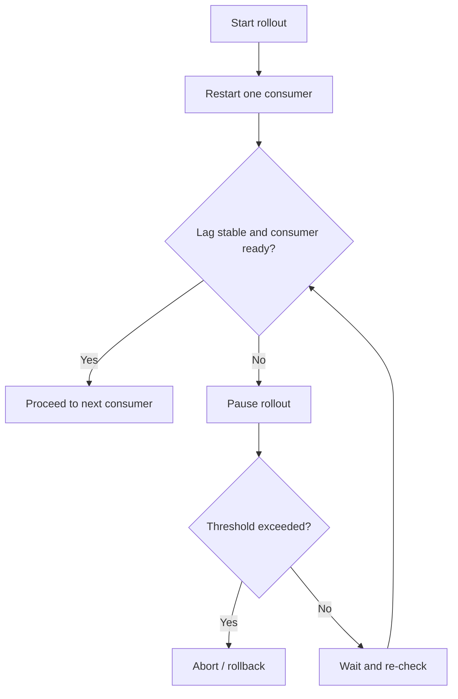

---
categories:
- Java
- Kafka
- Distributed Systems
date: 2026-06-28
seo_title: Consumer Group Rebalance Internals and Zero Downtime Tuning (Part 3)
seo_description: 'Hands-on guide: Consumer Group Rebalance Internals and Zero Downtime
  Tuning. Deployment runbook and guardrails.'
tags:
- java
- kafka
- distributed-systems
- streaming
- backend
title: Consumer Group Rebalance Internals and Zero Downtime Tuning (Part 3)
toc: true
toc_icon: cog
toc_label: In This Article
header:
  overlay_image: "/assets/images/java-advanced-generic-banner.svg"
  overlay_filter: 0.35
  show_overlay_excerpt: false
  caption: June Kafka Hands-On Series
---
Part goal: **Turn the tuning into a real deployment runbook with guardrails**.

---

## Problem 1: How Do We Roll Consumers Safely in Production?

Problem description:
Even after tuning assignors and membership, a production rollout can still cause trouble if multiple instances restart too quickly, readiness is wrong, or lag is already elevated before deployment begins.

What we are solving actually:
We are solving operational discipline.
Configuration improvements reduce rebalance pain, but zero-downtime behavior usually depends on rollout sequencing, lag gates, and clear abort conditions.

What we are doing actually:

1. Roll one instance at a time.
2. Pause autoscaling or other concurrent capacity changes during the rollout.
3. Gate each step on lag stabilization and consumer readiness.
4. Abort or roll back when rebalance duration or lag growth crosses a defined threshold.

---

## Rollout Control Flow

This is the missing layer in many teams.
They tune Kafka settings but still deploy in a way that defeats those gains.

---

## Production-Oriented Guardrails

Before rollout:

- confirm lag is near normal baseline
- confirm no consumer is already unhealthy
- pause horizontal autoscaler if it may churn the group during rollout
- ensure readiness means "able to consume safely," not just "process started"

---

## Lab Steps

1. Roll one pod at a time.
2. Pause autoscaler during rollout.
3. Gate next step on lag stabilization.
4. Abort on rebalance-duration threshold.

This is where the series becomes a runbook instead of a tuning note.
Operational sequencing is part of the solution.

---

## Example Guardrails

~~~text
Rollback trigger example:
- rebalance > 20s for 3 consecutive events
- lag growth slope > threshold
- consumer fails readiness after restart window
- partition movement exceeds expected safe envelope
~~~

Pick thresholds from your measured baseline, not from guesswork.
If Part 2 normally stabilizes in 5 seconds, then 20 seconds may be a sensible abort threshold.
If your environment normally needs 30 seconds, a 20-second threshold will only create false alarms.

---

## Verify

~~~bash
# pre/post deploy lag snapshots
kafka-consumer-groups --bootstrap-server localhost:9092 --all-groups --describe
~~~

Also capture:

- rebalance event duration
- assignment churn count
- time until lag slope returns to normal
- consumer readiness time after restart

---

## Failure Drill

Simulate slow startup initialization and verify the rollout gate halts progression.
Then simulate elevated background lag before rollout and verify the deployment does not continue just because each pod eventually becomes ready.

---

## Example Deployment Checklist

1. Confirm baseline lag and consumer health are normal.
2. Restart only one consumer instance.
3. Wait for readiness plus lag stabilization.
4. Check rebalance duration against threshold.
5. Continue only if all gates pass.

This checklist is intentionally simple because operators need something they can apply during incidents or late-night deploys without reinterpreting design notes.

---

## Debug Steps

Debug steps:

- inspect whether readiness turns green before the consumer is actually polling
- compare pre-deploy and post-deploy lag slope, not just absolute lag
- verify autoscaling or restart automation is not changing multiple consumers at once
- test rollback conditions in staging instead of inventing them during an incident

---

## What You Should Learn

- zero-downtime consumer deploys depend on rollout discipline as much as client settings
- measured guardrails turn restart tuning into an operational runbook
- the right rollback threshold comes from your baseline, not a copied number from another team
