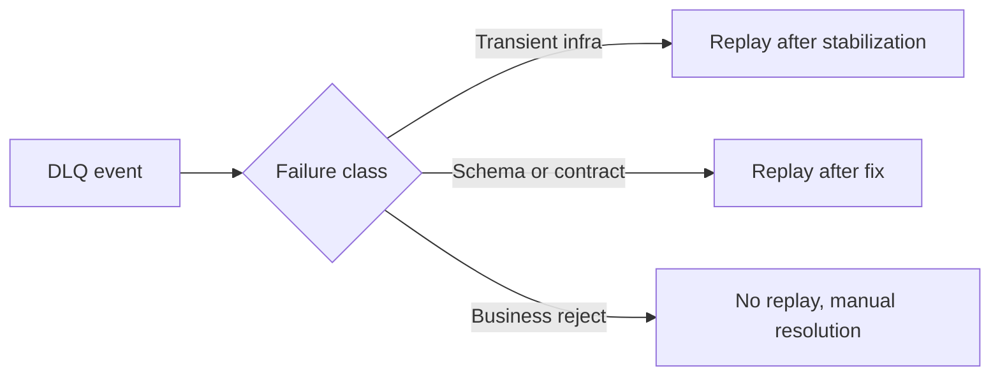

Part 1 created the bounded retry and DLQ topology. Part 2 made the failure path traceable. Part 3 is about ownership: who decides what happens to dead-lettered messages, which classes are replayable, and how the team stops the DLQ from becoming a long-lived pile of unresolved operational debt.

A DLQ is only useful when policy exists after the message lands there.

## Why a DLQ Needs a Playbook

Sending a record to a dead-letter topic is not resolution. It is only isolation.

The real questions begin immediately after:

- what kind of failure is this
- who owns investigation
- is replay allowed
- under what SLA should this be resolved

That classification is what turns the DLQ from storage into governance.

## Not Every DLQ Message Should Be Replayed

One of the most expensive mistakes teams make is treating replay as the universal answer.

Some failure classes deserve different treatment:

- transient infrastructure failures may be replayable once the environment is healthy
- schema or contract failures may be replayable only after the producer or consumer is fixed
- business rejections may never be replayable without manual correction

The playbook should say that explicitly, so incident response does not default to "put it back on the main topic and hope."

## Ownership Has to Be Concrete

For each DLQ class, define:

- the owning team
- expected response time
- replay eligibility
- the signal that marks the issue as resolved

If no owner exists, the queue becomes a quiet backlog instead of an operating system.

## Local Setup

### Prerequisites

- Docker Desktop
- Java 21
- Kafka CLI tools

### Local Stack

~~~yaml
services:
  zookeeper:
    image: confluentinc/cp-zookeeper:7.6.1
    environment:
      ZOOKEEPER_CLIENT_PORT: 2181

  kafka:
    image: confluentinc/cp-kafka:7.6.1
    depends_on: [zookeeper]
    ports: ["9092:9092"]
    environment:
      KAFKA_BROKER_ID: 1
      KAFKA_ZOOKEEPER_CONNECT: zookeeper:2181
      KAFKA_LISTENERS: PLAINTEXT://0.0.0.0:9092
      KAFKA_ADVERTISED_LISTENERS: PLAINTEXT://localhost:9092
      KAFKA_OFFSETS_TOPIC_REPLICATION_FACTOR: 1
~~~

~~~bash
docker compose up -d
~~~

## A Useful Governance Template

~~~text
DLQ policy:
- transient infra errors: replay after environment recovery
- schema errors: replay after producer or consumer fix
- business rejects: no automatic replay
~~~

The purpose of a simple policy like this is speed and clarity during incidents, not theoretical completeness.

## The Right Drill for Part 3

Run a synthetic DLQ exercise with multiple failure classes and verify:

- the classification is clear
- the right owner is obvious
- only replayable classes are replayed
- replay outcomes are audited afterward

That drill is more valuable than merely proving a replay script exists.

> [!important]
> A DLQ playbook should optimize for safe decisions under pressure, not for maximum theoretical flexibility.

## Common Mistakes

### Letting "just replay it" become the default reflex

That often reintroduces the same bad message into the hot path without addressing the cause.

### No SLA or owner for DLQ classes

Without ownership, the queue may be operationally visible but practically unmanaged.

### No replay audit

If replay results are never reviewed, the team never learns whether the fix actually resolved the underlying issue.

## What This Part Should Leave You With

After Part 3, the team should understand:

1. why DLQ handling needs ownership and policy, not only tooling
2. why replay should differ by failure class
3. how a practiced playbook keeps the queue from turning into unresolved system debt

That is what makes retry and DLQ design operationally complete by the end of the series.
