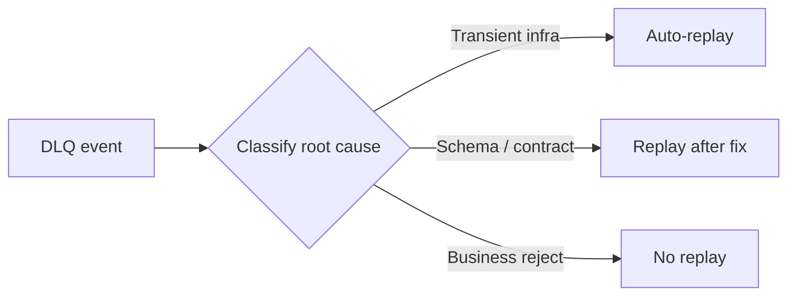

---
categories:
- Java
- Kafka
- Distributed Systems
date: 2026-06-29
seo_title: Retry Topics DLQ Design and Poison Message Governance (Part 3)
seo_description: 'Hands-on guide: Retry Topics DLQ Design and Poison Message Governance.
  DLQ governance playbook.'
tags:
- java
- kafka
- distributed-systems
- streaming
- backend
title: Retry Topics DLQ Design and Poison Message Governance (Part 3)
toc: true
toc_icon: cog
toc_label: In This Article
header:
  overlay_image: "/assets/images/java-advanced-generic-banner.svg"
  overlay_filter: 0.35
  show_overlay_excerpt: false
  caption: June Kafka Hands-On Series
---
Part goal: **Turn DLQ handling into an owned operational playbook**.

---

## Problem 1: Stop Treating the DLQ as a Dumping Ground

Problem description:
A DLQ is helpful only when teams know what kinds of failures belong there, who owns them, and what replay policy applies after a fix.

What we are solving actually:
We are solving governance of failed events after they are isolated.
The hard problem is not sending a message to DLQ; it is deciding what to do next in a way that is fast, safe, and repeatable.

What we are doing actually:

1. Classify DLQ records by failure type.
2. Assign owners and SLAs for each class.
3. Automate safe replay where policy allows it.

## Real-World Scenario

A poison event can block partition progress unless retries and DLQ are bounded and policy-driven.

---

## Run It Locally

### Prerequisites

- Docker Desktop
- Java 21
- Kafka CLI tools

### Local Stack

~~~yaml
services:
  zookeeper:
    image: confluentinc/cp-zookeeper:7.6.1
    environment:
      ZOOKEEPER_CLIENT_PORT: 2181

  kafka:
    image: confluentinc/cp-kafka:7.6.1
    depends_on: [zookeeper]
    ports: ["9092:9092"]
    environment:
      KAFKA_BROKER_ID: 1
      KAFKA_ZOOKEEPER_CONNECT: zookeeper:2181
      KAFKA_LISTENERS: PLAINTEXT://0.0.0.0:9092
      KAFKA_ADVERTISED_LISTENERS: PLAINTEXT://localhost:9092
      KAFKA_OFFSETS_TOPIC_REPLICATION_FACTOR: 1
~~~

~~~bash
docker compose up -d
~~~

---

## Lab Steps

1. Classify DLQ by root cause.
2. Assign owner and SLA.
3. Automate replay after fix.
4. Audit replay outcomes.

---

## Runnable Code Block

~~~text
DLQ policy:
- transient infra errors: auto-replay
- schema errors: replay after producer fix
- business rejects: no replay
~~~

---

## Verify

~~~bash
# sample replay command pipeline (replace with internal tool)
kafka-console-consumer --bootstrap-server localhost:9092 --topic orders.dlq --from-beginning | head
~~~

---

## Failure Drill

Run synthetic DLQ drill and verify playbook completion within target recovery window.

---

## Debug Steps

Debug steps:

- confirm every DLQ class has an owner and response expectation
- keep replay rules explicit so “just replay it” does not become the default answer
- audit replay outcomes to prove whether fixes really resolved the issue
- run synthetic DLQ drills so the playbook is practiced before a real incident

## Operational Note

The best DLQ playbooks are short, explicit, and practiced.
If responders need to rediscover policy during an incident, the DLQ is still functioning as storage rather than governance.

## What You Should Learn

- a DLQ is only useful when replay policy and ownership are clear
- not every failed message should be replayed
- governance turns DLQ handling from improvisation into operations

---

## Operator Prompt

For retry topics dlq design and poison message governance (part 3), keep one rollout question in the runbook: what metric tells us the topology is healthy, and what metric tells us to stop or roll back? Kafka systems usually fail operationally before they fail conceptually.

---

## Final Operations Note

One more practical rule helps this series topic stay useful in real systems: always pair the design with one rollback move and one "healthy again" signal. In Kafka, teams often know how to add topology complexity faster than they know how to back out safely, and that gap is exactly where routine changes turn into incidents.
