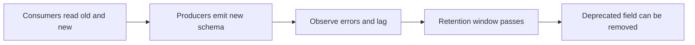

Part 1 defined compatibility rules. Part 2 moved them into CI. Part 3 is the production discipline that keeps a technically compatible change from still becoming a runtime incident: rollout order, deprecation timing, and the patience required to remove old fields only when the system is truly ready.

This is the part where contract evolution becomes an operating policy.

## Why Passing CI Is Not the End of the Story

A change can pass compatibility checks and still fail operationally if:

- producers move before consumers are ready
- deprecated fields are removed before historical traffic has aged out
- rollback expectations were never defined

Compatibility tools protect the shape of the contract. Rollout policy protects the lived transition.

That sequence matters more than many teams expect.

## The Safest Default Order

The safest rollout pattern is usually:

1. deploy consumers that can read both old and new forms
2. move producers to the new schema
3. observe the system under live traffic
4. remove deprecated fields only after the retention and rollback window has truly passed

This is the consumer-first rule in practice. It is boring, but it prevents a surprising number of incidents.

## Why Deprecation Needs Real Policy

Deprecated fields often linger because nobody knows when it is actually safe to remove them.

The answer should depend on:

- how long old events remain in retention
- whether replay is still possible or expected
- whether any lagging consumers or side systems still depend on the field

Without explicit dates and conditions, "temporary compatibility" turns into a permanent burden.

## What to Observe During Rollout

Do not rely only on the registry and CI result. Also watch:

- deserialization error rate
- consumer lag during the rollout window
- DLQ or fallback traffic if decode failures are routed there
- any rollback path that depends on older readers and writers coexisting

Those are the signals that tell you whether the rollout is healthy in practice.

## Local Setup

### Prerequisites

- Docker Desktop
- Java 21
- Kafka CLI tools

### Local Stack

~~~yaml
services:
  zookeeper:
    image: confluentinc/cp-zookeeper:7.6.1
    environment:
      ZOOKEEPER_CLIENT_PORT: 2181

  kafka:
    image: confluentinc/cp-kafka:7.6.1
    depends_on: [zookeeper]
    ports: ["9092:9092"]
    environment:
      KAFKA_BROKER_ID: 1
      KAFKA_ZOOKEEPER_CONNECT: zookeeper:2181
      KAFKA_LISTENERS: PLAINTEXT://0.0.0.0:9092
      KAFKA_ADVERTISED_LISTENERS: PLAINTEXT://localhost:9092
      KAFKA_OFFSETS_TOPIC_REPLICATION_FACTOR: 1
~~~

~~~bash
docker compose up -d
~~~

## A Better Rollout Checklist

1. Confirm consumers can read both old and new forms.
2. Roll producers to the new schema.
3. Watch deserialization failures and lag directly.
4. Keep rollback to the old producer path available during the observation window.
5. Remove deprecated fields only after retention and dependency checks are complete.

That checklist is intentionally simple because schema changes fail operationally through sequencing mistakes more often than through missing theory.

> [!important]
> A deprecated field is not removable just because the new producer no longer writes it. It is removable when the full system no longer needs it for live reads, lagged reads, or replay.

## Common Mistakes

### Producer-first rollout

This is often where theoretical compatibility meets practical decode failures.

### No defined deprecation horizon

Fields stay forever, and nobody can tell which ones are actually still needed.

### Forgetting rollback compatibility

If rollback to the previous producer version is part of the safety plan, the contract has to support that path too.

## What This Part Should Leave You With

After Part 3, the team should understand:

1. why rollout order is as important as compatibility mode
2. how deprecation should be tied to retention and replay reality
3. what a safe schema-change runbook looks like in production

That is what closes the loop on schema evolution: not only safe shapes and safe CI, but safe live rollout and removal policy.
