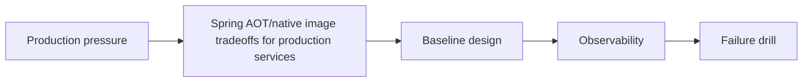

---
categories:
- Java
- Spring Boot
- Backend
date: 2026-07-02
seo_title: Spring AOT/native image tradeoffs for production services - Advanced Guide
seo_description: Advanced practical guide on spring aot/native image tradeoffs for
  production services with architecture decisions, trade-offs, and production patterns.
tags:
- java
- spring-boot
- backend
- architecture
- production
title: Spring AOT/native image tradeoffs for production services
toc: true
toc_icon: cog
toc_label: In This Article
header:
  overlay_image: "/assets/images/java-advanced-generic-banner.svg"
  overlay_filter: 0.35
  show_overlay_excerpt: false
  caption: Advanced Spring Boot Runtime Engineering
---
Spring AOT/native image tradeoffs for production services becomes valuable only when the Spring container behavior, runtime constraints, and rollout risks are all made explicit. The interesting part is rarely the annotation itself; it is how the application behaves under startup pressure, configuration drift, and live traffic.

---

## Problem 1: Spring AOT/native image tradeoffs for production services

Problem description:
We want to apply spring aot/native image tradeoffs for production services in a way that stays predictable during startup, configuration changes, and production rollout. This part focuses on the baseline model and the safe default shape.

What we are solving actually:
We are establishing the core boundary, deciding what must stay explicit, and choosing a baseline that is easy to observe. For Spring systems, the hidden risk is often framework magic that obscures order of initialization or override behavior.

What we are doing actually:

1. make Spring Boot explicit: identify the ownership boundary and the non-negotiable invariant
2. make Spring Boot explicit: choose the simplest baseline design that preserves correctness
3. make Spring Boot explicit: make observability visible from the first implementation
4. make Spring Boot explicit: validate the baseline with one concrete failure drill

---

## Why This Topic Matters

- startup order and bean wiring become operational concerns in large services
- safe customization matters more than clever override tricks
- rollback and configuration drift should be considered before production rollout

---

## Architecture Model



The model keeps bean lifecycle, override points, and rollout behavior in one frame so spring aot/native image tradeoffs for production services stays reviewable under pressure.
Once those three signals are visible, the deeper framework detail has somewhere safe to attach.

---

## Practical Design Pattern

```java
@Configuration
class TopicConfiguration {

    @Bean
    TopicPolicy topicPolicy() {
        return new TopicPolicy("Spring AOT/native image tradeoffs for production services", 1);
    }
}
```

This code sketch stays intentionally narrow because the real value in spring aot/native image tradeoffs for production services is choosing one safe extension point and one predictable fallback path.
If the customization needs surprises in three different configuration layers, the design is already too hard to operate.

---

## Failure Drill

Baseline drill: inject a startup or override misconfiguration and verify the failure mode is obvious, bounded, and recoverable for spring aot/native image tradeoffs for production services.

That check matters early, before rollout assumptions harden into defaults because Spring issues around spring aot/native image tradeoffs for production services often show up in startup order, refresh timing, or rollback windows rather than in straightforward unit tests.

---

## Debug Steps

Debug steps:

- trace bean creation, condition evaluation, and configuration precedence while validating spring aot/native image tradeoffs for production services
- keep customization close to the intended extension point instead of scattered overrides while validating spring aot/native image tradeoffs for production services
- observe startup, request, and shutdown phases separately while validating spring aot/native image tradeoffs for production services
- verify rollback by disabling the new behavior, not by rewriting it live while validating spring aot/native image tradeoffs for production services

---

## Production Checklist

- named extension point and explicit fallback path
- startup or runtime metric that proves the first rollout is safe
- configuration precedence documented for the changed path
- rollback tested without emergency code surgery

---

## Key Takeaways

- Spring AOT/native image tradeoffs for production services should be designed as a production decision, not just an implementation detail
- framework behavior should stay observable and override paths should stay intentional
- start from a measurable baseline before optimizing
