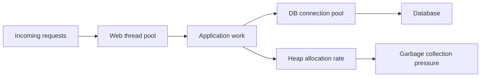

---
categories:
- Java
- Spring Boot
- Backend
date: 2026-07-10
seo_title: 'Spring performance tuning: thread pools, DB pools, GC fit - Advanced Guide'
seo_description: 'Advanced practical guide on spring performance tuning: thread pools,
  db pools, gc fit with architecture decisions, trade-offs, and production patterns.'
tags:
- java
- spring-boot
- backend
- architecture
- production
title: 'Spring performance tuning: thread pools, DB pools, GC fit'
toc: true
toc_icon: cog
toc_label: In This Article
header:
  overlay_image: "/assets/images/java-advanced-generic-banner.svg"
  overlay_filter: 0.35
  show_overlay_excerpt: false
  caption: Advanced Spring Boot Runtime Engineering
---
Spring performance tuning usually goes wrong when teams tune one queue at a time.
They change the web thread pool, then the JDBC pool, then the GC, and each change looks locally reasonable.
The problem is that throughput and latency are controlled by the whole capacity chain, not by any single knob.

---

## Start With the Capacity Path

For a typical Spring service, a request often competes through this path:



If any stage becomes the real bottleneck, the others start to look broken even when they are only waiting behind it.

That is why tuning has to begin with measurement, not folklore.

---

## The Three Things People Confuse

These are different problems:

- **thread pool sizing**: how much concurrent work the service can schedule
- **DB pool sizing**: how many requests can actively use the database at once
- **GC fit**: how much allocation pressure the JVM can absorb before latency becomes unstable

If a service is DB-bound, increasing the request thread pool often makes the system worse by letting more work queue up against the same limited database capacity.

> [!IMPORTANT]
> A larger thread pool is not more throughput by default. It is often just more waiting.

---

## A Concrete Spring Example

A common starting point is an executor plus HikariCP configuration that is explicit instead of inherited from defaults nobody reviews.

```java
@Bean
ThreadPoolTaskExecutor applicationExecutor() {
    ThreadPoolTaskExecutor executor = new ThreadPoolTaskExecutor();
    executor.setCorePoolSize(32);
    executor.setMaxPoolSize(64);
    executor.setQueueCapacity(200);
    executor.setThreadNamePrefix("app-worker-");
    executor.initialize();
    return executor;
}
```

```yaml
spring:
  datasource:
    hikari:
      maximum-pool-size: 24
      minimum-idle: 8
      connection-timeout: 1000
```

This does not mean `64` and `24` are correct values.
It means the service has declared its concurrency assumptions instead of hiding behind defaults.

---

## How the Pools Interact

If the request executor can run `64` active tasks but only `24` of them can hold DB connections, then the remaining tasks may simply pile up waiting for the database.

That can show up as:

- higher p95 latency
- longer executor queues
- more time spent blocked on JDBC acquisition
- more retained objects and therefore more GC pressure

The result is that a database bottleneck starts to masquerade as an application-thread or garbage-collector problem.

---

## GC Is Not a Separate Story

GC tuning should follow allocation behavior, not superstition.

If request concurrency is too high, the service often allocates more:

- request objects live longer in queues
- response buffers stay around longer
- retry and timeout machinery creates additional churn
- blocked work retains state that otherwise would die quickly

That means some "GC problems" are really concurrency-shape problems.

Before changing collectors or flags, check whether the service is simply holding too much in-flight work.

---

## A Better Tuning Order

In practice, the safer sequence is:

1. identify where the request spends time
2. confirm whether the service is CPU-bound, DB-bound, or allocation-bound
3. tune thread and DB pool interaction first
4. then inspect heap pressure and GC pause behavior
5. only after that consider collector or flag changes

This order prevents the team from treating GC as the first suspect when the real issue is often saturation upstream.

---

## Failure Drill

A strong drill for this topic is controlled overload:

1. drive concurrency up with realistic request mix
2. watch executor active threads and queue depth
3. watch HikariCP active, idle, and pending connections
4. watch heap occupancy and GC pause behavior at the same time

The point is to learn which graph moves first.
That tells you where the real bottleneck lives.

---

## Debug Steps

- correlate request latency with executor queue depth and DB pool wait time
- inspect whether CPU saturation or DB waits dominate before touching GC settings
- treat long GC pauses as a symptom until proven otherwise
- review retry, timeout, and fallback behavior because they change in-flight work volume
- prefer fewer, well-measured changes over multi-knob tuning bursts

---

## Production Checklist

- thread-pool size matches the actual workload shape
- DB pool size reflects safe database concurrency, not wishful application concurrency
- executor and Hikari metrics are visible in the same dashboard
- allocation rate and GC pause metrics are tracked with latency
- the team can explain which stage is the bottleneck under load

---

## Key Takeaways

- Thread pools, DB pools, and GC belong to the same performance system.
- Tuning one layer in isolation often shifts pressure instead of removing it.
- Most performance work improves when concurrency limits are made explicit first.
- The best tuning change is the one supported by end-to-end evidence, not by generic rules of thumb.
