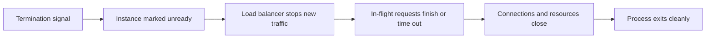

---
categories:
- Java
- Spring Boot
- Backend
date: 2026-07-12
seo_title: Graceful shutdown and connection draining in Spring Boot - Advanced Guide
seo_description: Advanced practical guide on graceful shutdown and connection draining
  in spring boot with architecture decisions, trade-offs, and production patterns.
tags:
- java
- spring-boot
- backend
- architecture
- production
title: Graceful shutdown and connection draining in Spring Boot
toc: true
toc_icon: cog
toc_label: In This Article
header:
  overlay_image: "/assets/images/java-advanced-generic-banner.svg"
  overlay_filter: 0.35
  show_overlay_excerpt: false
  caption: Advanced Spring Boot Runtime Engineering
---
Graceful shutdown matters because a service rarely disappears in isolation.
It usually sits behind a load balancer, holds open connections, and may still be processing work when the platform decides to terminate it.
If shutdown is not coordinated, users see dropped requests, half-finished writes, or pods that look healthy right up until they vanish.

---

## The Real Goal

Graceful shutdown is not "stop slowly."
The real goal is:

- stop receiving new traffic
- let in-flight work finish or time out cleanly
- close resources in the right order
- exit before the platform forcibly kills the process

That means application code, embedded server behavior, and platform termination settings all have to agree on the same shutdown story.

---

## A Useful Lifecycle Model

The shutdown sequence should look more like this:



If any step is missing, the service may still stop, but it will not stop safely.

---

## Where Spring Boot Fits

Spring Boot can help with server-side graceful shutdown, but that is only part of the story.
You still need to think about:

- readiness probe behavior
- load balancer deregistration timing
- request timeout limits
- background executors and message consumers
- database and downstream client cleanup

Boot can coordinate the app. It cannot single-handedly coordinate the platform around it.

---

## A Concrete Configuration Baseline

A reasonable starting point is to enable graceful shutdown explicitly:

```yaml
server:
  shutdown: graceful

spring:
  lifecycle:
    timeout-per-shutdown-phase: 30s
```

This gives the application a bounded window to stop accepting new work and finish what is already running.

For many teams, the next missing piece is not Spring configuration. It is readiness and draining behavior outside the process.

If you run on Kubernetes, the application drain window also has to fit inside the pod termination budget:

```yaml
terminationGracePeriodSeconds: 45

readinessProbe:
  httpGet:
    path: /actuator/health/readiness
    port: 8080
  periodSeconds: 5
```

The rule of thumb is simple:

- the pod should become unready first
- the load balancer should stop sending new traffic next
- the Spring shutdown phases should finish before the platform sends a hard kill

---

## The Request-Draining Problem

Imagine a pod receives `SIGTERM` while still marked ready.
The load balancer may keep routing requests to it for a short window, even while shutdown begins.

That is why graceful shutdown often fails in practice:

- the app starts shutting down
- the platform still sends new traffic
- in-flight requests compete with late-arriving requests
- the hard kill deadline arrives before the drain completes

> [!IMPORTANT]
> Application-level graceful shutdown without readiness/draining coordination is incomplete. It often looks correct in logs while still dropping real traffic.

---

## A Practical Spring Hook

When needed, it helps to make the service stop advertising readiness before the final shutdown window closes.
Spring Boot already exposes application availability states, which is usually a safer hook than building a custom flag from scratch.

```java
@Component
class ShutdownCoordinator {

    private final ApplicationEventPublisher publisher;

    ShutdownCoordinator(ApplicationEventPublisher publisher) {
        this.publisher = publisher;
    }

    @EventListener
    public void onClosed(ContextClosedEvent event) {
        AvailabilityChangeEvent.publish(
                publisher,
                event.getApplicationContext(),
                ReadinessState.REFUSING_TRAFFIC
        );
    }
}
```

That does not deregister the instance from every upstream system automatically, but it makes the application say the right thing at the right time.
From there, the platform can stop routing new traffic while the remaining requests complete.

> [!NOTE]
> If a load balancer or service mesh ignores readiness for a short deregistration window, that window still has to be accounted for in the total shutdown budget.

---

## What Else Needs Draining

HTTP requests are only one part of graceful shutdown.
The other common shutdown traps are:

- async executors still accepting tasks
- scheduled jobs firing during termination
- Kafka or queue consumers still polling
- long-running DB transactions holding resources too long

If those components do not respect shutdown, the service can still fail noisily even if web traffic drains cleanly.

One common miss is async work that keeps accepting tasks after the service is already draining.
For thread-pool-backed workloads, make the policy explicit:

```java
@Bean
ThreadPoolTaskExecutor applicationTaskExecutor() {
    ThreadPoolTaskExecutor executor = new ThreadPoolTaskExecutor();
    executor.setCorePoolSize(16);
    executor.setMaxPoolSize(32);
    executor.setQueueCapacity(200);
    executor.setWaitForTasksToCompleteOnShutdown(true);
    executor.setAwaitTerminationSeconds(20);
    executor.initialize();
    return executor;
}
```

That configuration does not guarantee business correctness, but it does keep the executor from dropping work blindly as the context closes.

---

## Failure Drill

A useful drill is rolling termination under live traffic:

1. send a steady stream of requests
2. trigger shutdown on one instance
3. verify readiness drops before termination completes
4. confirm new traffic stops arriving
5. confirm in-flight requests either finish cleanly or fail within the expected timeout budget

This test is much more valuable than only checking whether the JVM exits without stack traces.

Good signals to collect during the drill:

- request rate before and after readiness flips
- active thread count in the web server and task executor
- queue consumer lag or poll activity
- pod termination timestamps versus application exit timestamps

---

## Debug Steps

- compare request counts before and during shutdown to detect late traffic
- watch readiness state, load balancer deregistration, and process exit timing together
- inspect executor, queue-consumer, and scheduler behavior during termination
- verify that shutdown timeout settings are shorter than the platform's hard-kill window
- treat incomplete drain as a coordination bug, not only an application bug
- check whether keep-alive connections or proxy buffering extend the real drain window beyond what the app logs suggest

---

## Production Checklist

- graceful shutdown is enabled in the application
- readiness changes stop new traffic before final process exit
- in-flight request timeout fits within the shutdown budget
- executors, schedulers, and consumers stop accepting new work during termination
- the platform hard-kill deadline is longer than the application drain window

---

## Key Takeaways

- Graceful shutdown is a coordination problem across the app, the server, and the platform.
- The two most important goals are stopping new traffic and finishing in-flight work predictably.
- Readiness and connection draining usually matter more than one extra shutdown annotation.
- If shutdown behavior is not tested under live traffic, it is mostly theory.
