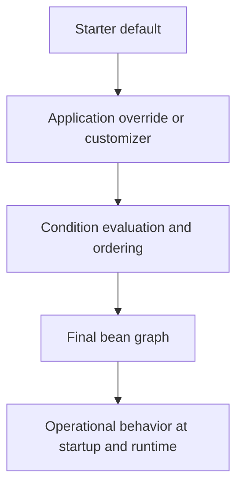

Part 1 established the core model: auto-configuration is conditional configuration, not startup magic.
Part 2 is where teams usually get into trouble, because now the question is not only "why did Boot create this bean" but "how do we extend or replace Boot behavior without making future upgrades dangerous."

---

## The Harder Problem in Real Systems

Auto-configuration is easy to like when one starter contributes one default bean.
It becomes much harder when:

- several starters contribute related infrastructure
- an application wants to replace only one layer of the stack
- a library upgrade changes condition ordering or bean presence
- the final context depends on which customization wins first

The production question is no longer "can Boot configure this."
The production question is "can the team still predict the context after the next dependency upgrade."

---

## Safe Customization Starts with Contracts

The healthiest auto-configuration customizations have explicit contracts:

- the starter owns the default bean
- the application owns the replacement
- the back-off rule is obvious
- downstream configuration does not depend on accidental bean names or side effects

If your customization requires three exclusions, one `@Primary`, one bean name override, and a property that only exists for historical reasons, the design is already fragile.

---

## The Real Collision Point

The most common collision is not "Boot created the wrong bean."
It is "two valid customizations interact in a way nobody reviewed as a whole."

Typical examples:

- a security starter contributes a default filter chain
- an application adds a custom chain
- a management endpoint starter adds another conditionally ordered bean
- a later library release changes the order in which those pieces are considered

That is why part 2 should focus on extension strategy, not annotation trivia.

---

## A Better Mental Model



This is the sequence to reason about during reviews.
If the final bean graph cannot be predicted from those four steps, the configuration is too implicit.

---

## Prefer Customizers Over Full Replacement When Possible

Full bean replacement is sometimes necessary, but it is often a blunt instrument.
A safer pattern is to keep the default infrastructure bean and expose a narrow customizer contract.

```java
@AutoConfiguration
class HttpClientAutoConfiguration {

    @Bean
    @ConditionalOnMissingBean
    ClientHttpConnector clientHttpConnector(List<ClientHttpConnectorCustomizer> customizers) {
        ClientHttpConnector connector = new ReactorClientHttpConnector();
        for (ClientHttpConnectorCustomizer customizer : customizers) {
            connector = customizer.customize(connector);
        }
        return connector;
    }
}
```

That structure gives applications a safe intervention point without forcing them to replace the whole auto-configuration surface.

Applications then contribute only the delta:

```java
@Component
class TimeoutCustomizer implements ClientHttpConnectorCustomizer {

    @Override
    public ClientHttpConnector customize(ClientHttpConnector connector) {
        HttpClient client = HttpClient.create()
                .responseTimeout(Duration.ofSeconds(2));
        return new ReactorClientHttpConnector(client);
    }
}
```

This is easier to review, easier to test, and usually safer across upgrades than replacing the entire connector stack.

---

## Ordering Is Where Fragility Hides

Most "Spring Boot changed behavior after upgrade" incidents are really ordering incidents:

- one configuration matched earlier than expected
- a replacement bean appeared before a condition checked for absence
- multiple customizers executed in a different order than the code assumed

If ordering matters, make it explicit and document why.
If ordering does not matter, design the extension point so that it remains safe regardless of order.

> [!IMPORTANT]
> Any customization that depends on undocumented bean creation order is carrying upgrade risk, even if it works today.

---

## Failure Drill

A strong drill for this topic is controlled override failure:

1. start the application with only the starter defaults
2. add one application-level replacement or customizer
3. inspect `/actuator/conditions` and `/actuator/beans`
4. then add a second customization that should coexist
5. verify the final bean graph still matches the intended contract

That test catches the difference between "Boot backed off cleanly" and "Boot happened to tolerate this combination."

---

## Debug Steps

- inspect the condition report before changing annotations
- trace which bean is meant to be replaced versus customized
- check ordering annotations and customizer order only when the behavior truly depends on sequence
- test the same profile and dependency set used in production, not a stripped-down local context
- treat any bean-name-based override as a design smell until proven necessary

---

## Production Checklist

- starter defaults back off through clear type-based rules
- extension points are narrow and documented
- conditions and final beans are observable through logs or Actuator
- customization does not rely on accidental bean names or hidden ordering
- rollback means removing one override, not untangling several intertwined ones

---

## Key Takeaways

- Safe auto-configuration in mature services is mostly about contract design.
- Prefer narrow customizer hooks over full replacement when the starter can support them.
- Ordering assumptions are one of the fastest ways to turn Boot customization into upgrade risk.
- If the final bean graph cannot be explained clearly, the extension model is too implicit.
