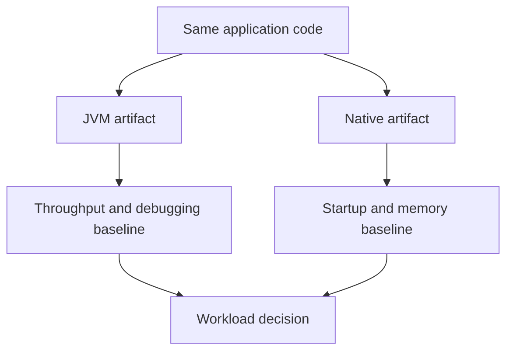

Part 1 framed Spring AOT and native images as a workload decision rather than a blanket upgrade.
Part 2 is where platform teams usually feel the real cost: once some services go native and others stay on the JVM, the deployment model, diagnostics, and support expectations start to diverge.

---

## The Harder Decision Is Fleet-Wide Consistency

The hard part is rarely getting one service to build as a native image.
The hard part is deciding what happens when:

- one service benefits from native startup
- another service needs JVM tooling for throughput tuning
- the incident playbook is different for each artifact type
- build pipelines now have two support paths instead of one

That is the point where AOT becomes an operating-model decision, not just a packaging experiment.

---

## Not Every Fast Start Is Worth a Split Platform

Native images are attractive because the wins are visible:

- lower cold-start latency
- lower memory footprint at idle
- easier scale-to-zero economics in some environments

But the cost is not only build complexity.
The cost is also that your team now has to answer different questions for different services:

- which ones get heap dumps and JFR-based analysis
- which ones get native-image-specific debugging paths
- which ones justify longer CI pipelines
- which ones are allowed to diverge from the default platform profile

---

## A Better Selection Model

Instead of asking "can this service run as native," use a scoring model:

- does cold start materially change the business outcome
- is the dependency graph stable and AOT-friendly
- is the service operationally simple enough that reduced debugging ergonomics are acceptable
- does the team have a JVM fallback artifact ready if production reality changes

If two of those answers are weak, the service probably should not be your next native candidate.

---

## The Two-Artifact Mental Model

For many teams, the safest native adoption pattern is not replacement.
It is dual capability for a while.



This keeps the comparison honest.
Without a JVM fallback, teams often rationalize native-image pain because rollback feels socially or operationally expensive.

---

## Make Runtime Hints Part of the Contract

Part 1 talked about reflection and dynamic behavior.
In practice, part 2 is where you decide whether that behavior is treated as one-off exception handling or as part of the service contract.

```java
@Configuration
class NativeHintsConfiguration implements RuntimeHintsRegistrar {

    @Override
    public void registerHints(RuntimeHints hints, ClassLoader classLoader) {
        hints.reflection().registerType(OrderSummary.class,
                builder -> builder.withMembers(MemberCategory.INVOKE_DECLARED_CONSTRUCTORS,
                        MemberCategory.INVOKE_PUBLIC_METHODS));
        hints.resources().registerPattern("pricing/default-rules.json");
    }
}
```

This matters because native readiness is not just "the build passed."
It means the service has declared the dynamic pieces it depends on.

> [!IMPORTANT]
> If a service reaches production only because a developer kept adding ad hoc hints until the build stopped failing, the team does not yet understand the native support surface well enough.

---

## The Operational Trade-Off Is Often Hidden in Incident Response

The deployment benchmark usually looks great.
The incident benchmark is where teams get surprised.

Ask these questions before scaling the model across services:

- how will we debug serialization differences in production
- how will we compare native versus JVM latency under the same workload
- which tooling is no longer available or becomes less useful
- who owns the extra CI and release complexity

If there is no clear answer, the platform is not ready for broad native adoption even if the first build succeeded.

---

## Failure Drill

A strong drill here is artifact parity:

1. deploy the JVM build and the native build behind the same contract tests
2. run the same warm-up and steady-state workload
3. compare startup, RSS, p95 latency, and error modes
4. trigger one serialization or reflection-sensitive path intentionally
5. verify rollback to the JVM artifact is operationally routine

That drill tells you whether native is truly production-ready for the service or merely benchmark-ready.

---

## Debug Steps

- compare native output against a measured JVM baseline, not memory of past runs
- inspect reflection, proxy, and resource-loading paths first when behavior diverges
- keep build-time failures and runtime failures as separate classes of problems
- validate observability and incident tooling before platform rollout
- keep a JVM fallback artifact until the native behavior is boring in production

---

## Production Checklist

- native adoption is justified by real startup or memory pressure
- runtime hints are maintained as code, not tribal knowledge
- JVM and native artifacts have been compared under the same workload
- CI and release costs are acceptable for the owning team
- rollback to the JVM build is fast and documented

---

## Key Takeaways

- The second native-image question is not technical feasibility; it is platform sustainability.
- Dual artifact support is often the safest bridge while a team learns where native actually helps.
- Runtime hints should be treated as part of the service contract, not build noise.
- A native rollout is incomplete until rollback and incident response are equally clear.
