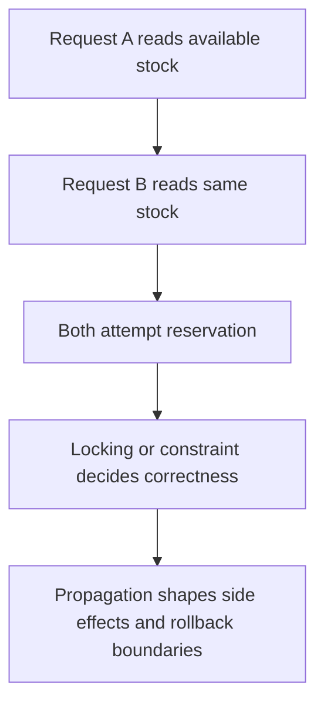
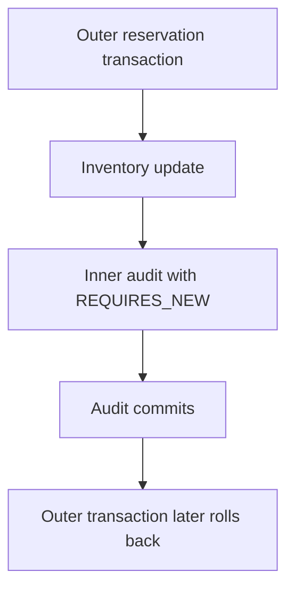

---
categories:
- Java
- Spring Boot
- Backend
date: 2026-07-15
seo_title: 'Advanced transactional boundaries: propagation and isolation (Part 2)
  - Advanced Guide'
seo_description: 'Advanced practical guide on advanced transactional boundaries: propagation
  and isolation (part 2) with architecture decisions, trade-offs, and production patterns.'
tags:
- java
- spring-boot
- backend
- architecture
- production
title: 'Advanced transactional boundaries: propagation and isolation (Part 2)'
toc: true
toc_icon: cog
toc_label: In This Article
header:
  overlay_image: "/assets/images/java-advanced-generic-banner.svg"
  overlay_filter: 0.35
  show_overlay_excerpt: false
  caption: Advanced Spring Boot Runtime Engineering
---
Part 1 established the core distinction: propagation decides transaction boundaries, isolation decides what concurrent anomalies are tolerated.
Part 2 goes deeper into the place where teams usually get hurt: multiple writes that look like one business workflow, but are not actually protected by the same correctness model.

---

## The Hard Problem Is Business Invariants Under Concurrency

Most transaction bugs are not obvious syntax mistakes.
They happen when an application assumes:

- one workflow equals one atomic outcome
- each service call sees a stable database view
- retries are harmless because the code is transactional
- audit, reservation, and notification steps can all share the same boundary safely

Those assumptions fail under load unless the transaction model is tied directly to the invariant you are protecting.

---

## Example: Inventory Reservation Is Not Just a CRUD Transaction

Imagine a checkout flow that reserves stock and records an audit event.
The business invariant is simple:

- reserved quantity must never exceed available inventory
- audit may be useful even when reservation fails
- duplicate retries must not reserve twice

That means propagation, locking, and retry semantics all matter together.

---

## A Concrete Service Shape

```java
@Service
class InventoryReservationService {

    private final InventoryRepository inventoryRepository;
    private final ReservationAuditService reservationAuditService;

    @Transactional
    public void reserve(String sku, int quantity) {
        InventoryRow row = inventoryRepository.findBySkuForUpdate(sku)
                .orElseThrow();

        if (row.availableUnits() < quantity) {
            throw new IllegalStateException("Insufficient inventory");
        }

        row.reserve(quantity);
        inventoryRepository.save(row);

        reservationAuditService.recordSuccess(sku, quantity);
    }
}
```

This already raises two separate design questions:

- should `recordSuccess()` commit with the reservation or independently
- what concurrency control prevents two requests from both believing stock is available

---

## Propagation Cannot Repair a Weak Invariant



If the inventory row is read without the right locking strategy, changing propagation will not save correctness.
You can still oversell inventory with beautiful `@Transactional` annotations if two transactions both read stale state before updating.

That is why the first review question should be:
"What invariant is protected at the database boundary?"

Only then should you ask whether `REQUIRED`, `REQUIRES_NEW`, or another propagation mode is appropriate.

---

## Where `REQUIRES_NEW` Helps and Hurts

Suppose the audit write should survive even if the outer reservation later fails due to a downstream error.



That may be correct for observability.
It may also be misleading if the audit trail now says "reservation succeeded" when the real business operation failed.

---

## Isolation Needs a Named Failure Mode

Choosing `READ_COMMITTED` versus `REPEATABLE_READ` should not be framed as an abstract database preference.
Name the anomaly you are trying to avoid:

- lost update
- non-repeatable read
- phantom rows
- write skew

If the team cannot name the failure mode, it usually means the isolation choice is cargo-culted.

> [!IMPORTANT]
> Isolation is only meaningful when tied to the actual database engine and access pattern. The same annotation can mean different operational risk across PostgreSQL, MySQL, or another store.

---

## A Safer Audit Split

If the audit should reflect the committed outcome rather than just the attempted operation, publish it after the transaction commits.

```java
@Service
class ReservationAuditPublisher {

    @TransactionalEventListener(phase = TransactionPhase.AFTER_COMMIT)
    public void onReserved(ReservationSucceededEvent event) {
        // persist or publish audit after the inventory reservation commits
    }
}
```

That model often matches business truth better than forcing an inner `REQUIRES_NEW` transaction to commit early.

---

## Spring Trap: Transactional Boundaries Still Depend on Invocation Paths

Even good transaction design fails if the code path never crosses the Spring proxy that applies it.
Part 1 covered self-invocation.
In larger systems, a subtler version appears when internal helper flows are moved across methods and developers assume the propagation semantics still apply.

This is another reason to put transaction boundaries on business-facing service methods rather than on fine-grained internal implementation helpers.

---

## Failure Drill

A strong drill for this topic is intentional invariant pressure:

1. start two concurrent reservation requests for the same SKU
2. keep inventory low enough that only one should succeed
3. verify the final stock and audit state
4. then introduce an inner `REQUIRES_NEW` audit or outbox write
5. confirm the committed side effects still match the real business outcome

This catches the difference between "the code is transactional" and "the business invariant is actually protected."

---

## Debug Steps

- start from the invariant: what state must never be violated
- trace which writes truly share one transaction and which do not
- inspect actual database locking and isolation behavior under concurrency
- test retry paths and partial-failure paths, not only happy-path commits
- verify that audit, outbox, and notification steps reflect the right business truth

---

## Production Checklist

- each transaction boundary maps to one clear business responsibility
- any use of `REQUIRES_NEW` is justified by a concrete independent side effect
- isolation level is tied to a named anomaly the workload cannot tolerate
- concurrency tests exist for the hottest transactional invariants
- proxy boundaries are understood and not bypassed accidentally

---

## Key Takeaways

- Transaction design is really invariant design under failure and concurrency.
- Propagation and isolation only make sense when connected to the business rule being protected.
- `REQUIRES_NEW` is useful for independent side effects, but dangerous when it creates a false picture of business success.
- The best transaction review starts with "what must stay true," not "which annotation should we use."
