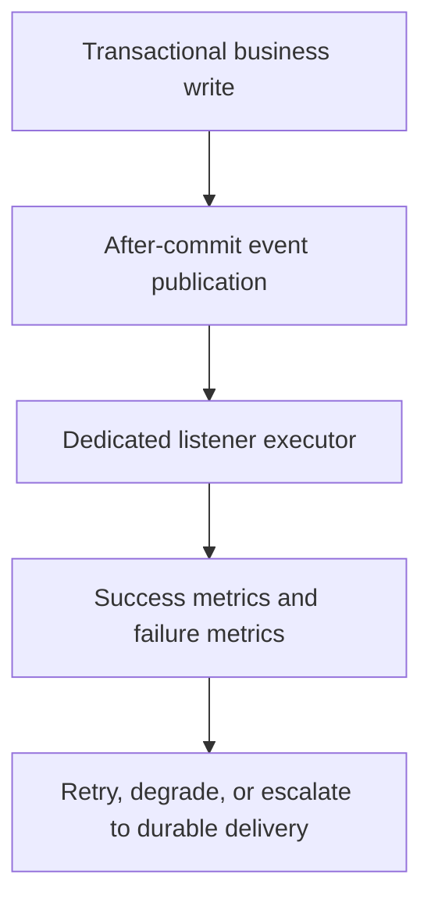

Part 1 established the core rule: Spring events are useful for in-process decoupling, not for pretending durable messaging exists where it does not.
Part 2 goes deeper into the next operational question: once you do choose async listeners, how do you stop one weak listener from quietly becoming a hidden reliability boundary for the whole service.

---

## The Harder Problem Is Listener Failure Containment

The first version of an event-driven Spring workflow often looks reasonable:

- publish a domain event after commit
- handle it asynchronously
- log failures
- move on

The second version is where the real questions show up:

- what prevents a slow listener from saturating the executor
- what happens when one event type is much noisier than another
- how does the team know which events were dropped, delayed, or retried
- where does the system draw the line between best-effort side effects and durable obligations

That is where async event handling becomes an operations design problem, not just a decoupling trick.

---

## One Executor for Everything Is Usually a Smell

Teams get into trouble when all async listeners share one default executor.
That model couples unrelated workloads:

- email notifications
- cache refreshes
- audit logging
- enrichment calls to downstream systems

If one of those paths backs up, the others can degrade with it.

The better pattern is to classify listeners by business criticality and latency tolerance.

---

## A Better Failure Model



The missing piece in many systems is the last one.
If the listener fails repeatedly, the application needs a conscious policy rather than a pile of stack traces.

---

## Separate Best-Effort Listeners from Must-Observe Listeners

If a listener is truly best effort, the code should say so through its execution model and monitoring.
If it is not best effort, it probably needs a stronger delivery model than plain async events.

```java
@Configuration
class EventExecutorsConfiguration {

    @Bean
    ThreadPoolTaskExecutor notificationEventsExecutor() {
        ThreadPoolTaskExecutor executor = new ThreadPoolTaskExecutor();
        executor.setThreadNamePrefix("notification-events-");
        executor.setCorePoolSize(4);
        executor.setMaxPoolSize(8);
        executor.setQueueCapacity(200);
        executor.setRejectedExecutionHandler(new ThreadPoolExecutor.CallerRunsPolicy());
        executor.initialize();
        return executor;
    }
}
```

And then bind the listener to that policy explicitly:

```java
@Component
class OrderNotificationListener {

    @Async("notificationEventsExecutor")
    @TransactionalEventListener(phase = TransactionPhase.AFTER_COMMIT)
    void onOrderPlaced(OrderPlacedEvent event) {
        // send customer notification
    }
}
```

This does not create durability, but it does make the failure surface visible and reviewable.

> [!IMPORTANT]
> If the business cannot tolerate losing the side effect when the node crashes after commit, plain async listeners are the wrong tool. That is the line where an outbox or broker-backed design becomes justified.

---

## Backpressure Still Exists Even Without a Broker

Async listeners do not remove backpressure.
They hide it until the queue fills, the executor saturates, or the downstream dependency starts timing out.

That means every listener design should answer:

- what is the maximum queued work we are willing to hold
- what happens when the queue is full
- which events can be shed
- which events must be promoted to a durable path instead

If those questions are unanswered, the architecture is event-driven only in appearance.

---

## Failure Drill

A strong drill here is selective listener pressure:

1. publish a steady stream of domain events
2. make one async listener slow or intermittently failing
3. verify unrelated listeners do not degrade with it
4. inspect queue depth, rejection behavior, and failure metrics
5. decide whether the side effect is still acceptable as best effort

This exposes whether failure is actually contained or merely deferred.

---

## Debug Steps

- trace listener execution by event type, not only by exception logs
- separate executor saturation from downstream dependency failure
- inspect queue depth and rejection policy under load
- verify after-commit timing so side effects do not publish uncommitted truth
- escalate critical listeners to an outbox or broker when best effort stops being acceptable

---

## Production Checklist

- async listeners use named executors with explicit queue and rejection policies
- listener workloads are separated by criticality or latency profile
- failure metrics exist per event type, not only globally
- teams can explain which listeners are best effort and which require durable delivery
- crash-after-commit behavior has been discussed, not ignored

---

## Key Takeaways

- Async Spring events need failure containment, not just decoupling.
- A shared default executor is often the first hidden coupling point in event-driven application code.
- Best-effort side effects should be explicitly treated as best effort.
- If the business needs durability, move from in-process async listeners to an outbox or broker-backed path.
