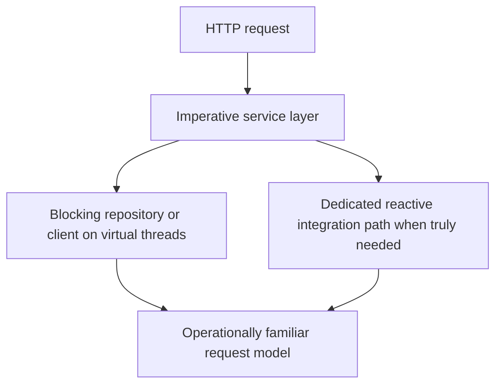

Part 1 treated reactive versus virtual threads as a workload decision.
Part 2 is where teams usually need more help: not choosing a slogan, but deciding how to live with a mixed platform where some paths are reactive, some are imperative, and the migration cost is real.

---

## The Harder Problem Is Mixed-Model Architecture

The clean comparison in architecture slides is usually not the real production situation.
What teams actually face is something like this:

- an existing MVC service needs better concurrency for blocking I/O
- one downstream client is already reactive
- another critical library is strictly blocking
- the team wants to avoid a half-reactive codebase that nobody can reason about

That is why part 2 should focus on migration boundaries and operational consistency rather than repeating the basic pros and cons.

---

## The Worst State Is Often Hybrid by Accident

The riskiest architecture is not fully reactive or fully imperative.
It is partially reactive by accident:

- request handling is reactive
- blocking database calls are still present
- thread dumps no longer tell the whole story cleanly
- backpressure assumptions stop at the first blocking integration

That state combines the cognitive cost of reactive with the runtime bottlenecks of blocking systems.

---

## A Better Migration Lens

Instead of asking "should we choose reactive or virtual threads," ask:

- where is the service blocking today
- which call paths are sensitive to fan-out or streaming pressure
- can the blocking dependencies be isolated behind clear boundaries
- what will the on-call team actually debug at 2 a.m.

That lens usually makes virtual threads the safer choice for incremental modernization, and reactive the stronger choice for intentionally non-blocking designs.

---

## A Practical Mixed-Stack Boundary

If you keep an imperative service shape but want efficient concurrency for blocking adapters, virtual threads often let you improve the service without rewriting its whole mental model.



This is not a purity model.
It is a containment model: reactive only where its strengths matter, imperative everywhere else.

---

## Concurrency Limits Still Matter with Virtual Threads

Virtual threads make blocking cheaper, but they do not make downstream capacity infinite.
You still need admission control around the slow dependency.

```java
@Configuration
class ClientConcurrencyConfiguration {

    @Bean
    Semaphore pricingClientPermits() {
        return new Semaphore(200);
    }
}
```

Then keep the service code straightforward while limiting downstream pressure:

```java
@Service
class PricingFacade {

    private final Semaphore pricingClientPermits;
    private final PricingClient pricingClient;

    PriceResponse fetch(String sku) throws InterruptedException {
        pricingClientPermits.acquire();
        try {
            return pricingClient.fetch(sku);
        } finally {
            pricingClientPermits.release();
        }
    }
}
```

This is a good example of the larger point: virtual threads change the thread model, not the capacity model.

---

## Reactive Should Earn Its Complexity

Reactive pays off most when the workload naturally needs:

- long-lived streams
- explicit backpressure
- composition of multiple async sources
- cancellation and flow control as first-class behavior

If the main business flow is still a standard request/response path around blocking infrastructure, reactive may create more operational surface area than value.

> [!NOTE]
> A service can use reactive clients or streaming subpaths without forcing the whole application into a reactive identity.

---

## Debugging Is Part of the Decision

When teams compare models only by throughput charts, they miss a crucial cost:
which system is easier to reason about when latency spikes, cancellations race, or one dependency becomes flaky.

Virtual-thread-based systems usually preserve a more familiar debugging story.
Reactive systems can be extremely effective, but only when the team is willing to invest in the tooling and mental model needed to operate them well.

---

## Failure Drill

A strong drill here is mixed dependency pressure:

1. keep one downstream client blocking and make it slow
2. keep another path reactive and high-volume
3. raise concurrent request load sharply
4. verify the service still exposes understandable saturation signals
5. decide whether the chosen model reduced complexity or just moved it

That drill is better than arguing from ideology because it reveals where the real bottleneck and operator burden actually live.

---

## Debug Steps

- inventory which dependencies are blocking, reactive, or mixed before choosing the model
- keep downstream concurrency limits explicit even on virtual threads
- inspect cancellation, timeout, and backpressure behavior under real load
- avoid partial reactive adoption unless the boundary is deliberate and documented
- prefer the model the team can diagnose consistently in production

---

## Production Checklist

- the service has a clear boundary between blocking and non-blocking paths
- concurrency control exists independently of the thread model
- operational tooling fits the chosen model
- mixed-model sections are deliberate, small, and documented
- the decision was validated against real dependency behavior, not only benchmark results

---

## Key Takeaways

- The hardest decision is usually not reactive versus virtual threads, but how to avoid an accidental hybrid architecture.
- Virtual threads are often the safer modernization path for imperative Spring services.
- Reactive should be adopted where backpressure and non-blocking composition are core to correctness.
- Capacity limits, timeout policy, and debugging ergonomics matter more than trend-driven model choice.
