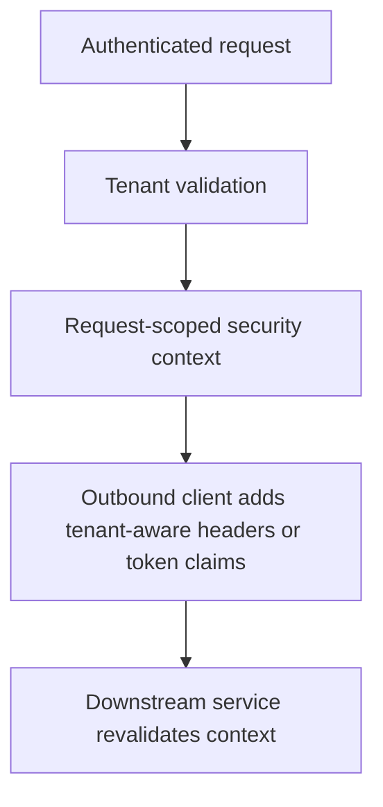

Part 1 focused on the edge: separating authentication, tenant resolution, and authorization so a valid identity cannot silently become a valid tenant switch.
Part 2 goes deeper into the next risk: once the edge accepts a request, how do you preserve tenant truth across downstream calls, async work, and operator access without leaking context or widening trust accidentally.

---

## The Harder Problem Is Context Propagation Without Context Leakage

Multi-tenant systems often validate the first hop correctly and then become weaker internally.
The usual failure pattern looks like this:

- the edge authenticates the user
- the tenant is validated once
- a downstream call switches to a broad service credential
- async processing loses the original tenant context
- support or operator paths bypass the same tenant checks entirely

That creates an unpleasant illusion: the request looked zero-trust at ingress, but became trust-me semantics after the first hop.

---

## Trust Boundaries Must Survive Internal Hops

The important follow-up question after edge validation is:
"What exactly do downstream services need to know?"

Usually the answer is some combination of:

- tenant identifier
- caller identity or delegated subject
- service identity
- scopes or permissions
- correlation metadata for auditing

If all of that gets collapsed into "internal call from a trusted service," the multi-tenant model becomes much weaker than the external design suggests.

---

## A Safer Propagation Shape



That last step matters.
Zero trust is weakened immediately if downstream systems treat propagated tenant data as true without their own validation rules.

---

## Keep Propagation Explicit in Code

```java
@Bean
RestClient restClient(RestClient.Builder builder) {
    return builder
            .requestInterceptor((request, body, execution) -> {
                TenantPrincipal principal = TenantSecurityContext.current();
                request.getHeaders().add("X-Tenant-Id", principal.tenantId());
                request.getHeaders().add("X-Subject-Id", principal.subject());
                return execution.execute(request, body);
            })
            .build();
}
```

This does two useful things:

- makes propagation policy reviewable
- keeps the service from "forgetting" tenant context on one ad hoc call path

It still assumes the current tenant context is trustworthy and request-scoped.
That means cleanup remains non-negotiable.

> [!IMPORTANT]
> Thread-local tenant context becomes a data leak risk the moment it crosses async boundaries without an explicit handoff strategy.

---

## Async Boundaries Need Special Handling

Part 1 already stressed clearing request-scoped context.
Part 2 is where async work becomes dangerous:

- `@Async` listeners may run on pooled threads
- scheduler threads may be reused across tenants
- background workflows may no longer have an end-user identity at all

That means async code needs a deliberate model:

- copy only the identity fields that are safe and necessary
- clear them after work finishes
- prefer explicit arguments or event payloads over ambient context when possible

If the async workflow becomes durable or long-lived, a signed or validated message contract is usually safer than trying to carry live thread context forward.

---

## Operator Access Needs a Different Contract

Support engineers, break-glass administrators, and platform operators should not fit awkwardly into the same tenant model as ordinary users.
If they do, teams often end up with broad hidden bypasses.

A safer pattern is to distinguish:

- tenant-scoped user access
- support access with explicit elevation and audit
- platform-level service access

That separation keeps "global operator" from becoming "unbounded tenant impersonation without traceability."

---

## Failure Drill

A strong drill here is downstream tenant confusion:

1. authenticate a user in tenant `A`
2. let the edge validate correctly
3. invoke an internal service hop with mismatched or missing tenant context
4. verify the downstream service rejects or quarantines the request
5. inspect logs to confirm the system records the identity mismatch clearly

This is how you discover whether zero-trust assumptions survive beyond the first filter chain.

---

## Debug Steps

- trace identity and tenant context across internal hops, not only at ingress
- inspect async executors and schedulers for context leakage risk
- verify downstream services revalidate propagated context instead of trusting headers blindly
- separate operator flows from ordinary tenant flows in tests and audits
- confirm denial paths are observable and attributable to the correct trust boundary

---

## Production Checklist

- downstream propagation rules are explicit and reviewed
- request-scoped tenant context is cleared across sync and async paths
- downstream services do not blindly trust upstream tenant headers
- support and operator access models are explicit and auditable
- identity mismatch events are visible in logs, metrics, and alerts

---

## Key Takeaways

- Zero trust is not complete at ingress; it has to survive internal propagation too.
- Multi-tenant security gets weaker quickly when async paths or internal calls lose or over-broaden context.
- Explicit propagation code is usually safer than ambient, implicit context spread.
- Operator access should be modeled separately from normal tenant access so elevation stays visible and auditable.
