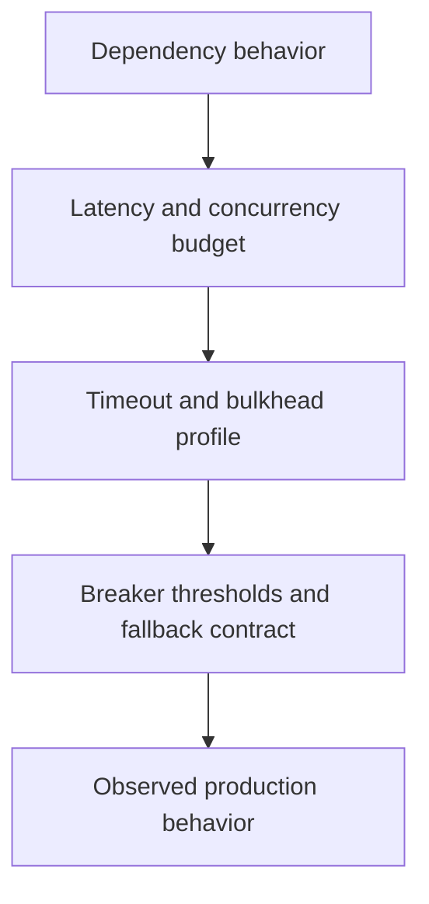

---
categories:
- Java
- Spring Boot
- Backend
date: 2026-07-19
seo_title: 'Resilience4j patterns in Spring: timeout, bulkhead, circuit breaker (Part
  2) - Advanced Guide'
seo_description: 'Advanced practical guide on resilience4j patterns in spring: timeout,
  bulkhead, circuit breaker (part 2) with architecture decisions, trade-offs, and
  production patterns.'
tags:
- java
- spring-boot
- backend
- architecture
- production
title: 'Resilience4j patterns in Spring: timeout, bulkhead, circuit breaker (Part
  2)'
toc: true
toc_icon: cog
toc_label: In This Article
header:
  overlay_image: "/assets/images/java-advanced-generic-banner.svg"
  overlay_filter: 0.35
  show_overlay_excerpt: false
  caption: Advanced Spring Boot Runtime Engineering
---
Part 1 established the core idea: timeout, bulkhead, and circuit breaker have to operate as one coordinated policy.
Part 2 goes deeper into the production problem that usually follows: once those controls exist, how do you tune them per dependency without creating a maze of fallbacks, retries, and contradictory failure behavior.

---

## The Harder Problem Is Dependency-Specific Policy

One resilience profile for every downstream call is almost always wrong.
Different dependencies fail differently:

- one is fast but occasionally spikes
- one is slow but stable
- one fails hard and should trip quickly
- one supports degraded reads but not degraded writes

If all of them share one timeout budget, one bulkhead shape, and one fallback style, the service ends up with policy consistency on paper and failure inconsistency in reality.

---

## Policy Has to Match Dependency Shape

The right second-step question is:
"What failure behavior is acceptable for this exact dependency?"

That usually breaks into:

- how much latency budget it is allowed to consume
- how much concurrency it may hold
- whether fallback is safe, partial, or forbidden
- whether retry should exist at all

This is where resilience stops being a library feature and becomes a contract with the dependency.

---

## A Better Tuning Model



If those four steps are not tied together, resilience tuning becomes guesswork.

---

## Named Profiles Are Better Than Hidden Defaults

```java
@Service
class PricingClientFacade {

    @CircuitBreaker(name = "pricing-api")
    @TimeLimiter(name = "pricing-api")
    @Bulkhead(name = "pricing-api", type = Bulkhead.Type.THREADPOOL)
    CompletableFuture<PriceQuote> fetchQuote(String sku) {
        return CompletableFuture.supplyAsync(() -> pricingClient.fetchQuote(sku));
    }

    CompletableFuture<PriceQuote> fallbackQuote(String sku, Throwable error) {
        return CompletableFuture.completedFuture(PriceQuote.unavailable(sku));
    }
}
```

The key is not the annotation count.
The key is that `pricing-api` should mean something operationally specific.
It should map to a documented budget and a real fallback policy, not just a copied block of config.

---

## Fallback Quality Matters More Than Fallback Existence

A fallback is only good if it preserves business truth.
Examples:

- cached price quote may be acceptable for catalog browsing
- "temporarily unavailable" may be acceptable for recommendation widgets
- synthetic success is almost never acceptable for payment or write paths

> [!IMPORTANT]
> A bad fallback can turn a visible dependency outage into silent data corruption or misleading business behavior.

That is why many write paths should fail fast instead of inventing degraded success.

---

## Retry Is the Most Dangerous Add-On

Retries often get added after the first resilience pass, and that is where systems start to amplify their own pain.

If you already have:

- a bounded timeout
- a constrained bulkhead
- a circuit breaker

then adding retries may do one of two things:

- rescue rare transient failures
- or multiply load on a struggling dependency right when it can least absorb it

The rule should be: retries only where the operation is safe, idempotent, and short enough to stay inside the total request budget.

---

## Failure Drill

A strong drill for this topic is partial degradation:

1. make the dependency slow, not completely unavailable
2. raise concurrent request volume until the bulkhead begins to protect
3. inspect timeout rate, rejection rate, and breaker state together
4. verify fallback responses remain business-safe
5. then add retries and confirm they help rather than amplify

This catches the common case where each control looks sensible in isolation but fails as a combined system.

---

## Debug Steps

- review timeout, bulkhead, breaker, and retry as one dependency policy
- graph timeout, rejection, and open-breaker metrics together
- inspect whether fallbacks trigger more downstream work than expected
- keep per-dependency profiles explicit instead of layering global defaults and exceptions
- validate that the total degraded path still fits the service-level latency budget

---

## Production Checklist

- each dependency has a named, documented resilience profile
- fallbacks are business-safe, not merely convenient
- retries are used only on safe operations with bounded budgets
- metrics distinguish timeout, rejection, breaker-open, and fallback paths
- operators can explain why a degraded response was returned

---

## Key Takeaways

- Part 2 of resilience work is dependency-specific tuning, not adding more annotations.
- A named resilience profile should reflect real latency, concurrency, and fallback rules.
- Fallback quality matters more than fallback quantity.
- Retries are helpful only when they stay inside the same disciplined budget as the rest of the resilience policy.
