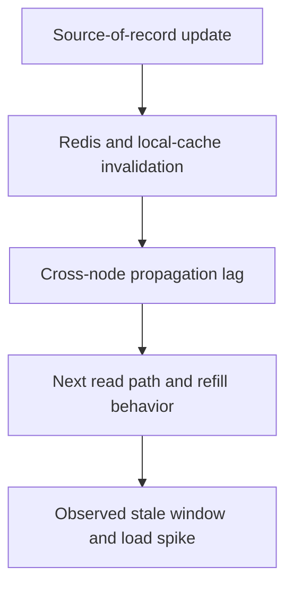

---
categories:
- Java
- Spring Boot
- Backend
date: 2026-07-20
seo_title: Advanced caching in Spring with Caffeine + Redis + invalidation (Part 2)
  - Advanced Guide
seo_description: Advanced practical guide on advanced caching in spring with caffeine
  + redis + invalidation (part 2) with architecture decisions, trade-offs, and production
  patterns.
tags:
- java
- spring-boot
- backend
- architecture
- production
title: Advanced caching in Spring with Caffeine + Redis + invalidation (Part 2)
toc: true
toc_icon: cog
toc_label: In This Article
header:
  overlay_image: "/assets/images/java-advanced-generic-banner.svg"
  overlay_filter: 0.35
  show_overlay_excerpt: false
  caption: Advanced Spring Boot Runtime Engineering
---
Part 1 established the real issue: once you add Caffeine, Redis, and invalidation, the design is no longer just about speed.
Part 2 is where the harder production question appears: how do you keep that cache hierarchy trustworthy when writes, fan-out lag, and partial failures all arrive at once.

---

## The Harder Problem Is Consistency Under Change

The first cache design often works in quiet traffic:

- read from local cache
- fall back to Redis
- repopulate from the database
- invalidate on update

The second version is where it gets real:

- an update races with a hot read path
- one node invalidates correctly and another misses the event
- Redis is slow exactly when the local cache expires
- repeated misses trigger a thundering herd toward the database

That is why part 2 should focus on coordination and failure behavior, not on cache annotation basics.

---

## The Real Design Question Is Stampede and Stale Window Control

Two questions matter more than raw hit rate:

- how long can stale data survive after a write
- what happens when many readers miss at the same time

If the team cannot answer both, the cache hierarchy may be fast but still unsafe.

---

## A Better Operational Model



This is the sequence to review in production.
If one of those links is only "probably fine," the cache design is not mature yet.

---

## Protect Refill Paths from Stampedes

When a hot key expires or is invalidated, many callers may race to repopulate it.
Some form of per-key coordination is often worth the complexity.

```java
class ProductCacheService {

    private final ConcurrentHashMap<String, ReentrantLock> keyLocks = new ConcurrentHashMap<>();

    ProductView getProduct(String productId) {
        ProductView local = localCache.getIfPresent(productId);
        if (local != null) {
            return local;
        }

        ReentrantLock lock = keyLocks.computeIfAbsent(productId, ignored -> new ReentrantLock());
        lock.lock();
        try {
            ProductView secondCheck = localCache.getIfPresent(productId);
            if (secondCheck != null) {
                return secondCheck;
            }
            return refillFromRedisOrSource(productId);
        } finally {
            lock.unlock();
        }
    }
}
```

This is not the only option, but it shows the right concern: refill pressure itself needs a policy.

---

## Invalidation Ordering Matters

The most common subtle bug is update ordering:

1. write new value to source of record
2. publish invalidation
3. some nodes still serve old local values
4. one node repopulates from stale distributed state

If the invalidation path and refill path are not sequenced carefully, the system can keep reintroducing stale data after the write has already committed.

> [!IMPORTANT]
> An invalidation strategy is only complete if it explains what happens during propagation delay, not only after all nodes eventually converge.

---

## Degraded Cache Modes Need Rules Too

Part 1 already framed Redis failure as important.
Part 2 is where you need to decide what degraded mode looks like:

- keep serving local cache for a short grace window
- bypass Redis and hit the database directly
- fail closed for data that must not be stale
- drop non-essential cache warmup entirely

Those modes should differ by data class.
Product catalog reads and entitlement checks should not share the same stale-data tolerance.

---

## Failure Drill

A strong drill here is invalidation lag plus refill pressure:

1. warm the same key on multiple nodes
2. update the source of record
3. delay one invalidation path artificially
4. force high read traffic immediately after the update
5. measure stale-window duration and refill amplification

This tells you whether the hierarchy stays correct under change, not only whether it is fast under steady-state reads.

---

## Debug Steps

- measure stale-read incidents alongside hit rates
- inspect refill amplification, not only miss counts
- trace invalidation from source-of-record write to every cache layer
- verify degraded behavior when Redis is slow or unavailable
- keep cache key shape and invalidation triggers explicit in code reviews

---

## Production Checklist

- stale-window tolerance is documented per data class
- refill behavior is protected against hot-key stampedes
- invalidation paths are tested across multiple nodes
- degraded cache behavior is intentional rather than accidental
- metrics distinguish local hits, Redis hits, misses, and stale-read events

---

## Key Takeaways

- Part 2 of cache design is about change management, not just read speed.
- The two hardest problems are stale-window control and refill stampede control.
- A hybrid cache is only trustworthy when invalidation ordering is as explicit as lookup ordering.
- Hit rate is useful, but stale correctness is the metric that protects the business.
