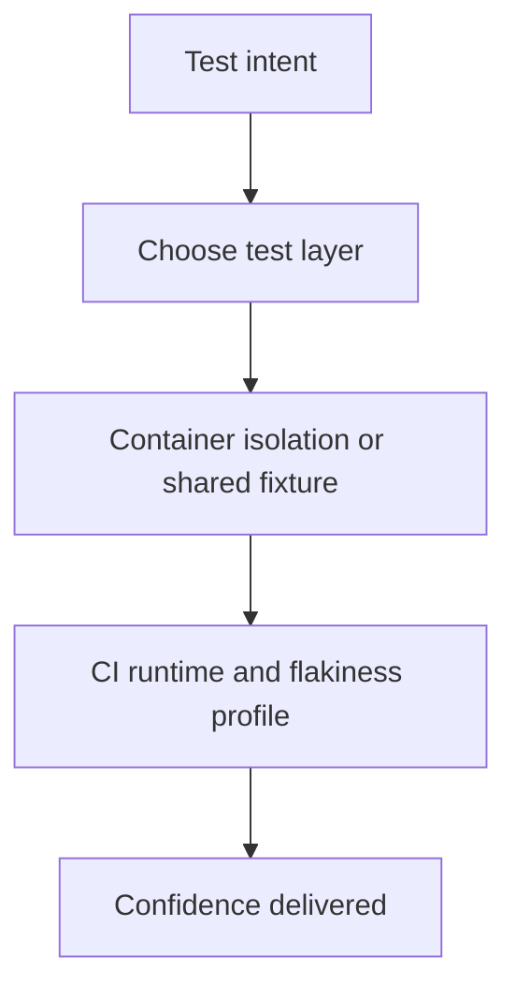

Part 1 established the basic rule: Testcontainers is most valuable when real dependency behavior matters.
Part 2 is about the next problem large teams actually hit: once container-backed tests become popular, how do you keep the suite fast, isolated, and economically trustworthy instead of turning every correctness question into a heavyweight integration run.

---

## The Harder Problem Is Test Portfolio Discipline

In a large Spring codebase, the first few Testcontainers tests feel like a clear win.
The tenth wave is where trouble starts:

- many modules start their own containers
- broad `@SpringBootTest` usage creeps upward
- CI runtime becomes hard to predict
- developers stop knowing which test layer is supposed to catch which class of bug

That is why part 2 should focus on test portfolio design, not just on how to start containers.

---

## Speed and Fidelity Are Both Budgeted Resources

Every test layer spends different kinds of budget:

- unit tests spend almost no infrastructure budget
- slice tests spend Spring wiring budget
- Testcontainers tests spend infrastructure realism budget
- end-to-end tests spend system-wide coordination budget

The mistake is assuming the most realistic test should answer every question.
In large systems, that makes the suite both slower and less intelligible.

---

## A Better Large-Codebase Strategy

Testcontainers works best when it is assigned to narrow, high-value responsibilities:

- repository behavior against the real database
- migration safety
- serialization or wire-compatibility checks
- message-broker semantics
- a small number of critical boundary workflows

It works badly when it becomes the default answer to uncertainty.

---

## The Real Trade-Off: Isolation Versus Reuse



This is where large-codebase testing gets nuanced.
Shared fixtures reduce cost, but they can also blur isolation and leak state if the suite is not disciplined.

---

## Shared Infrastructure Is Fine Only with Clear Reset Rules

For expensive dependencies, teams often reuse containers across a test class or test suite.
That can be a good trade if cleanup is explicit.

```java
@Testcontainers
abstract class AbstractPostgresIntegrationTest {

    @Container
    static final PostgreSQLContainer<?> postgres =
            new PostgreSQLContainer<>("postgres:16");
}
```

That base class is only healthy if the tests that extend it also enforce state reset through migrations, truncation, or per-test fixture setup.
Otherwise speed is bought by slowly weakening test trust.

> [!IMPORTANT]
> Shared containers are an optimization, not a license to let test order or leaked state determine correctness.

---

## Broad `@SpringBootTest` Use Should Stay Rare

The easiest test to write is often a full application context test.
The problem is that large codebases accumulate them faster than they justify them.

That creates three problems:

- longer startup times
- noisier failures with more unrelated wiring involved
- less clarity about what contract the test is actually proving

Part 2 of a mature testing strategy is pruning those tests back to the smallest layer that still proves the real thing.

---

## Failure Drill

A strong drill here is CI pressure:

1. classify a representative set of slow tests by intent
2. identify which ones truly need containers and full context
3. remove or narrow one noisy class of broad integration tests
4. measure runtime, flakiness, and bug-detection value afterward
5. keep the smaller layer only if it still catches the right failures

This is how teams stop cargo-culting test realism and start budgeting confidence deliberately.

---

## Debug Steps

- map slow tests to the exact failure class they are intended to catch
- prefer narrower Spring slices when the dependency contract is not the thing under test
- reuse containers carefully, but verify isolation on every shared-fixture layer
- measure CI timing and flaky-test rate as first-class quality metrics
- remove broad tests that do not catch failures the lower layers miss

---

## Production Checklist

- each test layer has a documented job
- shared containers have explicit reset or isolation rules
- broad `@SpringBootTest` usage is reviewed and justified
- CI runtime and flakiness trends are visible
- Testcontainers coverage focuses on true dependency semantics and migration risk

---

## Key Takeaways

- Part 2 of testing strategy is portfolio discipline, not more container usage.
- Shared fixtures are useful only when test isolation remains explicit and trustworthy.
- The most expensive test should prove something cheaper layers cannot.
- Large-codebase test quality depends as much on pruning as on adding coverage.
