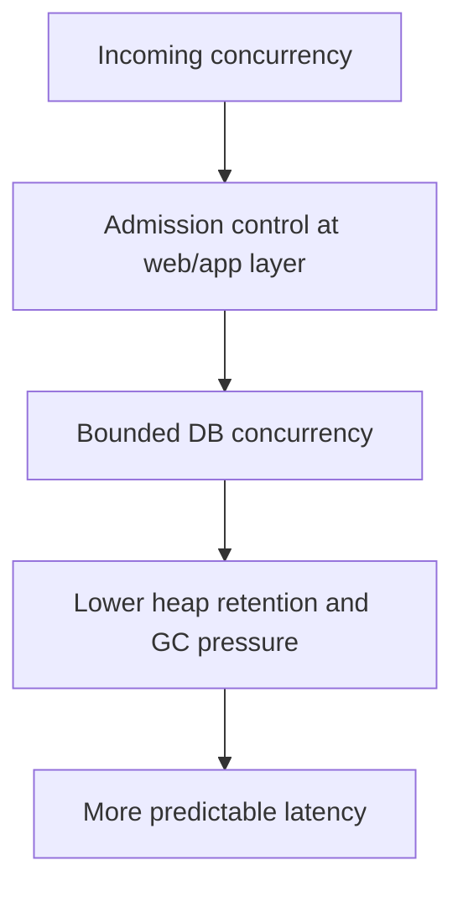

Part 1 established the main idea: thread pools, DB pools, and GC belong to the same capacity chain.
Part 2 is where teams usually get stuck next: once you know they interact, how do you tune the service without chasing symptoms across the wrong layer and making the bottleneck harder to see.

---

## The Harder Problem Is Capacity Mismatch

Many performance incidents are not raw shortage problems.
They are mismatch problems:

- the request pool can admit more work than the DB can absorb
- the DB pool is enlarged without checking database saturation
- the service queues enough work that heap pressure spikes before CPU does
- GC is tuned after the fact to survive excess in-flight work instead of reducing it

That is why part 2 should focus on capacity matching and queue discipline rather than on isolated knob tuning.

---

## Queueing Is Usually the Hidden Latency Multiplier

The dangerous part of a high-concurrency Spring service is often not active execution.
It is waiting:

- requests waiting for a worker thread
- workers waiting for a DB connection
- tasks waiting in executor queues
- objects waiting to die because the system is holding too much pending work

That means one of the highest-value questions is:
"Where are we allowing wait to accumulate?"

---

## A Better Load-Shedding Model



This is why reducing admitted work can improve latency even when it looks like "doing less."
The service becomes more predictable when it stops pretending every request can run at once.

---

## Make Concurrency Budgets Explicit in Code

```java
@Bean
TaskExecutor requestWorkExecutor() {
    ThreadPoolTaskExecutor executor = new ThreadPoolTaskExecutor();
    executor.setCorePoolSize(24);
    executor.setMaxPoolSize(24);
    executor.setQueueCapacity(50);
    executor.setThreadNamePrefix("request-work-");
    executor.initialize();
    return executor;
}
```

And if one downstream path is especially expensive, isolate it instead of letting it compete with everything else:

```java
@Bean
Semaphore reportingQueryPermits() {
    return new Semaphore(8);
}
```

```java
@Service
class ReportingService {

    private final Semaphore reportingQueryPermits;

    Report runHeavyReport(ReportRequest request) throws InterruptedException {
        reportingQueryPermits.acquire();
        try {
            return reportRepository.run(request);
        } finally {
            reportingQueryPermits.release();
        }
    }
}
```

This is not elegant by abstraction standards, but it is honest by capacity standards.
The service declares that one class of work is expensive and must be bounded.

> [!IMPORTANT]
> If the application is queueing heavily before the DB, increasing the DB pool can simply move the bottleneck deeper and make diagnosis harder.

---

## GC Tuning Should Follow Work Shaping

Once a team sees high pause time or allocation pressure, the instinct is often to tune the collector immediately.
Part 2 is where discipline matters:

- reduce retained in-flight work first
- reduce queue depth first
- reduce unnecessary retries and timeouts first
- then examine whether collector tuning is still needed

Otherwise the JVM gets treated as the first fix for an application-admission problem.

---

## Failure Drill

A strong drill here is controlled overload with one constrained downstream:

1. push concurrency until request latency starts to bend
2. watch executor queue depth, DB acquisition wait, and heap occupancy together
3. lower admitted application concurrency deliberately
4. compare p95 latency and GC pressure before touching collector settings
5. verify whether the system improved by shaping work rather than by tuning the JVM first

This is how teams learn whether the real problem is shortage, mismatch, or uncontrolled queueing.

---

## Debug Steps

- correlate queue depth, DB wait time, allocation rate, and latency in one view
- look for waiting saturation before CPU saturation
- bound expensive work classes separately when they distort the whole service
- treat GC as part of workload shape, not an isolated subsystem
- prefer fewer admitted requests over bigger hidden queues when overload begins

---

## Production Checklist

- executor, DB pool, and heap pressure metrics are reviewed together
- admitted concurrency is intentionally bounded
- expensive work classes have their own limits when needed
- queue depth is observable and kept finite
- GC tuning follows measured workload shape instead of replacing it

---

## Key Takeaways

- Part 2 of performance tuning is capacity matching, not more independent knob changes.
- Queueing is often the real latency multiplier in Spring services under load.
- Bounding admitted work can improve both latency and GC behavior.
- The best JVM tuning often starts by reducing unnecessary in-flight work first.
