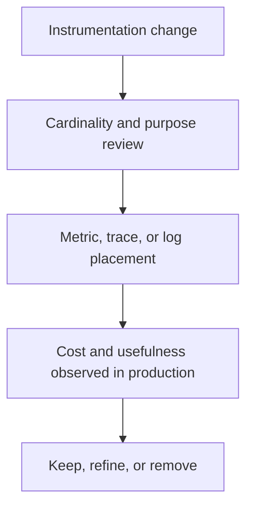

Part 1 established the core boundary: metrics should stay bounded while traces and logs carry richer request detail.
Part 2 is about the harder organizational problem: once instrumentation spreads across teams, how do you keep observability useful and affordable instead of letting every release add accidental telemetry debt.

---

## The Harder Problem Is Instrumentation Drift

Telemetry design often starts clean and becomes expensive gradually:

- one team adds a "temporary" tag for debugging
- another exports a new family of timers with slightly different names
- a third duplicates the same business dimension across metrics, traces, and logs
- six months later the platform pays for the sum of those decisions

That is why part 2 should focus on governance workflow, not just cardinality rules.

---

## Good Telemetry Needs Ownership, Not Only Libraries

The key follow-up question is:
"Who decides whether a new tag, span attribute, or meter name is worth its long-term cost?"

If the answer is "whoever touched the code," the observability estate will drift quickly.
At scale, telemetry behaves more like schema design than like logging convenience.

---

## A Better Governance Loop



Without the last step, telemetry only accumulates.
Teams rarely remove noisy instrumentation unless the process makes that cleanup explicit.

---

## Meter Filters Are a Good Safety Net, Not the Whole Strategy

Micrometer gives you one useful backstop: refuse or rewrite tags before they explode.

```java
@Bean
MeterFilter denyUnboundedTenantTag() {
    return MeterFilter.deny(id ->
            "tenant.id".equals(id.getTag("dimension")) || id.getTag("tenantId") != null);
}
```

That kind of filter can save the platform from a bad instrumentation release.
But it should not replace design review.
The ideal state is still that the team knows ahead of time whether a value belongs in:

- a metric tag
- a trace attribute
- a structured log field

---

## Dashboards Need Stable Semantics

One subtle failure mode is dashboard drift:

- metric names change for style reasons
- teams add slightly different labels for the same concept
- alerting starts depending on dimensions that are not guaranteed to remain bounded

Then the telemetry is technically rich but operationally brittle.

> [!IMPORTANT]
> The most valuable observability dimensions are the ones operators can depend on staying stable across releases.

---

## Sampling and Detail Belong in the Right Layer

Part 1 said rich detail often belongs in traces or logs.
Part 2 is where that becomes operational:

- metrics carry bounded, always-on signals
- traces carry richer context on selected requests
- logs carry event details when the team truly needs them

If all three layers try to carry the same detail, cost rises without adding much clarity.

---

## Failure Drill

A strong drill for this topic is telemetry-review under pressure:

1. simulate a release that adds one hot metric with an unbounded tag
2. verify whether meter filters or review gates catch it
3. move the same detail to a span attribute instead
4. compare query cost and debugging usefulness
5. decide whether the signal belongs in metrics at all

This teaches the team to govern telemetry as a product of trade-offs, not as a one-way stream of emitted data.


---

## Debug Steps

- review new telemetry like a schema change, not a log statement
- inspect top-cardinality metrics and top-cost exporters regularly
- use meter filters as a platform guardrail, not as the only line of defense
- keep dashboards and alerts bound to stable, low-cardinality dimensions
- remove duplicate telemetry when traces or logs already carry the needed detail

---

## Production Checklist

- instrumentation changes have an ownership and review path
- high-cardinality values are routed to traces or logs by default
- meter filters or similar guardrails protect the platform from obvious mistakes
- key dashboards rely on stable metric names and dimensions
- telemetry that is expensive and unused is removed, not merely tolerated

---

## Key Takeaways

- Part 2 of observability work is governance, not more raw emission.
- Telemetry needs ownership because cost and usefulness both compound over time.
- Meter filters are valuable safety rails, but they are not a substitute for instrumentation design.
- The best observability systems keep stable metrics lean and move richer detail to the layers designed to hold it.
