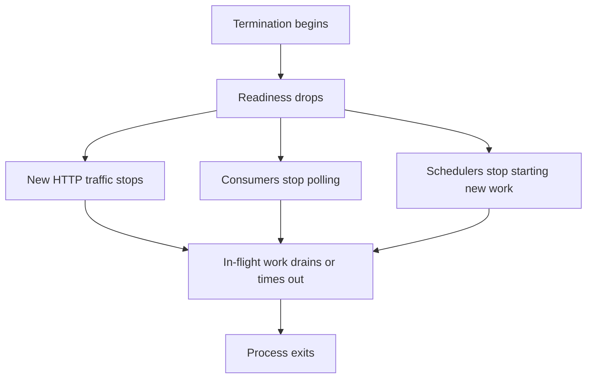

Part 1 established the basic shutdown story: stop new traffic, let in-flight work finish, and stay inside the platform termination budget.
Part 2 goes deeper into the real edge cases teams hit later: long-lived connections, background consumers, and workloads that do not behave like one short HTTP request.

---

## The Harder Problem Is Long-Lived Work

Shutdown gets much harder when the service owns work that outlives a normal request:

- streaming responses
- SSE or WebSocket sessions
- queue consumers with in-progress handlers
- scheduled jobs that might fire while the process is draining

These are the places where "Spring graceful shutdown is enabled" can still leave the service operationally unsafe.

---

## Not All Work Drains the Same Way

HTTP traffic, background jobs, and consumers need different shutdown semantics:

- short request/response traffic usually needs a bounded completion window
- queue consumers often need to stop polling before they stop processing
- stream-style connections may need explicit cutover or reconnect behavior

If all of those are treated as one generic drain process, the shutdown story is incomplete.

---

## A More Complete Shutdown Sequence



That is closer to the real contract teams need to review.
Shutdown is not only a web-server concern once the service owns asynchronous or long-lived work.

---

## Consumer Shutdown Needs a Separate Policy

One common miss is message consumption that keeps pulling work after the service has already started to drain.
At minimum, the service needs a way to stop new intake while letting current handlers finish or time out.

```java
@Component
class ShutdownAwareConsumerGate {

    private final AtomicBoolean acceptingMessages = new AtomicBoolean(true);

    @EventListener
    void onClosed(ContextClosedEvent event) {
        acceptingMessages.set(false);
    }

    boolean acceptingMessages() {
        return acceptingMessages.get();
    }
}
```

This is intentionally simple, but it shows the right idea:
shutdown-safe services stop admitting new units of work before they try to finish the old ones.

> [!IMPORTANT]
> If the service continues polling queues or accepting new background tasks during drain, graceful shutdown is mostly cosmetic.

---

## Long-Lived Connections Need an Explicit Exit Story

Part 1 covered standard request draining.
Part 2 should force a harder question:

- what should happen to SSE clients
- how should WebSocket clients reconnect
- how long may a long poll remain open

Sometimes the right answer is a bounded drain window.
Sometimes it is to terminate with a retryable signal and let the client reconnect elsewhere.

The point is that the behavior should be chosen, not discovered accidentally during rollout.

---

## Failure Drill

A strong drill for this topic is mixed-workload termination:

1. keep normal HTTP traffic flowing
2. keep one background consumer busy
3. keep one long-lived connection open
4. terminate one instance
5. verify each workload type follows the intended drain or reconnect path

This is more realistic than testing only short request completion, because it exercises the parts of shutdown most teams forget.


---

## Debug Steps

- separate shutdown behavior for HTTP, consumers, schedulers, and long-lived connections
- verify consumers stop intake before the process begins final drain
- inspect whether long-lived connections have a bounded and predictable exit path
- keep platform kill budget longer than the sum of the real drain windows
- test with live traffic and mixed workloads, not only idle termination

---

## Production Checklist

- readiness, consumer intake, and scheduler admission all stop in the right order
- long-lived connections have a defined reconnect or termination contract
- background executors and consumers respect shutdown state
- drain timing is validated against real platform termination windows
- mixed-workload shutdown drills are part of rollout confidence

---

## Key Takeaways

- Part 2 of graceful shutdown is about non-HTTP work and long-lived traffic.
- Safe termination means stopping intake before draining existing work.
- Long-lived connections need an explicit reconnect or timeout strategy.
- A shutdown story is only complete when it covers the full workload mix the service actually owns.
