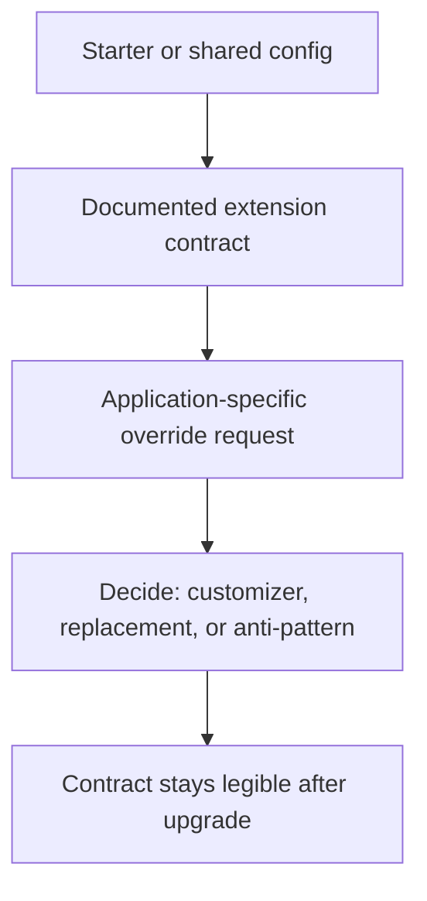

Part 1 explained how auto-configuration really works.
Part 2 focused on safe extension contracts.
Part 3 is the final operational question: how do you keep a custom Boot extension model understandable a year later, after new starters, dependency upgrades, and a second team have all touched it.

---

## The Final Problem Is Configuration Drift

Most Boot customization is not destroyed by one bad annotation.
It decays by accumulation:

- one team adds a narrow override
- another team excludes the starter entirely for one environment
- a dependency upgrade changes a condition outcome
- nobody can explain the final bean graph without reading three modules and two YAML files

That is why the final maturity step is not more extension points.
It is keeping the extension model legible over time.

---

## A Mature Customization Model Has an Owner and a Contract

By part 3, the questions are operational:

- who owns the starter or shared auto-configuration
- what is the supported customization contract
- what must remain stable across upgrades
- how does a team know when a local override should become a first-class extension point

If there is no answer, the application is building a framework without governance.

---

## The Right Review Loop



This is the real governance path.
It keeps every local override from becoming an accidental permanent branch of framework behavior.

---

## Prefer One Supported Way to Customize

```java
public interface AuditPublisherCustomizer {
    AuditPublisher customize(AuditPublisher publisher);
}
```

```java
@AutoConfiguration
class AuditAutoConfiguration {

    @Bean
    @ConditionalOnMissingBean
    AuditPublisher auditPublisher(ObjectMapper objectMapper,
            ObjectProvider<AuditPublisherCustomizer> customizer) {
        AuditPublisher publisher = new JsonAuditPublisher(objectMapper);
        AuditPublisherCustomizer candidate = customizer.getIfAvailable();
        return candidate != null ? candidate.customize(publisher) : publisher;
    }
}
```

This is not always the right abstraction, but it illustrates the part-3 goal:
one blessed customization path is usually easier to operate than five clever ones.

> [!NOTE]
> If every application needs a different workaround, the shared auto-configuration contract is probably underdesigned or solving too many problems at once.

---

## Upgrade Safety Is the Real Test

The best maturity drill for this topic is not a canary rollout.
It is a dependency upgrade:

- update one Boot or starter version
- inspect condition changes
- verify documented extension points still behave the same way
- check that unsupported overrides fail loudly, not silently

If the team cannot do this with confidence, the customization model is already too implicit.

---

## Failure Drill

1. choose one shared starter with known consumers
2. upgrade the dependency in a controlled branch
3. inspect `/actuator/conditions` and final bean graphs
4. verify supported customizations still work
5. identify any application relying on undocumented override behavior

This is how you find framework drift before it becomes production folklore.

---

## Debug Steps

- document supported extension points and treat everything else as suspect
- inspect condition reports during upgrades, not only incidents
- collapse overlapping customization mechanisms where possible
- review which overrides are local exceptions versus legitimate reusable contracts
- prefer type-based extension contracts over bean-name tricks and exclusions

---

## Production Checklist

- shared auto-configuration has a named owner
- supported extension points are documented and intentionally narrow
- upgrades are checked against real consuming applications
- local overrides are periodically reviewed for contract drift
- unsupported customization patterns fail clearly instead of silently

---

## Key Takeaways

- Part 3 of Boot customization is about long-term legibility.
- A shared starter becomes dangerous when many applications rely on undocumented override behavior.
- One supported customization path is usually healthier than many ad hoc ones.
- Upgrade safety is the best real-world test of whether the auto-configuration contract is mature.
