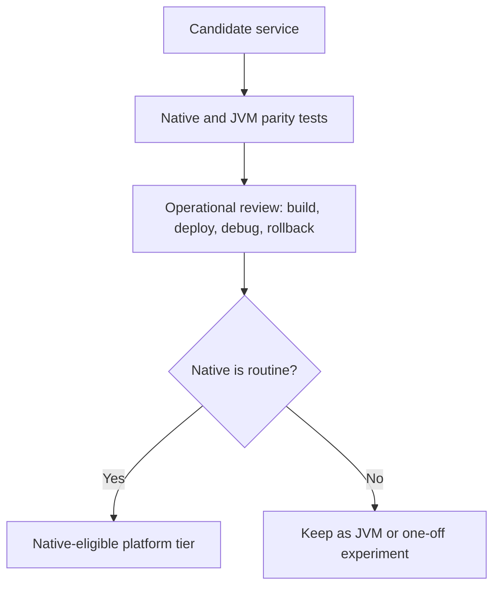

---
categories:
- Java
- Spring Boot
- Backend
date: 2026-07-26
seo_title: Spring AOT/native image tradeoffs for production services (Part 3) - Advanced
  Guide
seo_description: Advanced practical guide on spring aot/native image tradeoffs for
  production services (part 3) with architecture decisions, trade-offs, and production
  patterns.
tags:
- java
- spring-boot
- backend
- architecture
- production
title: Spring AOT/native image tradeoffs for production services (Part 3)
toc: true
toc_icon: cog
toc_label: In This Article
header:
  overlay_image: "/assets/images/java-advanced-generic-banner.svg"
  overlay_filter: 0.35
  show_overlay_excerpt: false
  caption: Advanced Spring Boot Runtime Engineering
---
Part 1 asked whether native images fit the workload.
Part 2 asked whether the platform could sustain a mixed deployment model.
Part 3 is the final decision layer: how do you know whether native is ready to become a repeatable platform choice instead of a one-service exception that everyone secretly hopes not to operate.

---

## The Final Problem Is Platform Repeatability

One service succeeding with native does not mean the platform is ready for native as a broader default.
The real maturity question is:

- can the team build, debug, and roll back native services routinely
- do runtime hints and compatibility work stay manageable
- is the CI/release cost justified across multiple services
- do incident playbooks feel normal rather than special-case

If the answer is "only for one hand-held service," native may still be valuable, but it is not yet a generalized platform model.

---

## The Right Outcome May Be a Tiered Platform

By part 3, the best answer is often not "all native" or "no native."
It is a clear tiering model:

- services that are good native candidates
- services that stay on the JVM by default
- criteria for moving from one tier to the other

That is healthier than a culture war around one runtime model winning permanently.

---

## A Better Adoption Loop



This is more honest than treating one benchmark win as a long-term platform decision.

---

## Keep the JVM Escape Hatch Deliberately Alive

```java
record RuntimeProfile(boolean nativePreferred, boolean jvmFallbackRequired) {

    static RuntimeProfile platformDefault() {
        return new RuntimeProfile(false, true);
    }
}
```

That is intentionally simple, but it captures the operational truth:
the platform should know whether native is preferred, optional, or experimental for a service class.

> [!IMPORTANT]
> If rollback to the JVM artifact is socially or operationally difficult, the platform will keep running native even when native is no longer the right choice.

---

## Incident Ergonomics Are Part of the Decision

The final maturity check is not "does the build pass."
It is "how ordinary does an incident feel."

- can on-call engineers recognize native-specific failure modes
- are logs, traces, and profiling alternatives sufficient
- does rollback happen fast when native behavior diverges

If the answer is no, the service may still be a good native candidate technically, but the platform model is not finished.

---

## Failure Drill

1. deploy both native and JVM variants of the same service
2. inject one reflection-sensitive or serialization-sensitive failure
3. compare diagnosis speed and rollback speed
4. decide whether native support feels operationally routine
5. update the service-tier decision accordingly

This is a better part-3 drill than a generic canary because it tests the human side of platform sustainability.

---

## Debug Steps

- keep JVM parity as a living comparison point, not a forgotten migration artifact
- review native candidacy per service, not by ideology
- track CI cost, build flakiness, and incident cost along with startup wins
- treat runtime hints as code that needs ownership and review
- promote native only where the operational story is boring enough to repeat

---

## Production Checklist

- services are classified by native suitability
- JVM rollback remains fast and practiced
- native-specific debugging expectations are documented
- build and release cost is acceptable at platform scale
- native adoption is reviewed as an ongoing platform choice, not a one-time migration

---

## Key Takeaways

- Part 3 of native adoption is about repeatability, not excitement.
- A tiered platform model is often healthier than a universal native mandate.
- JVM rollback should stay easy until native operations are truly routine.
- The final test for native maturity is whether incidents feel normal, not special.
