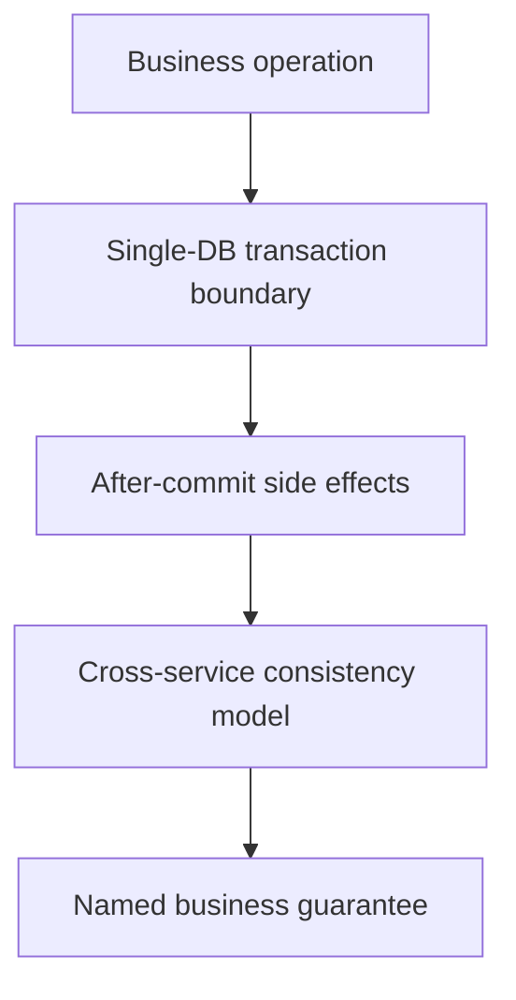

Part 1 separated propagation from isolation.
Part 2 tied both to business invariants under concurrency.
Part 3 is the final maturity step: how do you keep transaction design understandable across teams, services, and changing business flows so that "transactional" still means something precise a year later.

---

## The Final Problem Is Transactional Meaning Drift

Transaction design often degrades quietly:

- one service adds `REQUIRES_NEW` for audit
- another adds retries around the same workflow
- a new async step appears after commit
- a cross-service saga is described as "still transactional" even though the atomic boundary changed completely

That is how teams end up using one word, `transaction`, for multiple very different correctness models.

---

## A Mature System Names Its Guarantees Clearly

By part 3, the important question is not only "which annotation do we use."
It is:

- what is atomic in one database transaction
- what is durable but asynchronous
- what is eventually consistent across boundaries
- what side effects may outlive a business rollback

If those answers are not named clearly, the system is already difficult to reason about.

---

## A Better Language for Review



This is the kind of review sequence that keeps propagation, isolation, and eventual consistency from blurring into one vague concept.

---

## Document the Boundary in the Code Shape

```java
record PaymentCaptureResult(boolean persisted, boolean receiptQueued) {}
```

```java
@Service
class PaymentCaptureService {

    @Transactional
    PaymentCaptureResult capture(PaymentCommand command) {
        // persist payment state atomically
        // publish receipt event after commit
        return new PaymentCaptureResult(true, true);
    }
}
```

The value of a shape like this is not the record itself.
It is that the operation can state clearly what it guarantees now and what it delegates to after-commit processing.

> [!IMPORTANT]
> Once a workflow crosses service boundaries, calling the whole thing "one transaction" usually hides more than it explains.

---

## Cross-Service Work Needs Different Words

Part 3 should push teams away from transactional overclaiming.
Some workflows are:

- single-transaction and atomic
- locally atomic with after-commit side effects
- eventually consistent across services

Those are all valid, but they are not interchangeable.

---

## Failure Drill

1. choose one important business workflow
2. map which writes are inside one database transaction
3. map which side effects occur after commit
4. map which steps cross service boundaries
5. verify the documented business guarantee matches that real execution model

This is how teams stop using transactional language as a comfort blanket and start using it as a precise correctness label.

---

## Debug Steps

- describe transaction boundaries in business language, not only framework language
- separate local atomicity from cross-service consistency explicitly
- review every `REQUIRES_NEW` or after-commit side effect for semantic accuracy
- test concurrency invariants and partial-failure semantics together
- treat retry policies as part of the transactional meaning, not as a separate concern

---

## Production Checklist

- important workflows have named and documented consistency models
- transaction boundaries align with clear business responsibilities
- after-commit and cross-service behavior is not mislabeled as atomic
- retries, idempotency, and rollback assumptions are reviewed together
- operators can explain what "success" means at each stage of the workflow

---

## Key Takeaways

- Part 3 of transaction design is semantic clarity.
- Teams need different words for atomic, after-commit, and eventually consistent work.
- Transactional language should describe real guarantees, not hopeful intent.
- The healthiest transaction design is the one future maintainers can still explain without mythology.
