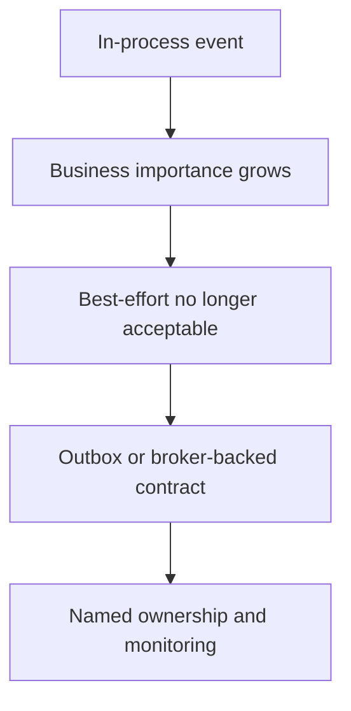

Part 1 clarified that Spring events are in-process coordination, not durable messaging.
Part 2 focused on async failure containment.
Part 3 is the final maturity step: deciding which event-driven flows are allowed to remain best effort and which ones have grown important enough to deserve durable delivery and stronger ownership.

---

## The Final Problem Is Event Contract Escalation

Many systems start with lightweight in-process events for good reasons.
The problem comes later when one of those listeners quietly becomes business-critical:

- finance cares about it
- another team depends on it
- missed delivery creates real customer impact
- but the code still treats it as best-effort async work

That is the moment where the architecture needs to decide whether the event stays local or graduates to a durable contract.

---

## Not Every Event Deserves a Broker, But Some Eventually Do

By part 3, the useful question is:
"What class of guarantee does this event need now?"

Typical categories:

- purely local side effect
- best-effort async convenience
- must-observe internal event
- cross-service durable integration event

The mistake is leaving all four in the same implementation model forever.

---

## A Better Evolution Path



This is not overengineering.
It is just refusing to leave important business guarantees hidden inside listener callbacks.

---

## Make Event Class Matter in the Code

```java
sealed interface OrderEvent permits LocalOrderAuditEvent, DurableOrderPlacedEvent {}

record LocalOrderAuditEvent(String orderId) implements OrderEvent {}
record DurableOrderPlacedEvent(String orderId) implements OrderEvent {}
```

Even a simple distinction like that can clarify design intent:

- some events are local convenience
- some are durable business contracts

That is healthier than making all listeners look equal while depending on them unequally.

> [!IMPORTANT]
> When the business treats an event as guaranteed but the code treats it as best effort, the system is carrying hidden reliability debt.

---

## Durable Delivery Needs a Different Boundary

For must-observe events, a typical next step is an outbox write inside the same transaction as the source-of-truth update:

```java
@Transactional
public void checkout(Order order) {
    orderRepository.save(order);
    outboxRepository.save(OutboxMessage.orderPlaced(order.id()));
}
```

That changes the operational model fundamentally.
Now the event is no longer "maybe the async listener ran."
It becomes "the state change and durable emission intent committed together."

---

## Ownership Matters as Much as Delivery

Part 3 also needs governance:

- who owns the event schema
- who owns retries and dead-letter handling
- who can add consumers
- which changes are backward compatible

Without that, a broker can still give you durable chaos.

---

## Failure Drill

1. choose one event currently handled in-process
2. ask whether missed delivery is truly acceptable
3. if not, model the durable alternative explicitly
4. compare operational ownership before and after the change
5. decide whether the event has outgrown the local listener model

This is the part-3 decision that keeps event-driven systems honest as they mature.

---

## Debug Steps

- classify each event by guarantee level, not only by implementation style
- review whether business-critical listeners are still hiding in best-effort executors
- promote durable events through an outbox or broker boundary when needed
- define event ownership and compatibility expectations explicitly
- remove local event patterns that no longer match business importance

---

## Production Checklist

- event types are classified by guarantee level
- must-observe events are not implemented as casual best-effort listeners
- durable event ownership and schema evolution are defined
- retry and dead-letter behavior belongs to someone concrete
- local events remain local only when their business impact truly allows it

---

## Key Takeaways

- Part 3 of event-driven design is deciding which events deserve stronger guarantees.
- In-process async listeners are fine for local best-effort work, not for hidden business contracts.
- Durable delivery and ownership usually need a boundary like an outbox or broker.
- Mature event-driven systems classify their events by business importance, not just by code shape.
