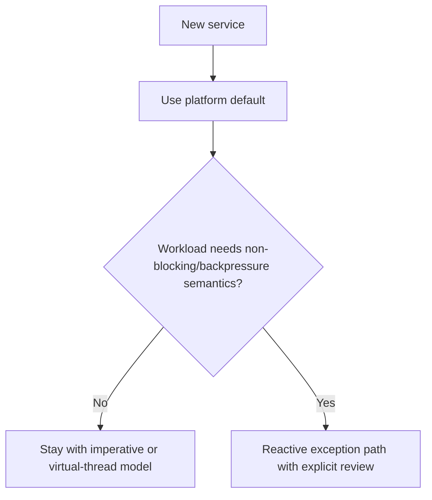

Part 1 framed reactive versus virtual threads as a workload decision.
Part 2 focused on mixed-model migration risk.
Part 3 is the final operational question: how does a team decide what becomes the platform default, what remains a special case, and how to avoid spending years debating runtime ideology instead of shipping reliable services.

---

## The Final Problem Is Platform Defaulting

Once a team has tried both models, the tension changes.
The question is no longer "which one is interesting."
It becomes:

- what should new services choose by default
- what exceptions are allowed
- who approves a divergent runtime model
- how much platform support exists for each path

If there is no answer, every new service reopens the same debate and the platform drifts.

---

## A Platform Default Is About Cognitive Cost Too

The best default is not always the most theoretically powerful model.
It is usually the model that:

- fits most workloads well enough
- keeps debugging and hiring approachable
- has the strongest shared tooling and operational literacy

That often makes virtual threads or imperative Spring the sensible default, with reactive reserved for workloads that genuinely need its semantics.

---

## A Better Decision Ladder



This is what keeps architecture choice from turning into recurring ideology theatre.

---

## Write Down the Exception Criteria

```java
record RuntimeChoiceGuide(
        boolean defaultImperative,
        boolean reactiveRequiresReview,
        boolean virtualThreadsPreferredForBlockingIo) {}
```

This is deliberately small, but it represents a healthy platform move:
stop treating runtime choice as personal taste and start treating it as an explicit engineering decision.

Typical reactive exception criteria might include:

- long-lived streams are central
- backpressure is part of correctness
- the full dependency path can stay genuinely non-blocking
- the owning team has real reactive experience

> [!NOTE]
> "It benchmarks well in isolation" is not enough reason to make a reactive exception part of a shared platform.

---

## Avoid Permanent Half-Commitment

Part 3 also has to watch for a common failure mode:
platforms that never choose.

That produces:

- multiple app models
- duplicated observability patterns
- two operational vocabularies
- recurring migration proposals that never finish

Sometimes "support both forever" is the right answer.
But if that is the choice, it should be intentional and budgeted, not just indecision wearing an architecture badge.

---

## Failure Drill

1. take a new service design
2. apply the platform default honestly
3. list the reasons it would need a runtime exception
4. verify those reasons are workload-driven, not preference-driven
5. document the decision so the next team does not restart the same argument

That is the part-3 discipline that keeps runtime choice from becoming platform folklore.

---

## Debug Steps

- define a platform default explicitly
- define narrow criteria for exceptions
- review whether the full dependency path actually matches the chosen model
- track operational and cognitive cost, not only throughput claims
- prevent one-off architectural enthusiasm from silently becoming platform policy

---

## Production Checklist

- new services have a documented runtime default
- exceptions require real workload evidence
- shared tooling and observability fit the supported models
- teams know what support they get for each runtime path
- platform diversity is intentional rather than accidental

---

## Key Takeaways

- Part 3 of runtime choice is platform governance.
- The best default is usually the one the platform can support calmly and repeatedly.
- Reactive should be an explicit exception where its semantics are genuinely required.
- Runtime ideology is cheaper to argue than to operate; mature platforms optimize for operability instead.
