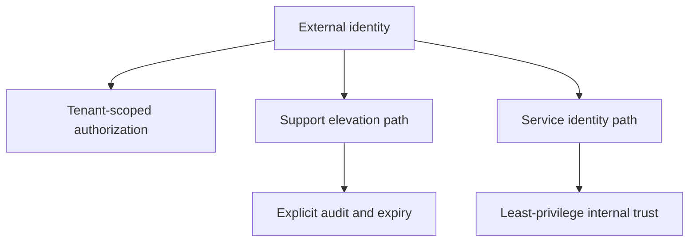

---
categories:
- Java
- Spring Boot
- Backend
date: 2026-07-30
seo_title: Spring Security for multi-tenant and zero-trust service edges (Part 3)
  - Advanced Guide
seo_description: Advanced practical guide on spring security for multi-tenant and
  zero-trust service edges (part 3) with architecture decisions, trade-offs, and production
  patterns.
tags:
- java
- spring-boot
- backend
- architecture
- production
title: Spring Security for multi-tenant and zero-trust service edges (Part 3)
toc: true
toc_icon: cog
toc_label: In This Article
header:
  overlay_image: "/assets/images/java-advanced-generic-banner.svg"
  overlay_filter: 0.35
  show_overlay_excerpt: false
  caption: Advanced Spring Boot Runtime Engineering
---
Part 1 focused on edge trust boundaries.
Part 2 focused on internal propagation and context leakage.
Part 3 is the final maturity step: how does a multi-tenant zero-trust model stay governable over time, especially as support paths, operator access, and service-to-service identity become more complex than the original user-facing edge.

---

## The Final Problem Is Trust-Model Governance

A multi-tenant edge often begins cleanly and then gets more complicated:

- support engineers need elevated access
- background jobs need service identities
- internal services need delegated scopes
- incident response wants break-glass behavior

If those additions are not governed carefully, the zero-trust model slowly turns into a collection of special cases that everyone treats as normal.

---

## A Mature Tenant Model Separates Roles Explicitly

By part 3, the core question is:
"Who is allowed to act in whose name, under what audit trail?"

That means keeping separate categories for:

- tenant-scoped end users
- support users with explicit elevation
- internal service identities
- platform operators and break-glass flows

If those categories collapse into one broad admin model, the multi-tenant contract is already eroding.

---

## A Better Trust Map



This is what keeps a strong tenant model from dissolving into implicit exceptions.

---

## Put Elevation in the Model, Not in Hidden Bypasses

```java
record AccessContext(
        String subject,
        String tenantId,
        boolean supportElevated,
        boolean serviceIdentity) {}
```

Even a small explicit model like this is healthier than relying on "special admin header" or hidden support-only paths.
Once elevation exists, the code should say so.

> [!IMPORTANT]
> Break-glass access is not a reason to weaken normal tenant boundaries. It is a reason to model exception paths with stronger audit and tighter time limits.

---

## Service-to-Service Trust Should Stay Narrow

One of the biggest long-term risks is broad internal trust:

- one internal service is allowed to act for all tenants
- propagation rules become "trusted because internal"
- downstream authorization stops being tenant-aware

That creates a system that sounds zero-trust at the edge and wide-open inside.

---

## Failure Drill

1. choose a support or internal-service flow
2. verify what tenant scope it can assert
3. verify how elevation is granted, logged, and expired
4. verify downstream services see the right identity shape
5. reject any path where "internal" silently becomes "allowed everywhere"

This is the kind of part-3 test that keeps exception handling from turning into trust-model collapse.

---

## Debug Steps

- classify identity paths explicitly: user, support, service, operator
- audit elevation and impersonation flows as first-class security features
- verify downstream services keep tenant-aware authorization active
- reject broad internal credentials that bypass tenant boundaries silently
- review whether every exception path still fits the zero-trust model on purpose

---

## Production Checklist

- tenant, support, service, and operator access paths are modeled separately
- elevation is explicit, time-bounded, and audited
- internal services use least-privilege identities
- downstream services remain tenant-aware instead of trusting internal callers blindly
- trust-model exceptions are reviewed like security-sensitive schema changes

---

## Key Takeaways

- Part 3 of multi-tenant zero-trust design is governance of exception paths.
- Support access, service identity, and break-glass flows should be explicit security models, not hidden shortcuts.
- Zero trust is weakest where "internal" quietly becomes "trusted."
- Mature tenant systems preserve strong boundaries even when real-world operators need elevated access.
