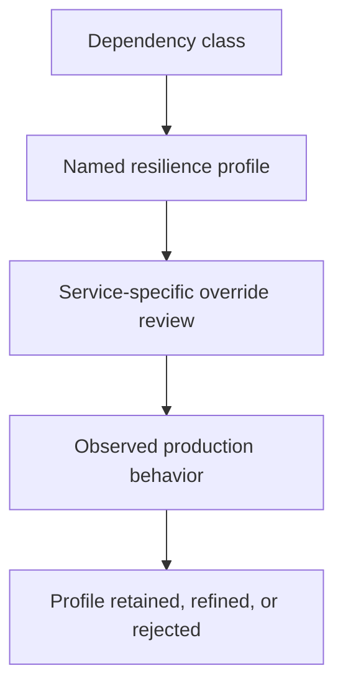

Part 1 established that timeout, bulkhead, and circuit breaker need to act as one policy.
Part 2 focused on dependency-specific tuning and fallback quality.
Part 3 is the final maturity step: how does a platform keep resilience rules clear, owned, and safe as more dependencies and more teams start relying on them.

---

## The Final Problem Is Resilience Policy Ownership

Resilience controls often begin as local defensive code and turn into shared platform behavior over time:

- one team defines the first timeout profile
- another copies it for a very different dependency
- a platform module adds defaults
- nobody knows who owns the policy when production behavior becomes confusing

That is how resilience grows from a useful safety layer into a hidden source of inconsistent behavior.

---

## A Mature Platform Treats Resilience as Contract, Not Decoration

By part 3, the important questions are:

- who owns resilience profiles per dependency class
- which defaults are platform policy and which are service-local
- what fallback behaviors are allowed in shared code
- how are retries, breakers, and timeouts reviewed together

If those answers are missing, resilience becomes copy-paste architecture.

---

## A Better Ownership Loop



This loop is what keeps resilience settings from drifting into superstition.

---

## Shared Defaults Should Stay Narrow and Explainable

```java
record ResilienceProfile(
        Duration timeout,
        int maxConcurrentCalls,
        boolean fallbackAllowed,
        boolean retryAllowed) {}
```

```java
class PricingDependencyProfile {

    static ResilienceProfile defaultProfile() {
        return new ResilienceProfile(Duration.ofMillis(300), 20, true, false);
    }
}
```

This is deliberately simple, but it shows the right part-3 instinct:
resilience settings should be named and reviewable as policy, not buried as incidental annotations.

> [!IMPORTANT]
> Shared fallbacks are especially dangerous. A platform default should never quietly return misleading business success just because a common dependency failed.

---

## Retry and Fallback Need Stronger Scrutiny Than Timeouts

Timeouts and bulkheads are often mechanical safety tools.
Retries and fallbacks are semantic tools:

- retries can multiply pressure
- fallbacks can change business truth

That means part 3 should treat them as policy decisions with owners, not as harmless library add-ons.

---

## Failure Drill

1. choose one shared resilience profile used by multiple services
2. verify which dependencies it actually matches well
3. inspect whether fallback and retry semantics are still business-safe in every consumer
4. remove or narrow any shared rule that creates semantic mismatch
5. keep only the parts of the profile the platform can genuinely own

This is how teams stop treating resilience defaults as universal truths.

---

## Debug Steps

- name resilience profiles by dependency role, not by random service nickname
- review retries and fallbacks as semantic behavior, not just technical configuration
- compare shared defaults against actual dependency latency and failure patterns
- remove copied settings that no longer match the workload
- ensure operators can explain why a timeout, rejection, fallback, or open breaker happened

---

## Production Checklist

- resilience profiles have explicit owners
- shared defaults stay narrow and dependency-shaped
- fallbacks are business-safe and intentionally reviewed
- retries are used only where they are safe and budgeted
- the platform can explain and evolve resilience policy without folklore

---

## Key Takeaways

- Part 3 of resilience design is ownership and policy clarity.
- Shared defaults are useful only when they match real dependency classes.
- Retry and fallback behavior deserve stronger scrutiny than mechanical safety settings.
- Mature resilience systems are reviewed as business-affecting policy, not as annotation trivia.
