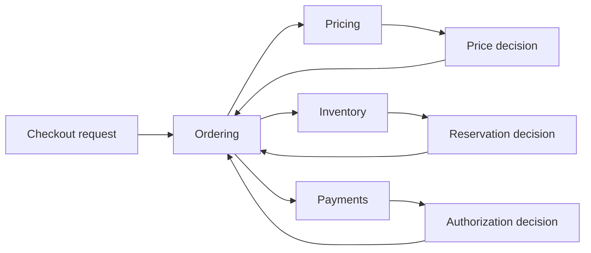

Splitting a monolith into services is easy on a slide and expensive in production. The real work is deciding which business decisions deserve an independent ownership boundary and which ones should stay in the same transaction, release cadence, and incident blast radius.

This first part is about the decomposition decision itself. Before talking about sagas, async messaging, or platform standards, we need a reliable way to answer a simpler question: where should one service stop and another begin?

## What A Good Boundary Actually Protects

A bounded context is not just a namespace or a team folder. It is the place where a domain model, business language, and operational ownership all line up.

When a boundary is healthy:

- the owning team can change rules without coordinating every release with another team
- the data model reflects one business concept instead of several competing ones
- failures degrade locally instead of forcing many services into the same incident
- the API expresses a business capability, not a thin wrapper around shared tables

When a boundary is unhealthy, the architecture looks distributed but the decision-making still behaves like one tightly coupled system.

> [!WARNING]
> Splitting by technical layers such as `user-service`, `order-dao-service`, and `notification-service` usually creates network hops without creating real ownership boundaries.

## The Smells Of A Distributed Monolith

Teams usually know they have "too much coupling," but the useful question is what kind.

Here are the most reliable early signals:

| Smell | What it usually means |
| --- | --- |
| Two services must deploy together to ship one feature | The boundary is organizationally fake |
| One workflow requires many synchronous calls to finish a user action | The decomposition is too chatty for the transaction you are trying to preserve |
| Multiple services write the same core business data | Ownership is ambiguous |
| Reporting needs direct database joins across services | The read model strategy was never designed |
| Engineers describe one workflow using different business terms in each service | The domain language is fractured |

These smells matter more than whether the codebase is "modular." A modular distributed monolith is still a distributed monolith.

## Start From Business Invariants, Not Endpoints

The safest way to decompose a system is to anchor each service boundary to a business invariant.

Examples:

- `Inventory` owns "available stock cannot go below zero"
- `Billing` owns "an invoice must reconcile with a payment state"
- `Identity` owns "a user credential change invalidates older trust assumptions"

If you cannot name the invariant a service protects, the service is probably just a transport boundary.

### A Useful Design Sequence

1. List the business capabilities the system provides.
2. For each capability, identify the core state transitions and invariants.
3. Ask which state must stay strongly consistent in the same write path.
4. Ask which state can be published and consumed asynchronously.
5. Draw boundaries only after the first four answers are clear.

This sequence prevents a common failure mode: decomposing around API routes and discovering later that the real consistency boundary cuts across all of them.

## A Practical Example: Commerce Platform

Suppose we are splitting an e-commerce platform. A weak decomposition often starts like this:

- `cart-service`
- `checkout-service`
- `payment-service`
- `order-service`
- `email-service`

That list sounds reasonable, but it can hide a problem: if `checkout-service` coordinates inventory reservation, payment authorization, promotion validation, shipping calculation, and order creation in one synchronous flow, it has become the real monolith boundary.

A stronger domain-first split looks more like:

- `Catalog`: product information and browse-facing attributes
- `Pricing`: price policy, promotions, and eligibility rules
- `Inventory`: stock reservation and availability truth
- `Ordering`: order lifecycle and customer-visible order state
- `Payments`: authorization, capture, refund, and settlement outcomes

Each service now owns a business concept instead of a screen flow.

## A Boundary Review Diagram



The key point is not the arrows. It is the ownership behind each decision. `Ordering` coordinates the workflow, but it does not own pricing rules, stock truth, or payment state.

## What Should Stay In The Same Service

A lot of bad decompositions come from treating every business capability as independently deployable by default. In practice, some things belong together.

Keep behavior in the same service when:

- the same transaction protects the same invariant
- the same engineers change the code together most of the time
- low-latency synchronous interaction is essential to user-facing correctness
- splitting would create duplicate domain concepts and reconciliation logic

For example, if discount eligibility is inseparable from pricing policy, separating them into `discount-service` and `pricing-service` may create more ambiguity than flexibility.

## What Can Be Split Safely

A boundary is easier to separate when:

- the upstream service only needs a published fact, not internal decision logic
- the downstream state can arrive with eventual consistency
- a queue or retry can absorb temporary unavailability
- the consumer can tolerate stale reads or rebuild its own read model

This is why notifications, search indexing, recommendation models, and many analytics workloads are usually safer to split than core order placement.

## An API That Reflects Ownership

A good service contract exposes a business decision, not internal tables.

```java
public interface InventoryReservationService {
    ReservationResult reserve(ReserveInventoryCommand command);
}

public record ReserveInventoryCommand(
        String orderId,
        String sku,
        int quantity
) {}

public sealed interface ReservationResult permits Reserved, Rejected {}

public record Reserved(String reservationId, Instant expiresAt) implements ReservationResult {}

public record Rejected(String reasonCode) implements ReservationResult {}
```

This interface says something important about the boundary:

- `Inventory` owns reservation
- the caller receives a business result, not raw storage details
- rejection is part of the contract, not an exceptional surprise

That is far healthier than exposing CRUD endpoints like `PATCH /inventory/row/123`.

## Data Ownership Is Part Of Decomposition

Teams often draw good service boxes and then quietly share the same database. That decision usually postpones pain rather than removing it.

If two services can update the same table directly:

- contract drift becomes invisible
- rollout safety depends on hidden schema coordination
- debugging becomes political because ownership is shared during incidents

There are exceptions during migration, but they should be treated as temporary debt with an exit plan.

> [!NOTE]
> Shared databases are sometimes useful as a transition step during extraction from a monolith. They are dangerous when treated as a steady-state architecture.

## Questions To Ask In A Decomposition Review

Before approving a new service boundary, ask:

1. What invariant does this service own?
2. What user-facing workflow breaks if this service is unavailable?
3. Which other teams must coordinate releases when this contract changes?
4. Can the consumer rebuild what it needs from events or published read models?
5. Are we splitting because of domain ownership, or because the codebase feels crowded?

If the answers are fuzzy, the boundary is probably still design fiction.

## Failure Drill

Run one realistic exercise before finalizing the split:

- make the downstream dependency slow or unavailable
- observe whether the caller fails fast, degrades safely, or fans out retries
- check whether dashboards show which boundary actually owns the failure
- confirm whether a product team can explain the customer impact in plain language

That drill catches boundaries that look elegant in architecture review but collapse under latency and coordination pressure.

## Key Takeaways

- A bounded context is valuable only when domain language, data ownership, and operational ownership point to the same place.
- Start decomposition from invariants and write paths, not from screens or controller routes.
- The most expensive bad boundary is the one that forces synchronous coordination across many services.
- If a service cannot explain what business decision it owns, it is probably not a real boundary yet.
