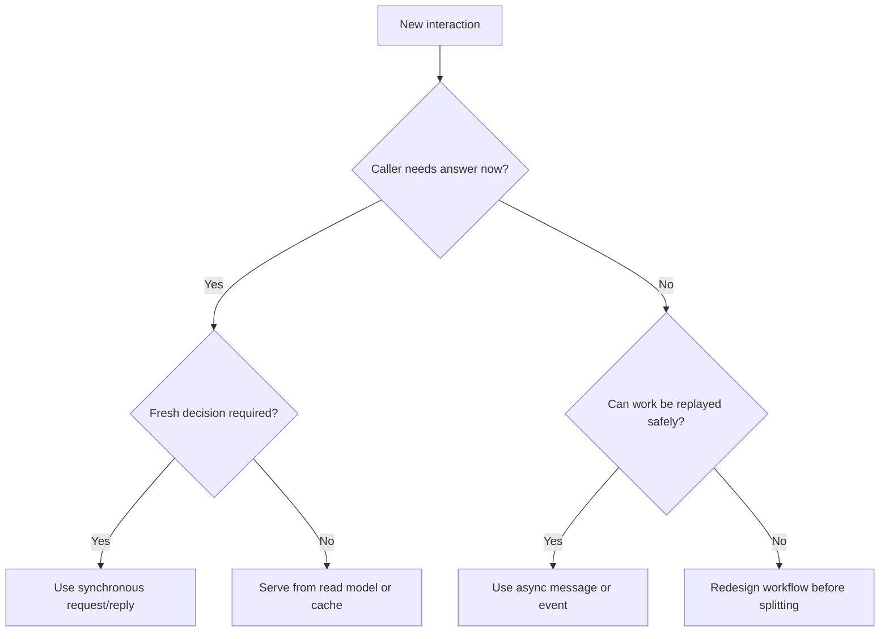

---
categories:
- Java
- Microservices
- Architecture
date: 2026-08-02
seo_title: Sync vs async communication selection framework - Advanced Guide
seo_description: Advanced practical guide on sync vs async communication selection
  framework with architecture decisions, trade-offs, and production patterns.
tags:
- java
- microservices
- distributed-systems
- architecture
- backend
title: Sync vs async communication selection framework
toc: true
toc_icon: cog
toc_label: In This Article
header:
  overlay_image: "/assets/images/java-advanced-generic-banner.svg"
  overlay_filter: 0.35
  show_overlay_excerpt: false
  caption: Microservices Architecture and Reliability Patterns
---
Teams often treat sync versus async communication as a style preference. In production, it is really a decision about latency budgets, failure visibility, ownership boundaries, and how much coordination the business workflow can tolerate.

The wrong choice creates familiar pain:

- synchronous call chains that turn one slow dependency into a user-facing outage
- asynchronous flows that hide business failure for too long
- retries in the wrong layer, creating duplicates and load amplification
- teams that cannot explain which system is the source of truth during an incident

This part builds a selection framework, not a slogan. The goal is to decide deliberately when a request needs an immediate answer and when a durable handoff is the healthier design.

## Start With The User Contract

Before discussing Kafka, REST, or gRPC, ask what the caller has actually been promised.

There are only a few meaningful user contracts:

| Caller expectation | Communication default |
| --- | --- |
| "Tell me now whether this action succeeded" | Synchronous |
| "Accept the work and finish it later" | Asynchronous |
| "Show me the current state for this resource" | Synchronous read |
| "Notify other systems that something already happened" | Asynchronous event |

If the business contract is ambiguous, the technical design will usually become ambiguous too.

## When Synchronous Communication Is The Right Tool

Use synchronous communication when the caller genuinely needs a fresh answer in the same interaction.

Typical cases:

- validating credentials before issuing a token
- checking whether a reservation can be made right now
- retrieving a read model that the user expects to see immediately
- issuing a command whose success or failure directly affects the current UX path

Synchronous calls work well when:

- the dependency is part of the critical path by design
- the latency budget is known and defended
- failure semantics are explicit
- the caller can make a clear decision on timeout or rejection

They work badly when teams silently turn them into workflow orchestration across many services.

> [!WARNING]
> A short synchronous chain can be healthy. A long synchronous chain usually means you are preserving transaction-like coupling across service boundaries.

## When Asynchronous Communication Is The Better Choice

Use asynchronous communication when the business can tolerate deferred completion and the main goal is durable decoupling.

Typical cases:

- publishing that an order was created so downstream systems can react
- sending emails, notifications, or audit trails
- updating search indexes and analytical projections
- kicking off compensation or reconciliation processes

Async handoff is especially useful when:

- the consumer is allowed to be temporarily unavailable
- retries should happen outside the user request path
- the producer only needs to record a fact, not wait for downstream work
- many consumers need the same event

The trade-off is operational: you gain decoupling, but you must design for delayed visibility, replay, idempotency, and eventual consistency.

## A Practical Selection Matrix

| Question | If the answer is yes | Preferred style |
| --- | --- | --- |
| Does the caller need an answer before proceeding? | The workflow blocks without it | Sync |
| Can the work be acknowledged and completed later? | Yes, with traceable status | Async |
| Is downstream unavailability acceptable for a short period? | Yes | Async |
| Does the action change system-of-record state that the user depends on immediately? | Yes | Usually sync at the ownership boundary |
| Are multiple subscribers expected to react independently? | Yes | Async event |

The phrase "usually" matters. Architecture decisions here are not religious rules. They are risk-management decisions.

## A Checkout Example

Imagine the checkout path in a commerce platform.

Good synchronous candidates:

- pricing validation
- inventory reservation
- payment authorization

Good asynchronous candidates:

- send order confirmation email
- update recommendation features
- publish shipment preparation event
- feed analytics and fraud-learning pipelines

Why? Because checkout cannot honestly tell the user "your order is accepted" without the first set of decisions. The second group is important, but not part of the same immediate truth contract.

## A Simple Decision Diagram



This is the architecture conversation teams should have before reaching for transport technology.

## Keep Retry Logic In The Right Layer

One reason sync versus async decisions go bad is that retries are scattered everywhere.

Bad pattern:

- client retries HTTP
- gateway retries again
- service retries database calls
- asynchronous consumer later retries the same logical operation

That stack creates duplicate pressure and unpredictable latency.

A better rule is:

- retry close to transient infrastructure failures
- do not retry business rejections as if they were transport faults
- make async consumers idempotent because replay is part of the design

```java
public record PaymentAuthorizationRequest(String orderId, BigDecimal amount) {}

public sealed interface AuthorizationResult permits Authorized, Declined, RetryableFailure {}

public record Authorized(String authId) implements AuthorizationResult {}
public record Declined(String reasonCode) implements AuthorizationResult {}
public record RetryableFailure(String dependency, Duration retryAfter) implements AuthorizationResult {}
```

This contract is useful because it separates business decline from transient failure. That distinction is what makes a synchronous path operationally safe.

## Ownership Changes The Answer

The same workflow can contain both sync and async edges depending on ownership.

Examples:

- `Ordering -> Inventory` may be synchronous when reservation is part of the acceptance decision
- `Ordering -> Notification` should usually be asynchronous because it is a side effect, not the source-of-truth write
- `Payments -> Ledger` may be asynchronous if the payment service records the durable fact first and the ledger consumes that fact later

What matters is not the transport style in isolation. What matters is which service owns the business decision the caller is waiting on.

## Failure Drills Worth Running Early

Before finalizing the design, simulate:

1. a slow synchronous dependency
2. an async consumer that is down for thirty minutes
3. duplicate delivery in the async path
4. a timeout where the caller is unsure whether the downstream action succeeded

If the team cannot explain what the user sees and what operators should do in each case, the communication model is not ready.

## Common Mistakes

- using async to hide a badly defined synchronous dependency
- using sync because "it is simpler" even when the workflow is naturally decoupled
- emitting events without a durable source-of-truth write
- pushing long-running work into request threads and calling it synchronous design
- assuming eventual consistency is free because the broker accepted the message

## Key Takeaways

- Choose sync when the current interaction needs an immediate, trustworthy decision.
- Choose async when the system can acknowledge work now and complete it later with durable handoff semantics.
- The right answer depends more on business contract and ownership than on transport preference.
- If retries, timeouts, and duplicate handling are not designed explicitly, the communication choice is still incomplete.

---

## Design Review Prompt

For every service interaction, force the team to answer three questions:

1. What does the caller need to know right now?
2. Which service owns the truth being requested?
3. What happens if the dependency is slow, down, or processes the work twice?

If those answers point in different directions, the communication style probably has not been chosen for the right reason.
