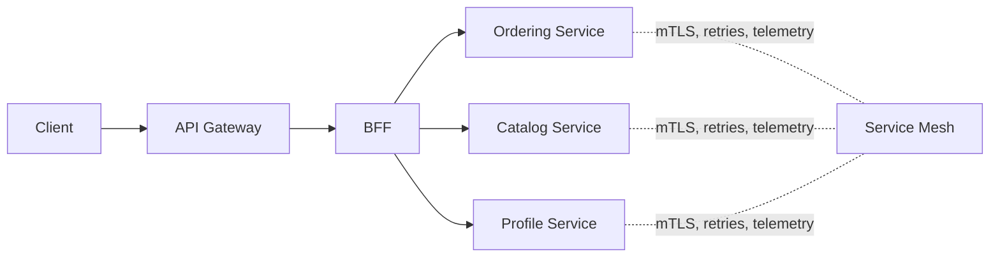

Teams often buy three different pieces of infrastructure and then let all of them solve the same problem badly. The API gateway, the backend-for-frontend (BFF), and the service mesh each have a place, but they are not interchangeable. Confusing them creates duplicate policies, broken ownership, and debugging pain.

This article is about drawing those lines clearly enough that platform teams, application teams, and frontend teams do not keep re-implementing each other's work.

## The Short Version

If you only need the first mental model, use this:

- API gateway: edge entry point and coarse-grained traffic policy
- BFF: client-specific composition and product-facing shaping
- service mesh: service-to-service networking concerns inside the platform

That sounds simple, but the hard part is deciding where a concern stops being "networking" and starts being "product behavior."

## What Each Layer Should Own

| Layer | Primary owner | Good responsibilities | Responsibilities to avoid |
| --- | --- | --- | --- |
| API gateway | Platform or shared edge team | authn handoff, routing, rate limiting, request normalization, edge observability | client-specific orchestration, business decision logic |
| BFF | Product team aligned to one client experience | response composition, client-specific authorization checks, frontend-friendly models | platform-wide cross-cutting policy, generic network plumbing |
| Service mesh | Platform team | mTLS, service identity, retries, traffic shifting, telemetry plumbing | business workflows, client payload shaping |

The overlap problems begin when teams do not respect the last column.

## A Common Failure Mode

Many organizations end up with:

- request transformation in the gateway
- the same transformation repeated in the BFF
- retries in the mesh and again in the application
- authorization fragments at the edge, in the BFF, and in each downstream service

That system is hard to reason about because no single layer has a coherent job.

## Use The Gateway For Edge Concerns

An API gateway is closest to the outside world, so it should handle concerns that are meaningful at the edge:

- inbound authentication handoff
- coarse routing to internal applications
- request size limits and protocol normalization
- global throttling
- simple, consistent edge metrics

What the gateway should not become:

- a universal orchestration engine
- a place where product teams keep shipping business rules
- a second application runtime with hidden coupling to many services

If the gateway owns too much product behavior, every new client experience becomes a platform change request.

## Use A BFF When Client Needs Diverge

A BFF exists because different clients often need different compositions of the same core domain capabilities.

Examples:

- a mobile app wants a single lightweight response with pre-joined fields
- an admin dashboard needs more operational metadata than the public web client
- one client requires a workflow-specific authorization or feature gating rule

That work belongs close to the product experience, not buried in a generic gateway.

```java
public final class MobileOrderBffService {
    private final OrderQueryClient orderQueryClient;
    private final ShipmentQueryClient shipmentQueryClient;

    public MobileOrderSummary getOrderSummary(String userId, String orderId) {
        OrderView order = orderQueryClient.findOrder(userId, orderId);
        ShipmentView shipment = shipmentQueryClient.findLatestShipment(orderId);
        return MobileOrderSummary.from(order, shipment);
    }
}
```

This is a BFF-friendly example because it is composing a client view. It is not trying to own order state or inventory decisions.

## Use The Mesh For East-West Operational Policy

The mesh is most valuable when you need consistent service-to-service behavior across many workloads:

- workload identity and mTLS
- traffic policy and progressive delivery primitives
- standard telemetry capture
- carefully scoped retries and timeouts

Those are infrastructure concerns. They should not depend on whether the current request is "checkout" or "profile update."

> [!WARNING]
> If a service mesh policy needs product-specific if/else logic, that logic probably belongs in the application layer instead.

## A Useful Architecture Picture



The gateway handles the edge, the BFF shapes the client experience, and the mesh handles internal service networking policy. When those lines are clear, incidents are easier to reason about.

## Where Authorization Usually Goes Wrong

Authorization is the most common place where these boundaries blur.

A healthy split often looks like:

- gateway: validate token presence and basic trust handoff
- BFF: enforce client-experience rules, tenant scoping, and view-level access
- downstream services: enforce resource ownership and business authorization

An unhealthy split is putting all authorization at the edge and assuming internal services no longer need to protect their own data.

## Retries Are Another Boundary Test

Retries are useful, but only when they happen in the right layer.

Good defaults:

- gateway: very limited retries, usually only for safe idempotent operations
- BFF: avoid broad retry loops that amplify user-facing latency
- mesh: low-level retries for short transient transport failures
- application: business-aware compensation when the outcome matters

The platform can provide retry machinery, but product teams still own whether a retried action is semantically safe.

## When You Do Not Need A BFF

A BFF is not mandatory. Skip it when:

- all clients need nearly the same representation
- the gateway can safely route to one application without custom composition
- client-specific logic is minimal and stable

Adding a BFF too early can create another hop and another codebase without solving a real product problem.

## Questions For Architecture Review

Before introducing or changing one of these layers, ask:

1. Is this concern about edge trust, client experience, or internal service networking?
2. Who will own changes to this logic six months from now?
3. Are we placing logic here because it belongs here, or because the existing service is inconvenient?
4. If something fails, which team will get paged and can they actually fix it from that layer?

Those questions catch a lot of accidental platform sprawl.

## Key Takeaways

- Gateways, BFFs, and meshes solve different problems, even when they all sit on the request path.
- The gateway should stay focused on edge policy, not product orchestration.
- A BFF is valuable when one client experience needs its own composition model.
- The service mesh should standardize internal network behavior, not absorb business logic.
- If a concern appears in all three layers, ownership is already drifting.
