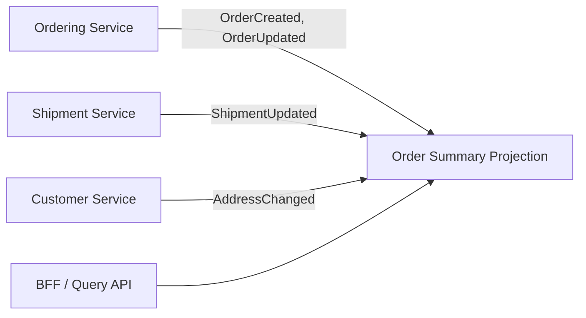

---
categories:
- Java
- Microservices
- Architecture
date: 2026-08-04
seo_title: Data ownership and cross-service query strategies - Advanced Guide
seo_description: Advanced practical guide on data ownership and cross-service query
  strategies with architecture decisions, trade-offs, and production patterns.
tags:
- java
- microservices
- distributed-systems
- architecture
- backend
title: Data ownership and cross-service query strategies
toc: true
toc_icon: cog
toc_label: In This Article
header:
  overlay_image: "/assets/images/java-advanced-generic-banner.svg"
  overlay_filter: 0.35
  show_overlay_excerpt: false
  caption: Microservices Architecture and Reliability Patterns
---
Microservices become operationally expensive the moment teams forget who owns the truth. The code may be split cleanly, but if queries still depend on cross-database joins, shared tables, or synchronous fan-out for basic screens, the architecture has not really separated.

This article focuses on the tension at the center of most microservice data designs:

- each service should own its own data
- users still expect one coherent product view

The answer is not "never join" or "always use CQRS." The answer is to decide where truth lives, what can be copied, and how fresh each query actually needs to be.

## Data Ownership Means Write Ownership

The cleanest definition is also the most useful one:

**A service owns data if it is the only service allowed to make business-valid writes to that data.**

That has real consequences:

- other services may cache or copy the data, but they do not authoritatively mutate it
- the owning service defines the meaning of state transitions
- incidents have a clear source-of-truth team
- schema evolution no longer requires hidden cross-team coordination

Without write ownership, "service boundaries" are often just deployment boundaries.

## The Most Common Anti-Pattern

The usual failure mode looks like this:

1. teams split services
2. one screen still needs data from three domains
3. somebody reaches into another service's database "just for reporting"
4. a second consumer does the same
5. the read path silently becomes the real integration contract

At that point, your query strategy is no longer explicit. It is encoded in fragile joins and accidental schema dependencies.

> [!WARNING]
> Reading another service's database directly feels fast in the short term and expensive in every later migration, incident, and schema change.

## Separate Source Of Truth From Query Convenience

There are only a few honest options for cross-service queries:

| Need | Better default |
| --- | --- |
| One service needs authoritative domain data owned elsewhere | Call the owning service |
| Many consumers need a combined read view | Build a projection or read model |
| The UI needs client-specific composition | Use a BFF or aggregation layer |
| Analytics needs broad historical data | Move data into a dedicated analytical pipeline |

The mistake is trying to use one mechanism for all four.

## A Simple Commerce Example

Assume:

- `Customer` owns profile and account settings
- `Ordering` owns order lifecycle
- `Shipment` owns package and delivery state

Now the customer app needs an "orders" screen that shows:

- order ID
- order status
- shipment ETA
- delivery address summary

There are several ways to build it.

### Option 1: Live fan-out on every request

The frontend or BFF calls all three services and joins results in real time.

Good for:

- low-volume internal tools
- early-stage systems with limited complexity

Bad for:

- mobile latency
- partial failure handling
- high-traffic user journeys

### Option 2: Dedicated query model

Publish events from `Ordering` and `Shipment`, then build a customer-facing read model optimized for this screen.

Good for:

- stable user experiences
- lower read latency
- reduced synchronous coupling

Trade-off:

- the view is eventually consistent
- replay and correction paths must be designed carefully

## A Useful Architectural Picture



The important point is that `Q` is not a new source of truth. It is a query-optimized projection built from facts published by the owning services.

## Choose Query Strategy By Freshness And Failure Tolerance

Ask two questions for every read path:

1. How fresh must the data be?
2. What should happen if one contributing service is unavailable?

That leads to clearer design choices:

| Situation | Better choice |
| --- | --- |
| Payment authorization decision needs latest account state | Live authoritative call |
| Customer dashboard can tolerate a short lag | Projection |
| Admin support tool can accept partial data with explicit warnings | Aggregated fan-out |
| Executive analytics needs wide joins and history | Analytical pipeline |

This framing is more useful than arguing abstractly about "CQRS versus REST."

## A Projection Is Not A Free Lunch

Teams often hear "build a read model" and underestimate the operational work behind it.

You need to define:

- event contracts and versioning
- replay behavior
- idempotent consumers
- backfill and repair procedures
- freshness monitoring

If those are missing, the projection becomes a second-class database that nobody fully trusts.

```java
public final class OrderSummaryProjectionUpdater {
    public void on(OrderCreated event) {
        // insert or update summary row keyed by orderId
    }

    public void on(ShipmentUpdated event) {
        // merge latest shipment state into the same read model
    }
}
```

This kind of code is intentionally boring. That is good. Projection logic should be explicit, deterministic, and easy to replay.

## Do Not Turn One Service Into Everyone's Query Layer

Another anti-pattern is letting one core service become the accidental aggregation hub.

For example:

- `Ordering` begins exposing shipment status to help one UI
- later it exposes customer fields too
- eventually every consumer asks `Ordering` for a giant combined payload

Now `Ordering` owns order truth and UI composition at the same time. That makes it harder to evolve and harder to page correctly during incidents.

## How To Review A Data Boundary

Use these questions during architecture review:

1. Which service is the system of record for this field?
2. Who is allowed to write it?
3. If another service displays it, where does that copy come from?
4. How stale can the displayed value be before it becomes a product problem?
5. If a projection drifts, who detects it and how is it rebuilt?

If the team cannot answer those clearly, the query model is not really designed yet.

## Failure Drill

Run one scenario before rollout:

- stop the event consumer that populates a read model
- allow writes to continue in the source services
- measure projection lag
- check whether dashboards, alerts, and product behavior make the staleness obvious

That exercise quickly reveals whether the system treats projections as first-class read infrastructure or as "best effort" glue.

## Key Takeaways

- Service ownership should be defined by authoritative writes, not by who can read a table.
- Cross-service queries need an explicit strategy: live call, projection, BFF aggregation, or analytics pipeline.
- Read models are powerful when freshness expectations and repair paths are clear.
- If teams are joining across service databases, the architecture is still carrying hidden monolith assumptions.

---

## Design Review Prompt

For every important screen or downstream consumer, ask:

1. where does the truth come from,
2. how fresh must it be,
3. what happens when one contributor is slow, down, or temporarily stale.

That conversation usually exposes whether the query strategy is architecture or improvisation.
