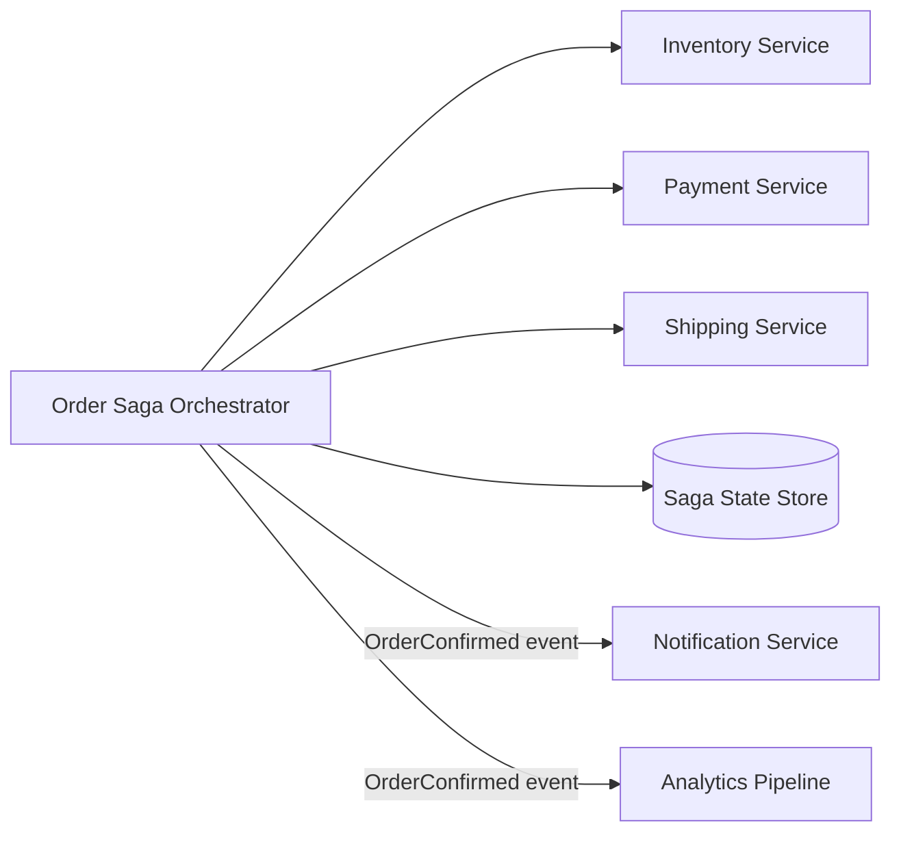

Sagas are what teams reach for once they realize one business action now spans multiple services, databases, and failure domains. The trouble is that many systems adopt the word without designing the operational model behind it. That is how "event-driven coordination" turns into invisible coupling and hard-to-replay failures.

This article focuses on the first design decision in saga-based workflows: should the flow be coordinated by an orchestrator or emerge from choreography between services?

The answer is not ideological. It depends on who must see the whole workflow, where business recovery decisions live, and how much hidden coupling your system can tolerate.

## What A Saga Is Actually Solving

A saga exists because one user-facing action needs several local transactions to succeed or be compensated.

Classic examples:

- place an order, reserve inventory, authorize payment, create shipment
- book a trip, reserve hotel, reserve flight, charge customer
- onboard a tenant, allocate resources, provision identity, emit billing record

No single database transaction spans the whole flow, so the architecture needs:

- forward steps
- a durable record of progress
- compensation or recovery when a downstream step fails

That is the real problem. "Orchestration versus choreography" is only the control-plane choice on top of it.

## Orchestration: One Place Sees The Workflow

In orchestration, a coordinator owns the workflow state and tells each participant what to do next.

Good fit when:

- the workflow is long-lived or business-critical
- you need strong visibility into step progression
- compensation ordering matters
- product or operations teams need one place to answer "what happened?"

Benefits:

- clearer audit trail
- easier timeout handling
- simpler replay and manual intervention
- fewer hidden dependencies between participant services

Risks:

- the orchestrator can become too smart
- teams may centralize business rules that really belong inside domain services

## Choreography: Services React To Domain Events

In choreography, services emit facts and other services react. There is no central conductor explicitly driving each step.

Good fit when:

- the workflow is relatively simple
- many downstream reactions are independent
- the primary value is decoupled propagation of business facts

Benefits:

- fewer coordination bottlenecks
- easier local ownership for independent reactions
- natural fit for side effects and projections

Risks:

- harder to visualize the full workflow
- implicit dependencies grow over time
- failure recovery becomes spread across many consumers

> [!WARNING]
> Choreography is often sold as "more decoupled," but poorly governed event chains can create some of the most opaque coupling in a microservice system.

## A Fast Selection Heuristic

| Situation | Better default |
| --- | --- |
| One business workflow with explicit success/failure semantics | Orchestration |
| Many independent consumers reacting to a completed fact | Choreography |
| Need manual intervention or operator replay | Orchestration |
| Need fan-out side effects like notifications and analytics | Choreography |
| Workflow order and compensation order are critical | Orchestration |

This is why many healthy systems use both:

- orchestration for the core transaction-like business flow
- choreography for secondary reactions after the core decision is durable

## A Commerce Example

Consider order placement.

Core flow:

1. create pending order
2. reserve inventory
3. authorize payment
4. confirm order

Secondary reactions:

- send confirmation email
- update recommendation features
- emit analytics events
- notify fulfillment systems

The first set usually benefits from orchestration because step order, timeout handling, and compensation are central to correctness. The second set often works better as choreography because the reactions are decoupled side effects.

## Architecture Picture



This split is important:

- orchestration owns the core workflow state
- choreography begins after the core business fact is committed

That keeps the transaction-like flow explicit without turning every downstream consumer into a participant in the same compensation story.

## Compensation Is Not Rollback

Teams often talk about compensation as if it were a distributed rollback. It is not.

A compensation action is a new business action that attempts to restore an acceptable business state.

Examples:

- release previously reserved inventory
- void a payment authorization
- cancel a shipment request if fulfillment has not started

These operations have their own semantics, timing, and failure modes. They should be designed like first-class commands, not like hidden undo buttons.

```java
public sealed interface SagaStepResult permits StepSucceeded, StepFailed {}

public record StepSucceeded(String stepName) implements SagaStepResult {}

public record StepFailed(String stepName, String reasonCode, boolean compensationRequired)
        implements SagaStepResult {}

public interface CompensationCommand {
    String sagaId();
    String stepName();
}
```

This matters because compensation has to be explicit in logs, replays, and runbooks.

## The Most Common Design Mistakes

- using choreography for a workflow that really needs centralized progress tracking
- creating an orchestrator that contains all domain rules instead of delegating to services
- emitting events without clear ownership of failure handling
- assuming compensation is always possible
- forgetting timeouts and stuck-step detection

The last one is especially dangerous. Many workflows look correct in happy-path demos and fail in production because one step never returns and nobody owns the timeout policy.

## What To Store Durably

If you orchestrate a saga, you usually need durable workflow state:

- saga ID
- current step
- last successful action
- retry count
- timeout deadline
- compensation status

Without durable state, operators cannot distinguish "step is slow" from "workflow is lost."

## Failure Drills To Run Before Production

Simulate these cases:

1. payment authorization succeeds but the orchestrator crashes before persisting the next step
2. compensation command is issued twice
3. one participant is unavailable for fifteen minutes
4. a late event arrives after the saga was already marked failed

If the team cannot explain how the workflow recovers, the saga design is still incomplete.

## Key Takeaways

- Orchestration is better when the workflow itself is a first-class business concern.
- Choreography is better when services mainly need to react independently to durable business facts.
- Compensation is not rollback; it is a new business action with its own correctness rules.
- Many production systems need both patterns, but they should be used for different layers of the workflow.

---

## Design Review Prompt

Ask one hard question before choosing choreography:

Can a new engineer, an operator, and a product manager all answer "where is this workflow right now and how do we recover it?" without reading five services and ten topics?

If not, orchestration is probably the safer default.
