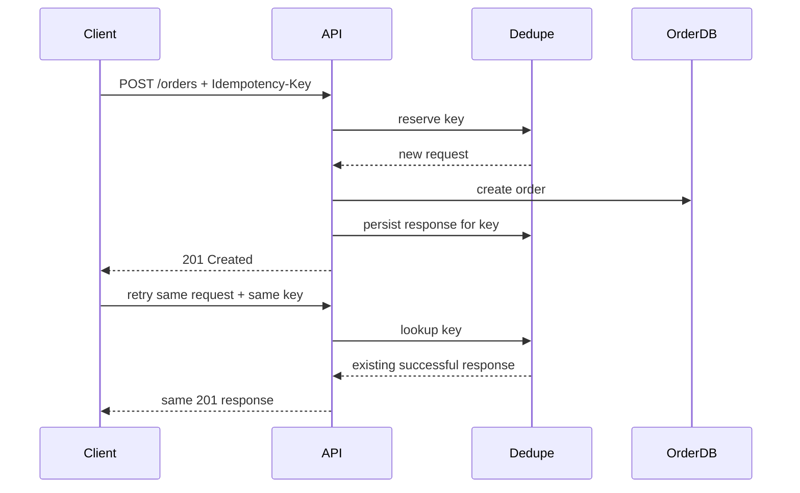

---
categories:
- Java
- Microservices
- Architecture
date: 2026-08-06
seo_title: Idempotency keys and dedupe stores for write APIs - Advanced Guide
seo_description: Advanced practical guide on idempotency keys and dedupe stores for
  write apis with architecture decisions, trade-offs, and production patterns.
tags:
- java
- microservices
- distributed-systems
- architecture
- backend
title: Idempotency keys and dedupe stores for write APIs
toc: true
toc_icon: cog
toc_label: In This Article
header:
  overlay_image: "/assets/images/java-advanced-generic-banner.svg"
  overlay_filter: 0.35
  show_overlay_excerpt: false
  caption: Microservices Architecture and Reliability Patterns
---
Distributed systems retry. Clients retry. Gateways retry. Message consumers replay. If a write API is not designed to tolerate duplicates, the system eventually charges twice, creates the same order twice, or mutates state twice in a way that is painful to repair.

That is why idempotency is not an optional API polish. It is part of the write contract itself.

This article focuses on the design of idempotency keys and dedupe stores for synchronous write APIs. The goal is not just "ignore duplicates," but to do so in a way that preserves correctness, observability, and operational trust.

## What Idempotency Protects

Idempotency matters whenever the caller can reasonably ask:

- "Did my original request succeed?"
- "Is it safe to retry?"
- "If I send this request again, will I get the same logical result?"

Good examples:

- create payment intent
- place order
- trigger refund
- register external webhook delivery

Bad examples for naive idempotency:

- append-only audit operations where every event should be preserved
- commands whose semantics intentionally depend on being repeated

Idempotency is a business-contract choice, not just a middleware feature.

## The Core Model

For a write API, idempotency usually means:

1. the client sends an idempotency key
2. the server binds that key to a request fingerprint and resulting response
3. repeated requests with the same logical intent return the same result instead of executing the side effect again

The hard part is deciding what the key means and where the dedupe state lives.

## A Safe Default Contract

The cleanest default is:

- the client generates a stable key per logical command
- the service stores the key close to the business write
- the service rejects key reuse with a different payload
- the service returns the previously committed result for exact duplicates

This makes retries safe without allowing one key to become a generic bypass token for unrelated requests.

```java
public record CreateOrderRequest(
        String customerId,
        List<LineItem> items,
        String paymentMethodId
) {}

public record IdempotentCommand<T>(
        String idempotencyKey,
        T payload
) {}
```

The key should represent one logical command attempt, not a user session and not a transport connection.

## Where Teams Usually Go Wrong

The most common mistakes are:

- storing only the key, not the request fingerprint
- letting keys live forever with no retention strategy
- putting dedupe in a cache that can evict under pressure with no fallback
- handling duplicates in the API layer while the downstream side effect remains non-idempotent
- reusing the same key across unrelated operations

Each of these looks fine in a happy-path demo and breaks under real retry behavior.

> [!WARNING]
> Idempotency at the HTTP layer is not enough if the actual side effect happens asynchronously or in another service without the same dedupe boundary.

## A Dedupe Store Needs More Than A Boolean

A robust dedupe record often stores:

- idempotency key
- request fingerprint or payload hash
- logical operation name
- status: in progress, succeeded, failed, expired
- response payload or reference to response
- creation time and expiry time

That extra state solves real production problems:

- distinguishing exact retries from accidental key reuse
- returning the original response
- handling in-flight duplicate requests safely
- supporting expiry and cleanup

## A Practical Flow



This is the behavior clients actually need when networks are unreliable.

## Keep The Dedupe Boundary Near The Write Boundary

The safest place for dedupe state is usually where the authoritative write happens.

Why:

- the service can atomically reason about key reservation and business write
- operators can debug one ownership boundary
- you avoid "API deduped it, but downstream executed twice anyway"

For example, if `Payments` owns authorization creation, dedupe should be part of the payment command boundary, not a shared gateway trick.

## Handling In-Flight Duplicates

One subtle problem is when the same key arrives while the first request is still being processed.

Reasonable options:

- return `409 Conflict` or a domain-specific "request in progress"
- block briefly and then return the stored result
- expose an async status endpoint for long-running commands

What matters is that the behavior is explicit and documented. Silent races create the exact confusion idempotency is meant to remove.

```java
public sealed interface IdempotencyLookupResult
        permits NewCommand, InFlightDuplicate, CompletedDuplicate, PayloadMismatch {}

public record NewCommand() implements IdempotencyLookupResult {}
public record InFlightDuplicate() implements IdempotencyLookupResult {}
public record CompletedDuplicate(String responseBody) implements IdempotencyLookupResult {}
public record PayloadMismatch(String reason) implements IdempotencyLookupResult {}
```

This kind of model is much safer than a vague `boolean seenBefore`.

## Expiry And Retention Matter

Keys should not live forever unless the business truly requires it.

Retention depends on:

- client retry windows
- payment-network semantics
- operational replay windows
- storage cost and growth patterns

For many APIs, a bounded retention window is enough. The important thing is that expiry be a conscious contract, not accidental cache eviction.

## Idempotency Does Not Replace Business Reconciliation

Idempotency protects against duplicate command execution. It does not solve every inconsistency.

You may still need:

- reconciliation against external providers
- outbox/inbox patterns for downstream messaging
- exactly-once illusions avoided through explicit compensation

This is why idempotency is a layer in the reliability model, not the whole model.

## Failure Drills Worth Running

Test these before trusting the design:

1. request succeeds in the database but times out before the client sees the response
2. same key is reused with a different payload
3. dedupe store is temporarily unavailable
4. downstream side effect is retried after the API already recorded success

If the system behaves inconsistently across those cases, the dedupe strategy is not production ready.

## Key Takeaways

- Idempotency is part of the command contract for retryable write APIs.
- A good dedupe store binds key, payload identity, execution state, and original response.
- The dedupe boundary should live close to the authoritative business write.
- Returning the original result is usually more useful than merely saying "duplicate."

---

## Design Review Prompt

Ask one uncomfortable question during review:

If the client times out after the write probably succeeded, what exact behavior does a retry produce?

If the answer is unclear, the API is not really idempotent yet.
