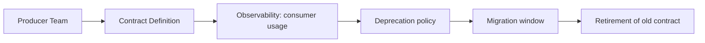

---
categories:
- Java
- Microservices
- Architecture
date: 2026-08-07
seo_title: Backward-compatible API evolution and deprecation governance - Advanced
  Guide
seo_description: Advanced practical guide on backward-compatible api evolution and
  deprecation governance with architecture decisions, trade-offs, and production patterns.
tags:
- java
- microservices
- distributed-systems
- architecture
- backend
title: Backward-compatible API evolution and deprecation governance
toc: true
toc_icon: cog
toc_label: In This Article
header:
  overlay_image: "/assets/images/java-advanced-generic-banner.svg"
  overlay_filter: 0.35
  show_overlay_excerpt: false
  caption: Microservices Architecture and Reliability Patterns
---
Most API versioning problems are not really versioning problems. They are ownership and migration problems that surface at the contract boundary. Teams change payloads, fields, or semantics faster than their consumers can move, then call the result "technical debt" when it is really a governance failure.

This article is about how to evolve service contracts without turning every change into a synchronized rollout. The goal is not to avoid all breaking change forever. The goal is to make compatibility, migration, and deprecation explicit enough that producers and consumers can evolve independently.

## Versioning Is A Last Resort, Not The First Move

The first question should not be "Do we need `v2`?" It should be "Can this change be introduced compatibly?"

Many useful API changes do not require a new version:

- adding optional fields
- adding new enum-like values when consumers are tolerant
- introducing new endpoints for new capabilities
- broadening filter support while preserving old behavior

A new version becomes justified when you are changing meaning, not just shape.

Examples:

- a field now represents a different business concept
- error semantics and required client handling are changing
- a previously synchronous acceptance contract becomes asynchronous
- pagination or ordering guarantees are changing in a way that breaks callers

## The Real Unit Of Compatibility

Compatibility is not just JSON shape compatibility. It is the combination of:

- payload shape
- field semantics
- status codes
- retries and idempotency expectations
- auth and authorization assumptions

That is why "the schema still validates" is not enough to declare a change safe.

## Prefer Contract Additivity When You Can

The safest evolution pattern is additive change with explicit old-path support.

Good examples:

- add `deliveryEstimate` while keeping old clients happy with existing fields
- expose a new `/orders/{id}/timeline` resource instead of mutating the meaning of `/orders/{id}`
- introduce a new header or capability flag for advanced behavior rather than changing the default silently

Bad examples:

- reusing an old field with a new meaning
- making a formerly optional field required without a migration path
- preserving a path but changing timeout, retry, or consistency expectations underneath it

> [!WARNING]
> Semantic breaking changes hidden behind "same endpoint, same field names" are often more damaging than an explicit version bump.

## Do Not Confuse Versioning With Parallel Endpoints

Teams sometimes create new endpoints for every change and call that versioning. That leads to drift, duplication, and unclear support commitments.

You usually need one of three patterns:

| Need | Better pattern |
| --- | --- |
| Small backward-compatible extension | Same contract, additive change |
| Major semantic break | New version or new resource contract |
| Temporary migration path | Parallel endpoint with clear sunset plan |

The important part is not the mechanism. It is the lifecycle governance attached to it.

## A Governance Model That Works

Good API evolution is mostly operational discipline:

1. announce intent before forcing migration
2. publish what is changing and why
3. measure which consumers are still using the old contract
4. give migration tooling or examples
5. deprecate with dates, not vague language
6. remove only when usage and business risk are understood

Without usage visibility, deprecation is guesswork.

## Architecture Picture



This lifecycle matters more than whether your path says `/v1`.

## Compatibility Needs Consumer Telemetry

If you do not know:

- which clients call the old contract
- which fields they rely on
- what traffic volume is affected
- which tenants or applications have not migrated

then you do not have deprecation governance. You have hope.

The producer should be able to answer:

- top consumers by traffic
- old-version usage trend over time
- percentage of calls using deprecated fields or behaviors
- last-seen usage for inactive consumers

That observability often determines whether a change is safe.

## Versioning Strategy Should Match Client Reality

Different clients tolerate different migration models.

- internal service-to-service consumers may move quickly with strong governance
- public API consumers may need long overlap windows
- mobile clients often force especially careful additive evolution because upgrade adoption is staggered

This is why one blanket versioning rule rarely fits every boundary in the system.

## A Safer Contract Style

Code can reinforce compatibility thinking.

```java
public record OrderResponseV1(
        String orderId,
        String status,
        BigDecimal totalAmount,
        String currency,
        String deliveryEstimate
) {}
```

The point here is not the record itself. It is the design mindset:

- new data is additive
- existing fields keep their meaning
- clients that do not care about `deliveryEstimate` are not broken

If `status` were being repurposed to include fulfillment sub-states with different workflow meaning, that should probably be a new contract, not a quiet mutation.

## Deprecation Messages Should Be Actionable

A useful deprecation notice includes:

- what is deprecated
- why it is being replaced
- the preferred replacement
- the migration deadline
- a link to migration guidance

An unhelpful notice says only "this API is deprecated."

Consumers need enough context to schedule real work, not just acknowledge a warning.

## Common Failure Modes

- producers stop supporting old clients before measuring usage
- teams add versions but never retire them
- clients pin to old contracts because the migration path is unclear
- contract changes are technically additive but operationally breaking
- documentation drifts from actual behavior

The last one matters more than teams expect. Many incidents happen because the contract was "compatible" on paper but not in the code paths consumers really exercise.

## Failure Drill

Before deprecating an old contract, test one realistic scenario:

1. identify a real deprecated field or endpoint
2. locate all top consumers through metrics
3. simulate removal in a lower environment
4. verify alerts, dashboards, and migration docs are enough for a consumer team to fix the issue quickly

If this drill fails, the deprecation program is not mature enough for aggressive retirement.

## Key Takeaways

- API evolution should begin with compatibility-first design, not immediate version proliferation.
- The true contract includes semantics, error behavior, and operational expectations, not just payload shape.
- Deprecation is a governance process with telemetry, dates, and migration ownership.
- Versioning is useful when meaning changes, but it is not a substitute for producer-consumer discipline.

---

## Design Review Prompt

Before approving an API change, ask:

1. what exactly stays compatible,
2. who still depends on the old behavior,
3. how we will know when it is safe to remove it.

If those answers are vague, the change is not really ready for production.
