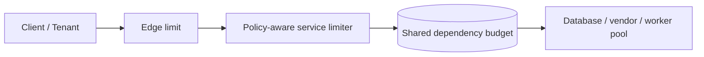

Rate limiting is easy to describe and easy to get wrong. Many systems implement it as a blunt request counter, then discover later that the real problem was not total traffic. It was fairness: one tenant, one client, or one workload consuming disproportionate capacity and turning shared infrastructure into a noisy-neighbor incident.

In a multi-tenant system, rate limiting is not only about protection from abuse. It is a resource-allocation policy.

This article focuses on how to design rate limits that preserve fairness without silently punishing healthy tenants or hiding capacity problems behind a `429`.

## Start With The Scarce Resource

The first question is not "which algorithm should we use?" It is "what are we protecting?"

Possible scarce resources:

- request threads
- database connections
- downstream vendor quotas
- message throughput
- CPU-heavy business operations

Different scarce resources require different limiting boundaries. A global request count rarely captures the real bottleneck.

## Fairness Means More Than A Hard Cap

A hard per-tenant cap is a useful starting point, but fairness often needs more nuance.

You may need to distinguish:

- free-tier vs premium tenants
- interactive user traffic vs bulk background sync
- idempotent reads vs expensive writes
- internal automation vs public client requests

If you treat all traffic as equivalent, the limit may be simple but the outcome may still be unfair.

## Where Rate Limiting Should Happen

There are several reasonable enforcement layers:

| Layer | Good for | Weakness |
| --- | --- | --- |
| API gateway | coarse edge protection, client authentication context | does not always know true downstream cost |
| service layer | business-aware fairness rules | harder to keep globally consistent |
| downstream dependency guard | protecting a narrow scarce resource | too late to stop upstream work |

Healthy systems often use more than one:

- coarse global protection at the edge
- finer policy where tenant and business context are known
- local backpressure near critical dependencies

The mistake is assuming one layer alone is enough.

## The Multi-Tenant Problem

Suppose three tenants share the same order-processing platform:

- Tenant A sends steady interactive traffic
- Tenant B runs bursty nightly imports
- Tenant C is small but latency-sensitive

A single shared bucket may let Tenant B exhaust capacity and indirectly degrade A and C, even if total system throughput is still below peak design.

Fairness requires a policy that says who gets to consume shared budget and under what conditions.

## A Better Mental Model

Think in terms of:

- **admission control**: should this request enter the system?
- **fair share**: how much capacity should this tenant get relative to others?
- **priority**: are some workloads more important than others?
- **backpressure**: what does the system tell callers when capacity is tight?

That makes rate limiting part of overload management, not just a static gateway feature.

## Architecture Picture



This shows an important separation:

- edge limiting absorbs obvious abuse or accidental bursts
- service-level limiting applies tenant-aware fairness
- dependency-level budgets stop saturation where the real constraint lives

## Use Policies That Reflect Product Reality

A useful fairness policy may combine:

- per-tenant request rate
- per-operation weights
- burst allowance
- concurrency caps
- premium-tier overrides

For example, a bulk export might cost more budget than a simple read, even if both are one HTTP request.

```java
public record LimitDecision(
        boolean allowed,
        String tenantId,
        String policyName,
        Duration retryAfter
) {}

public interface TenantFairnessPolicy {
    LimitDecision evaluate(String tenantId, String operationName, int costUnits);
}
```

This style is useful because it makes fairness an explicit policy decision rather than a hidden magic number.

## A `429` Is Not The Whole Story

Returning `429 Too Many Requests` is only one part of the design.

You also need to define:

- whether the client should retry immediately, later, or back off exponentially
- whether internal callers should queue instead of fail
- whether the system distinguishes tenant exhaustion from global exhaustion
- which metrics tell you the limiter is protecting fairness rather than masking under-provisioning

> [!NOTE]
> A limiter that fires constantly may be doing its job, or it may be compensating for a capacity problem nobody has fixed. You need metrics to tell the difference.

## Avoid Hidden Unfairness In Shared Background Work

Fairness problems often come from background workloads, not public traffic.

Examples:

- one tenant triggers heavy reindexing
- one import pipeline floods the same worker queue used by interactive requests
- retry storms from one customer monopolize downstream capacity

If background and interactive work share the same queues and worker pools, per-request edge limiting may not protect the user experience at all.

That is why multi-tenant fairness frequently requires queue partitioning, weighted scheduling, or separate worker classes in addition to API limits.

## The Most Common Mistakes

- one global limit for all tenants regardless of tier or usage shape
- protecting the edge while leaving the real bottleneck unguarded
- retry guidance that causes synchronized thundering herds
- counting requests equally when operations have very different cost
- ignoring fairness inside asynchronous workers

The last point is easy to miss. If your HTTP entrypoint is fair but your downstream worker pool is first-come-first-served, the system is only partially fair.

## Failure Drills Worth Running

Run at least these scenarios:

1. one tenant sends ten times its normal burst
2. one expensive operation floods the system while cheap reads continue
3. a premium tenant and a free-tier tenant compete during partial overload
4. retries from failed downstream calls amplify inbound traffic

Watch whether the limiter preserves the intended experience or simply fails everything more evenly.

## Key Takeaways

- In multi-tenant systems, rate limiting is really about fairness and resource allocation.
- The right limit depends on the scarce resource you are protecting, not just request count.
- Good designs combine edge protection, tenant-aware policy, and dependency-level safeguards.
- A fair system needs clear retry behavior and observability, not just `429` responses.

---

## Design Review Prompt

Ask one sharp question during review:

If one tenant misbehaves for fifteen minutes, which other tenants should still get a predictable experience, and exactly what mechanism guarantees that?

If the answer is hand-wavy, the fairness model is not ready.
