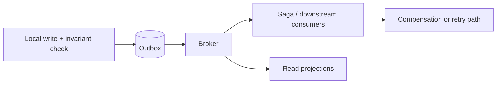

Once a system moves to multiple services, strong consistency does not disappear. It simply becomes local instead of global. The architecture challenge is deciding which invariants must stay inside one transactional boundary and which business flows can tolerate delayed convergence.

This is where teams often overcorrect. Some try to preserve monolithic transaction semantics across services. Others swing too far toward eventual consistency without defining what is allowed to be temporarily wrong.

This article is about designing consistency without distributed two-phase commit. The goal is not to accept inconsistency casually. The goal is to choose where truth is immediate, where it is convergent, and how recovery is made visible.

## Start With Business Invariants

Consistency decisions should begin with one question:

**What must never be observably wrong at commit time?**

Examples:

- inventory cannot be reserved below zero
- one payment authorization cannot be captured twice
- an account cannot spend beyond its allowed balance

Those invariants usually belong inside one service-owned write boundary.

Other things may converge later:

- search indexes
- recommendation models
- notification state
- customer-facing combined read views

The mistake is treating all data relationships as if they deserve the same consistency contract.

## Why 2PC Is Rarely The Right Escape Hatch

Distributed transactions look attractive because they promise a familiar model: either every participant commits or none do.

In practice, they create hard trade-offs:

- higher latency across services
- tighter availability coupling
- operational fragility under coordinator failures
- awkward fit with independent service ownership

Even when the infrastructure supports them, they often preserve a coupling model that the system was trying to escape.

> [!WARNING]
> If many services need one cross-service atomic commit to stay correct, the first problem is usually boundary design, not missing infrastructure.

## Local Transactions Plus Explicit Coordination

A healthier pattern is:

1. keep each invariant inside a local transaction
2. publish durable facts about committed state changes
3. coordinate downstream work with sagas, outbox, retries, and reconciliation
4. design read models around tolerated staleness

That moves the architecture from hidden global coupling to explicit business recovery.

## A Simple Order Example

Suppose order placement involves:

- `Ordering`
- `Inventory`
- `Payments`

What should be strongly consistent?

- `Ordering` should not mark the order confirmed before the workflow reaches a known business point
- `Inventory` should enforce its own reservation invariant locally
- `Payments` should enforce its own idempotent authorization semantics locally

What can be coordinated instead of globally committed?

- eventual workflow completion
- side effects like notifications
- read-model updates for dashboards

That is a consistency design, even though no global transaction exists.

## Practical Consistency Patterns

Here are the most useful building blocks:

| Pattern | Best for |
| --- | --- |
| Local transaction with outbox | durable state change plus downstream publication |
| Saga orchestration | multi-step workflow with compensating actions |
| Choreography | independent reactions to a committed business fact |
| Read model / projection | query-side convergence |
| Reconciliation job | repairing drift against source-of-truth systems |

The system usually needs several of these at once. No single pattern replaces the others.

## Architecture Picture



This picture is useful because it makes one thing explicit: correctness does not come from one giant transaction. It comes from well-defined local truth plus durable coordination.

## Design The "Temporary Wrongness" Budget

Eventual consistency becomes dangerous when teams never define what can be stale and for how long.

Ask:

- which user-facing views may lag?
- how stale is acceptable?
- what action is blocked until convergence completes?
- how do operators detect stuck convergence?

For example:

- "order confirmation email may lag by a minute" is acceptable
- "inventory may oversell for thirty seconds" may not be acceptable

Those are product decisions as much as technical ones.

## Use Code To Express Local Truth

One practical way to keep consistency honest is to make local transactional boundaries explicit in the code.

```java
@Transactional
public OrderCreated createPendingOrder(CreateOrderCommand command) {
    Order order = orderRepository.save(Order.pending(command.customerId(), command.items()));
    outboxRepository.save(OutboxEvent.orderCreated(order.getId(), command.items()));
    return new OrderCreated(order.getId());
}
```

This example matters because:

- the local invariant is committed with the outbox record
- publication is durable even if downstream consumers are delayed
- cross-service coordination happens after local truth is secured

That is the backbone of many consistency designs without 2PC.

## Where Teams Usually Fail

- they let one invariant span several services without naming an owner
- they rely on events but have no replay or reconciliation path
- they use eventual consistency as an excuse to avoid defining business correctness
- they expose stale read models without telling product teams what users may observe
- they skip idempotency in downstream consumers

In other words, the danger is not "no 2PC." The danger is implicit recovery semantics.

## Failure Drills Worth Running

Before trusting the design, simulate:

1. local write committed but broker publish delayed
2. downstream consumer processes the same message twice
3. one participant in a saga is unavailable for an hour
4. read model lags behind source-of-truth during peak traffic

If the team cannot explain user impact and repair path for each case, the consistency model is still underdesigned.

## Key Takeaways

- Strong consistency still matters, but it should usually be enforced inside one service-owned boundary.
- Cross-service correctness comes from local truth, durable publication, compensation, and reconciliation.
- Eventual consistency is acceptable only when the product can tolerate defined lag and temporary divergence.
- The most dangerous architecture is one that avoids 2PC but never replaces it with explicit coordination semantics.

---

## Design Review Prompt

Ask three questions in review:

1. which invariant is local and must never be violated,
2. which state is allowed to converge later,
3. how do we detect and repair when convergence stalls.

If any of those answers are vague, the system does not yet have a real consistency model.
