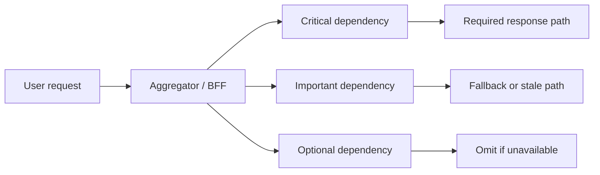

In a microservice system, partial failure is not an edge case. It is the normal shape of trouble. One dependency slows down, one cache goes cold, one projection lags, one recommendation engine times out. The architectural question is not whether failure happens. It is whether the product still behaves in a controlled, understandable way when only part of the system is healthy.

Graceful degradation is often described too vaguely. It does not mean "show some fallback." It means deciding which features are critical, which can be reduced, and which must fail fast so the rest of the system remains useful.

## Design Around User Journeys, Not Just Dependencies

Teams often map resilience around services:

- catalog service
- pricing service
- recommendation service
- notification service

Users do not experience the system that way. They experience:

- homepage load
- product detail
- checkout
- order tracking

Graceful degradation should be designed around those user journeys.

For example:

- checkout may require pricing and inventory, but not recommendations
- product detail may tolerate stale review counts
- account dashboard may tolerate delayed loyalty updates

The main rule is simple: not every dependency is equally critical to every experience.

## A Practical Criticality Model

For each dependency in a user flow, classify it as:

| Level | Meaning |
| --- | --- |
| Required | without it, the core action is invalid or unsafe |
| Important | the experience is worse, but still usable |
| Optional | the experience can proceed cleanly without it |

This classification is more useful than generic "tier 1 / tier 2" labels because it links degradation to real product behavior.

## Graceful Degradation Is A Product Contract

Good degradation is explicit:

- what the user still can do
- what is temporarily unavailable
- whether data may be stale
- whether retrying is useful

Bad degradation is ambiguous:

- empty widgets with no explanation
- partial responses that look complete
- timeouts that leave users unsure what succeeded

> [!WARNING]
> A degraded response that hides missing or stale data is often worse than an explicit partial-failure experience.

## An Example: Product Detail Page

Assume the page depends on:

- catalog details
- live inventory
- pricing
- recommendations
- reviews summary

A healthy degradation plan might be:

- fail the page only if catalog details are unavailable
- allow stale inventory with a visible "availability may change at checkout" note
- fail closed on pricing if the customer could otherwise see an invalid offer
- omit recommendations if the service is slow
- show cached review summary if live aggregation is unavailable

That is not just engineering behavior. It is product behavior encoded in architecture.

## Architecture Picture



This framing helps teams reason about where failure should stop propagating.

## Fail Fast, Fail Soft, Or Fail Closed

There are only a few meaningful choices:

- **fail fast** when the dependency is required and waiting longer only burns budget
- **fail soft** when a reduced experience is still honest and useful
- **fail closed** when returning uncertain data would violate trust or correctness

Examples:

- payment authorization dependency during checkout: usually fail closed
- recommendation engine on homepage: usually fail soft
- profile-photo service on admin audit action: maybe fail fast if not essential

The value is in making the policy explicit instead of letting every caller improvise.

## Code Should Reflect Degradation Decisions

One useful pattern is to model partial responses explicitly.

```java
public record ProductPageResponse(
        ProductView product,
        PriceView price,
        InventoryView inventory,
        List<RecommendationView> recommendations,
        List<String> warnings
) {}
```

That matters because degradation becomes part of the response contract, not an accidental side effect of exception handling.

## Timeouts Need To Follow The Criticality Model

Graceful degradation breaks down when all downstream calls use the same timeout strategy.

Required dependencies may deserve:

- tight timeout
- immediate fail-closed path
- clear user-facing error

Optional dependencies may deserve:

- shorter timeout
- fallback to cached data
- omission from the response

Important dependencies may deserve:

- bounded wait
- stale read fallback
- user-visible warning

One shared timeout policy often means the system treats all value as equal when it is not.

## Common Failure Modes

- optional dependencies are allowed to block required paths
- stale data is served without any product understanding of its consequences
- retries amplify latency for already-failing flows
- fallback code paths are never exercised until an incident
- degraded mode is not observable in metrics or logs

The last point matters more than most teams expect. If degraded mode is invisible, operators will not know whether the system is resilient or just silently dropping product value.

## Observability For Degraded Mode

At minimum, track:

- rate of degraded responses
- which dependency triggered degradation
- fallback type used: stale, omitted, defaulted, queued
- business impact: checkout blocked, recommendation omitted, stale profile shown

This lets you distinguish "system stayed up" from "system stayed barely functional."

## Failure Drills Worth Running

Test each of these deliberately:

1. recommendation dependency times out during peak load
2. inventory dependency is stale but not fully down
3. pricing dependency fails during checkout
4. one degraded dependency causes retry storms from upstream clients

A good exercise ends with a clear answer to two questions:

- what did the user experience?
- what signal told operators the system had degraded rather than fully failed?

## Key Takeaways

- Graceful degradation should be designed around user journeys, not only around service topology.
- Every dependency in a flow should be classified as required, important, or optional.
- Good degraded behavior is explicit, honest, and observable.
- A resilient system is not one that avoids all failure. It is one that contains failure without lying about what still works.

---

## Design Review Prompt

During review, ask:

If this dependency becomes slow or unavailable, what exactly does the user still see, what do they lose, and how will we know that degraded mode is active?

If the answer is vague, the graceful-degradation story is not real yet.
