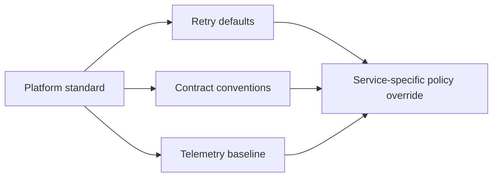

Platform standards are supposed to reduce cognitive load. In weak microservice programs, they do the opposite: every team gets a library, a YAML file, and a checklist, but nobody can explain which standards are mandatory, which are defaults, and which still require service-specific judgment.

This article is about designing platform standards that actually improve system reliability. The focus is on three areas where inconsistency hurts fast:

- retries
- service contracts
- telemetry

The goal is not total uniformity. The goal is to create a paved road that removes avoidable variance without flattening legitimate architectural differences.

## Standardize The Mistakes You Never Want Repeated

The best platform standards target the mistakes that keep recurring across teams:

- infinite or duplicated retries
- incompatible timeout defaults
- inconsistent error envelopes
- missing trace context
- high-cardinality metric labels
- undocumented contract-breaking changes

If the standard does not address a repeated operational failure mode, it may be governance theater rather than platform value.

## Separate Non-Negotiables From Defaults

One reason platform standards fail is that every rule is presented with equal weight.

In practice, there are three categories:

| Category | Meaning |
| --- | --- |
| Mandatory | every service must comply |
| Default | use unless the service has a justified reason not to |
| Advisory | useful guidance, but not enforced platform policy |

Examples of mandatory standards:

- propagate trace and correlation IDs
- emit basic request, error, and latency telemetry
- define explicit timeout values for outbound calls
- version or govern contract changes through an approved process

Examples of defaults:

- recommended retry policy for short transient failures
- shared error response format
- standard tags for metrics and traces

This distinction matters because it keeps the platform from becoming a giant pile of "best practices" with no enforcement semantics.

## Retries Need Guardrails, Not Blind Convenience

Retries are one of the most dangerous places for accidental inconsistency.

What the platform should provide:

- a shared retry abstraction
- sane defaults for jitter and exponential backoff
- clear rules about what is retryable
- visibility into retry counts and failure reasons

What the platform should not assume:

- that all operations are safe to retry
- that retrying business rejections is acceptable
- that all services have the same latency budget

> [!WARNING]
> A platform retry library without policy boundaries often spreads retry storms faster than it prevents failures.

## Contract Standards Should Reduce Surprise

A platform cannot design every domain contract, but it can standardize the mechanics that make contracts easier to evolve.

Useful cross-team standards include:

- error envelope shape
- idempotency-key header conventions for write APIs
- pagination conventions
- deprecation metadata and telemetry requirements
- consumer-visible correlation IDs

Those do not remove domain-specific design, but they reduce needless drift at the edges.

## Telemetry Standards Should Support Real Incident Work

Telemetry standards are valuable when they make services debug-friendly, not when they just maximize observability output.

Good standards:

- consistent service name and operation naming
- baseline RED metrics or equivalent
- trace context propagation
- deployment version and tenant-safe dimensions
- structured logs with correlation IDs

Bad standards:

- label everything with arbitrary dimensions
- let each team invent its own operation names
- require dashboards nobody uses during incidents

The platform should optimize for incident navigation: finding the broken request path fast, not for observability aesthetics.

## Architecture Picture



This distinction is important. The platform provides the baseline, but the service still owns business semantics.

## A Good Paved-Road Example

Imagine a shared outbound client wrapper:

```java
public interface OutboundCallPolicy {
    Duration timeout();
    RetryPolicy retryPolicy();
    boolean idempotentOperation();
}
```

The platform can provide:

- timeout enforcement
- retry instrumentation
- trace propagation
- standard error tagging

But the service still decides whether the operation is idempotent and whether retries are acceptable. That is the right split of responsibility.

## Governance Should Be Lightweight But Real

Standards become shelfware if the adoption mechanism is weak.

Reasonable enforcement approaches:

- starter libraries or service templates
- CI checks for trace propagation and telemetry presence
- API review for contract-breaking changes
- dashboards showing adoption gaps

The key is making compliance visible without forcing every team through bureaucratic architecture review for trivial changes.

## The Most Common Failure Modes

- the platform standard is too rigid for legitimate edge cases
- teams can override critical defaults silently
- one library mixes infrastructure policy with business assumptions
- standards are documented but not measurable
- the platform team standardizes output, not operator usefulness

Standards fail when they either over-centralize design or under-specify the things that matter operationally.

## Failure Drills To Validate The Standard

Before calling a new standard successful, test:

1. two services from different teams under the same transient failure
2. a contract deprecation where consumer usage must be measured
3. an incident where one request path crosses three services
4. a retry storm where you need to see which layer is amplifying load

If the standard does not make these scenarios easier, it is not pulling its weight.

## Key Takeaways

- Platform standards should target recurring failure modes, not generic architectural taste.
- The healthiest platforms distinguish mandatory rules from defaults and advice.
- Retry, contract, and telemetry standards should create consistency at the edges while preserving service-level business judgment.
- A paved road is successful only when teams can move faster and operators can debug more reliably.

---

## Design Review Prompt

For every proposed platform standard, ask:

1. what recurring failure mode does this eliminate,
2. what remains service-owned,
3. how will we measure adoption and usefulness during a real incident.

If those answers are weak, the standard is probably too abstract to help.
