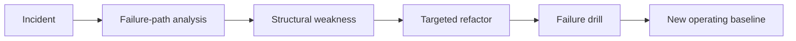

The most honest architecture reviews usually happen after an incident. That is when hidden coupling, poor fallback behavior, weak ownership boundaries, and noisy operational assumptions stop being theoretical. The mistake many teams make is treating the incident only as a reliability event instead of an architecture signal.

This article is about using incidents to drive architectural refactoring without overreacting to a single outage. The goal is to turn recurring production pain into targeted structural improvement.

## Not Every Incident Demands A Refactor

An incident can come from:

- a one-off operational error
- a bad rollout
- missing capacity
- poor observability
- a real design flaw

Only the last category truly requires architectural change.

A good post-incident review separates:

- what failed this time
- what would keep failing under slightly different conditions

The second question is where architecture work begins.

## Look For Repeating Failure Shapes

Architecture refactoring becomes justified when incidents reveal recurring structural patterns such as:

- one service acting as an accidental central dependency
- long synchronous call chains amplifying latency
- shared data ownership causing ambiguous recovery
- retry behavior multiplying downstream load
- workflows with no clear compensation or timeout owner

These patterns matter more than the exact stack trace from one outage.

## Incidents Expose Hidden Boundaries

One of the most useful architecture questions after an incident is:

**Where did the system behave like one component even though the design claimed several independent services?**

Examples:

- three services always fail together because they share one synchronous dependency chain
- two teams cannot restore service independently because ownership crosses databases
- one "optional" dependency turns out to be required for a critical path

That is often the real refactoring target, not the immediate bug.

## A Practical Incident-To-Refactor Flow

Use a sequence like this:

1. reconstruct the user-visible failure
2. identify the dependency path that amplified it
3. separate triggering condition from structural weakness
4. choose the smallest refactor that changes the future failure shape
5. verify the new design with a failure drill

This keeps refactoring focused on resilience outcomes instead of broad redesign enthusiasm.

## Architecture Picture



This flow matters because architecture learning only counts when it changes the next outage, not just the retrospective document.

## A Concrete Example

Imagine a commerce platform where checkout failed because:

- `Ordering` called `Pricing`
- `Pricing` called `Promotions`
- `Promotions` called `CustomerEligibility`
- one eligibility dependency became slow

The direct incident cause may be a slow downstream dependency. But the architectural signal might be:

- checkout depends on a deep synchronous chain
- promotion evaluation has become too entangled with customer-profile lookup
- there is no degraded pricing policy for partial dependency failure

The refactor might not be "rewrite promotions." It might be:

- precompute eligibility signals
- simplify the synchronous pricing path
- split optional campaign logic from required checkout pricing

That is a much more useful outcome than fixing one timeout.

## Refactor Toward Clearer Failure Containment

Good incident-driven refactors usually do one of a few things:

- shorten a call chain
- move optional work out of the critical path
- separate write ownership from read composition
- add explicit workflow state where recovery was previously implicit
- isolate expensive or bursty tenants/workloads

These are architecture-level changes because they change blast radius, not just code style.

## Avoid Retrospective Theater

Teams sometimes produce elegant postmortems and then pick refactors that are too broad, too vague, or too disconnected from the incident.

Bad examples:

- "move to event-driven architecture"
- "adopt service mesh"
- "introduce DDD boundaries"

Those may someday be good ideas, but they are not incident-driven unless the incident exposed a clear failure mode those changes directly address.

> [!WARNING]
> The most expensive postmortem outcome is a large refactor that feels strategic but does not actually change the failure pattern that caused the incident.

## Use Operational Evidence To Prioritize

A refactor deserves priority when the incident data shows:

- repeated occurrence across services or quarters
- high customer or revenue impact
- poor operator recovery time because system structure is confusing
- no credible workaround under load

This helps distinguish genuine architecture debt from ordinary service maintenance.

## Write Refactor Goals In Failure Terms

A strong architecture action item sounds like:

- "checkout must continue without recommendations"
- "pricing cannot depend on customer-profile lookups in the synchronous path"
- "duplicate message delivery must not create duplicate fulfillment requests"

That is much better than:

- "clean up service boundaries"
- "improve resiliency"
- "decouple services more"

The first set is testable. The second set is aspirational.

## Code Can Support Safer Follow-Through

Sometimes the architectural lesson needs an explicit seam in the codebase.

```java
public interface PricingEligibilityView {
    EligibilitySnapshot currentSnapshot(String customerId);
}
```

This kind of seam can support a refactor from live synchronous dependency to precomputed eligibility view. The architectural point is not the interface itself. It is the new failure boundary it makes possible.

## Failure Drills After The Refactor

A refactor is not done when the PR merges. It is done when the original incident shape is harder to reproduce.

Run the same class of failure again:

1. degrade the dependency that previously amplified the outage
2. observe the new user-visible behavior
3. verify that alerts and dashboards reflect the new boundary
4. confirm that recovery steps are simpler and owned by fewer teams

Without that validation, teams often assume a design improvement they have not actually proved.

## Key Takeaways

- Incidents are one of the best sources of architecture truth because they expose hidden coupling under pressure.
- The right refactor targets repeating failure shapes, not just the exact triggering bug.
- Strong post-incident actions are written in terms of changed failure behavior, not vague system aspirations.
- A useful incident-driven refactor reduces blast radius, shortens recovery, or makes degraded behavior more honest.

---

## Design Review Prompt

After a serious incident, ask:

1. what structural weakness made this outage easy to trigger,
2. what small set of changes would alter that failure path next time,
3. how will we prove the refactor actually changed the blast radius.

If those answers are clear, the incident is starting to pay architecture dividends.
