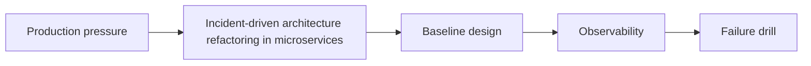

---
categories:
- Java
- Microservices
- Architecture
date: 2026-08-12
seo_title: Incident-driven architecture refactoring in microservices - Advanced Guide
seo_description: Advanced practical guide on incident-driven architecture refactoring
  in microservices with architecture decisions, trade-offs, and production patterns.
tags:
- java
- microservices
- distributed-systems
- architecture
- backend
title: Incident-driven architecture refactoring in microservices
toc: true
toc_icon: cog
toc_label: In This Article
header:
  overlay_image: "/assets/images/java-advanced-generic-banner.svg"
  overlay_filter: 0.35
  show_overlay_excerpt: false
  caption: Microservices Architecture and Reliability Patterns
---
Incident-driven architecture refactoring in microservices is not just a diagramming exercise. The hard part is deciding where ownership, failure handling, and change coordination should live once the system is split across services.

---

## Problem 1: Incident-driven architecture refactoring in microservices

Problem description:
We want to use incident-driven architecture refactoring in microservices without creating hidden coupling, rollout friction, or a distributed monolith. This part focuses on the baseline model and the safe default shape.

What we are solving actually:
We are establishing the core boundary, deciding what must stay explicit, and choosing a baseline that is easy to observe. For service architectures, the hidden risk is usually coupling that migrates from code into network boundaries and release processes.

What we are doing actually:

1. make the service landscape explicit: identify the ownership boundary and the non-negotiable invariant
2. make the service landscape explicit: choose the simplest baseline design that preserves correctness
3. make the service landscape explicit: make observability visible from the first implementation
4. make the service landscape explicit: validate the baseline with one concrete failure drill

---

## Why This Topic Matters

- service boundaries become release and incident boundaries too
- latency and ownership trade-offs often dominate abstract purity
- one unclear contract can multiply operational friction across many teams

---

## Architecture Model



The picture focuses on ownership, contracts, and failure flow because those are the expensive parts to undo once incident-driven architecture refactoring in microservices is live.
If a diagram cannot make those boundaries obvious, the implementation usually hides coupling rather than removing it.

---

## Practical Design Pattern

```java
public final class ServiceBoundary {
    public Decision evaluate(Command command) {
        // Keep ownership and failure policy explicit for: Incident-driven architecture refactoring in microservices
        return Decision.accept();
    }
}
```

The example is small on purpose: it shows where the decision enters and who owns the consequence when incident-driven architecture refactoring in microservices is applied.
That is usually more valuable in review than a larger demo that hides contracts behind extra scaffolding.

---

## Failure Drill

Baseline drill: degrade one dependency and observe whether the boundary still contains failure instead of amplifying it for incident-driven architecture refactoring in microservices.

That drill matters early, before rollout assumptions harden into defaults because service boundaries around incident-driven architecture refactoring in microservices usually break through coordination delay and unclear ownership long before they break through code syntax.

---

## Debug Steps

Debug steps:

- map the exact ownership boundary before discussing implementation mechanics while validating incident-driven architecture refactoring in microservices
- measure network and retry impact separately from business logic correctness while validating incident-driven architecture refactoring in microservices
- look for hidden coupling in shared databases, release order, or schemas while validating incident-driven architecture refactoring in microservices
- validate canary behavior under one realistic dependency failure while validating incident-driven architecture refactoring in microservices

---

## Production Checklist

- clear owner for the boundary introduced by the design
- latency or contract-health signal attached to the new interaction
- dependency degradation path documented before rollout
- canary step that validates the service split under real traffic

---

## Key Takeaways

- Incident-driven architecture refactoring in microservices should be designed as a production decision, not just an implementation detail
- boundaries are only good when ownership and failure semantics remain clear
- start from a measurable baseline before optimizing

---

## Design Review Prompt

A useful final check for incident-driven architecture refactoring in microservices is whether the ownership boundary, rollback path, and main SLO signal can all be explained in three sentences. If not, the design is probably still too implicit.
