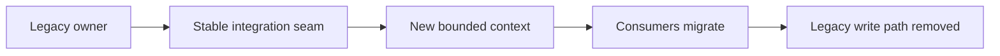

---
categories:
- Java
- Microservices
- Architecture
date: 2026-08-13
seo_title: Service decomposition with bounded contexts (avoiding distributed monoliths)
  (Part 2) - Advanced Guide
seo_description: Advanced practical guide on service decomposition with bounded contexts
  (avoiding distributed monoliths) (part 2) with architecture decisions, trade-offs,
  and production patterns.
tags:
- java
- microservices
- distributed-systems
- architecture
- backend
title: Service decomposition with bounded contexts (avoiding distributed monoliths)
  (Part 2)
toc: true
toc_icon: cog
toc_label: In This Article
header:
  overlay_image: "/assets/images/java-advanced-generic-banner.svg"
  overlay_filter: 0.35
  show_overlay_excerpt: false
  caption: Microservices Architecture and Reliability Patterns
---
Part 1 focused on where service boundaries should exist. Part 2 is about the part teams often underestimate: how to move toward those boundaries without creating a migration-era distributed monolith.

Many decompositions fail not because the target boundary is wrong, but because the extraction path creates months of dual writes, ambiguous ownership, temporary shared schemas, and release coupling that never gets cleaned up.

This article focuses on extraction strategy, temporary seams, and the signs that a "transition state" is becoming permanent architecture debt.

## The Extraction Path Matters As Much As The Destination

A good target decomposition can still fail operationally if the migration plan:

- requires many coordinated deployments
- allows two services to write the same business concept for too long
- relies on hidden schema compatibility assumptions
- leaves nobody certain which service is now authoritative

The migration plan should be evaluated with the same seriousness as the target architecture.

## Choose One Ownership Transfer Model

When moving a domain capability out of an existing system, teams usually need one of these models:

| Model | Best when | Main risk |
| --- | --- | --- |
| Strangler routing | request boundary is already clean | legacy internals may still leak through shared dependencies |
| Extract read first | you need safer query isolation before moving writes | false confidence if writes still remain coupled |
| Extract write ownership first | business invariant must move urgently | migration complexity on downstream readers |
| Event-carried transition | downstream consumers can rebuild state from durable events | replay and lag handling become critical |

The biggest mistake is mixing several models without naming the transition point for each.

## Do Not Let Temporary Shared Ownership Drift

During extraction, some temporary overlap is normal. What is dangerous is leaving that overlap unbounded.

Examples of high-risk transition states:

- old service writes customer credit limit, new service also writes adjustments
- both systems derive order status independently
- migration scripts update the same rows that live traffic is still mutating

Those are not just messy transitions. They are conditions where incidents turn into ownership arguments.

> [!WARNING]
> Temporary dual-write or shared-table arrangements need a named exit condition. Without one, they usually become the real long-term system design.

## A Safer Bounded-Context Extraction Sequence

For many teams, this order works better than a "rewrite and cut over" plan:

1. define the new service's owned invariant clearly
2. expose the old system through a stable integration seam
3. extract read models or client routing first if that reduces coupling
4. move authoritative writes once ownership is operationally ready
5. remove old write paths aggressively once cutover is proven

This sequence keeps migration pressure focused on business ownership instead of on moving files and endpoints around.

## Example: Extracting Pricing From Checkout

Suppose a monolith or overly broad `Checkout` service currently owns:

- promotions
- currency handling
- discount policy
- checkout orchestration

The target architecture says `Pricing` should become its own bounded context.

A weak extraction looks like:

- create `PricingService`
- continue reading the old tables directly
- let both systems calculate discounts during a transition

A stronger extraction looks like:

- make `Checkout` call an explicit pricing contract
- move pricing computation behind that contract
- cut off old write paths to discount rules
- migrate consumers to pricing outputs instead of database reads

The second path makes ownership more explicit even before every internal detail has moved.

## Architecture Picture



The seam matters because it creates a controlled place for ownership transfer instead of scattering migration logic through many consumers.

## Use Anti-Corruption Layers Deliberately

During migration, an anti-corruption layer can be extremely useful when:

- the old domain language is poor or overloaded
- the legacy model does not map cleanly to the new context
- you need to shield the new service from temporary legacy semantics

It is less useful when teams use it as a polite name for "we still do not know who owns what."

An anti-corruption layer should reduce semantic confusion, not prolong it.

## Measure Whether The Boundary Is Becoming Real

You should be able to see progress in concrete terms:

- fewer direct reads from the old schema
- fewer coordinated releases between old and new owners
- reduced number of shared write paths
- clearer incident routing and ownership

If the migration delivers none of those, the decomposition may be architectural theater.

## Code Can Make The Seam Explicit

```java
public interface PricingDecisionProvider {
    PriceDecision quote(QuotePricingCommand command);
}
```

This matters because callers now depend on a pricing decision contract rather than internal discount tables or checkout-specific helpers. That is the kind of seam that survives after migration, which is exactly what you want.

## Failure Drills For Extraction Work

Before declaring a migration phase safe, simulate:

1. old service unavailable while some consumers still depend on it indirectly
2. new service returns a valid but different domain interpretation than legacy code
3. delayed event or backfill causes old and new read models to diverge
4. rollback attempt after write ownership has partially moved

These exercises reveal whether the transition model is operationally honest.

## Signs You Are Building A Migration-Era Distributed Monolith

- every release plan still requires multiple teams to move together
- both old and new services own pieces of the same invariant
- consumers cannot explain which response is authoritative
- rollback plans depend on silent data reconciliation

When those signs persist, the system is not "in transition." It is already paying distributed-monolith costs.

## Key Takeaways

- A bounded-context extraction should be designed as an ownership transfer, not just a code movement plan.
- Temporary seams are healthy only when they have a defined exit and measurable progress.
- The migration path should reduce shared writes, release coupling, and semantic confusion over time.
- A decomposition is only succeeding when the new service becomes operationally authoritative, not merely deployable.
