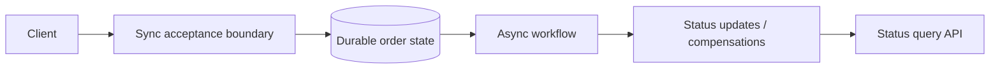

---
categories:
- Java
- Microservices
- Architecture
date: 2026-08-14
seo_title: Sync vs async communication selection framework (Part 2) - Advanced Guide
seo_description: Advanced practical guide on sync vs async communication selection
  framework (part 2) with architecture decisions, trade-offs, and production patterns.
tags:
- java
- microservices
- distributed-systems
- architecture
- backend
title: Sync vs async communication selection framework (Part 2)
toc: true
toc_icon: cog
toc_label: In This Article
header:
  overlay_image: "/assets/images/java-advanced-generic-banner.svg"
  overlay_filter: 0.35
  show_overlay_excerpt: false
  caption: Microservices Architecture and Reliability Patterns
---
Part 1 focused on choosing between synchronous and asynchronous communication based on business contract. Part 2 focuses on what happens after that initial choice, when retries, timeouts, duplicate delivery, and ambiguous outcomes start showing up in production.

This is where many seemingly reasonable designs break. A synchronous call that was fine at low traffic becomes a latency amplifier. An asynchronous handoff that looked decoupled becomes hard to reason about because nobody owns the status model. The real architecture question becomes: how do we handle uncertainty after the first design decision?

## The Hardest Case: Ambiguous Success

The most dangerous communication outcome is not clean success or clean failure. It is uncertainty.

Examples:

- synchronous request timed out, but the downstream side effect may have succeeded
- asynchronous command was accepted, but the consumer has not processed it yet
- an event was published twice and two consumers reacted differently

The system needs an explicit answer for what callers, operators, and downstream services should do in those states.

## When Sync Starts To Break Down

A synchronous flow is often still the right choice for immediate decisions, but it becomes risky when:

- multiple services sit on the same user-facing critical path
- retries are layered in several places
- the caller cannot distinguish business rejection from transient failure
- the same write may be attempted again after an ambiguous timeout

At that point, the problem is no longer "REST versus Kafka." It is ownership of uncertain outcomes.

## When Async Starts To Break Down

Asynchronous communication can reduce coupling, but it introduces its own failure shapes:

- no clear user-visible status
- duplicate delivery without idempotent handling
- consumers that lag without any freshness signal
- durable handoff in one system but no durable state transition in another

Async architecture is healthy only when delayed completion is made explicit rather than hidden.

> [!WARNING]
> Asynchronous handoff is not automatically safer than synchronous communication. It is safer only when the business can tolerate delayed truth and the platform can make that delay visible.

## A Better Second-Level Framework

After the initial sync-vs-async decision, apply a second filter:

| Question | If yes | Design consequence |
| --- | --- | --- |
| Can the caller observe an ambiguous timeout? | Yes | require idempotency or status lookup |
| Can the same logical command be delivered twice? | Yes | require duplicate-safe handling |
| Can the work complete after the caller disconnects? | Yes | expose durable status model |
| Can downstream lag change user expectations? | Yes | define freshness semantics |

This is the layer where reliable systems separate themselves from merely functional ones.

## A Useful Example: Order Submission

Suppose a client submits an order.

Synchronous part:

- validate cart
- compute price
- create pending order

Asynchronous part:

- reserve inventory
- authorize payment
- publish order-confirmed side effects

The weak design says:

- return success once the request is accepted
- hope downstream coordination completes

The stronger design says:

- return an order ID and explicit status
- make the order lifecycle queryable
- define what `PENDING`, `CONFIRMED`, and `FAILED` actually mean

That turns async uncertainty into a product contract rather than a support ticket.

## Architecture Picture



The key point is that once a workflow spans time, the system needs a durable status model. Without it, async design is just delayed ambiguity.

## Retries Need Different Treatment In Each Style

For synchronous paths:

- retry only short-lived transport failures
- avoid broad retries on non-idempotent writes
- distinguish retryable dependency errors from business rejection

For asynchronous paths:

- expect replay
- make consumers idempotent
- define dead-letter and reprocessing behavior clearly

This difference is why one generic "retry policy" rarely works across both styles.

## Backpressure Is Also A Communication Choice

A synchronous service under load may:

- reject quickly
- queue briefly
- shed optional work

An asynchronous pipeline under load may:

- allow lag to grow
- throttle producers
- route to dead letter or delayed retry

These are all communication-level decisions because they shape what the caller believes about system progress.

## Code Should Reflect The Status Model

```java
public enum OrderProcessingStatus {
    ACCEPTED,
    PENDING_CONFIRMATION,
    CONFIRMED,
    FAILED
}

public record OrderSubmissionResponse(
        String orderId,
        OrderProcessingStatus status
) {}
```

This kind of API helps because it prevents the system from pretending asynchronous work is already complete. The client gets a durable reference point instead of an optimistic lie.

## Common Failure Modes

- synchronous paths with no idempotency for ambiguous timeouts
- asynchronous designs with no status lookup or lifecycle model
- retries layered at client, gateway, service, and broker
- delayed consumers with no freshness SLO
- events used for work that really needed immediate authoritative answer

These failure modes usually appear together, which is why part 2 has to go deeper than the original sync-versus-async choice.

## Failure Drills Worth Running

Run these scenarios:

1. synchronous write succeeds downstream but times out before client sees response
2. asynchronous consumer processes the same command twice
3. workflow remains pending longer than product expects
4. retry storm hits a service that already uses async fan-out internally

If the team cannot explain the caller contract and operator workflow for each case, the communication model is still incomplete.

## Key Takeaways

- The initial sync-vs-async choice is only the first design decision; the harder part is handling uncertainty after that choice.
- Ambiguous outcomes require idempotency, durable status, or both.
- Synchronous and asynchronous paths need different retry, backpressure, and visibility strategies.
- A communication design is production-ready only when callers can tell the difference between acceptance, completion, and failure.
