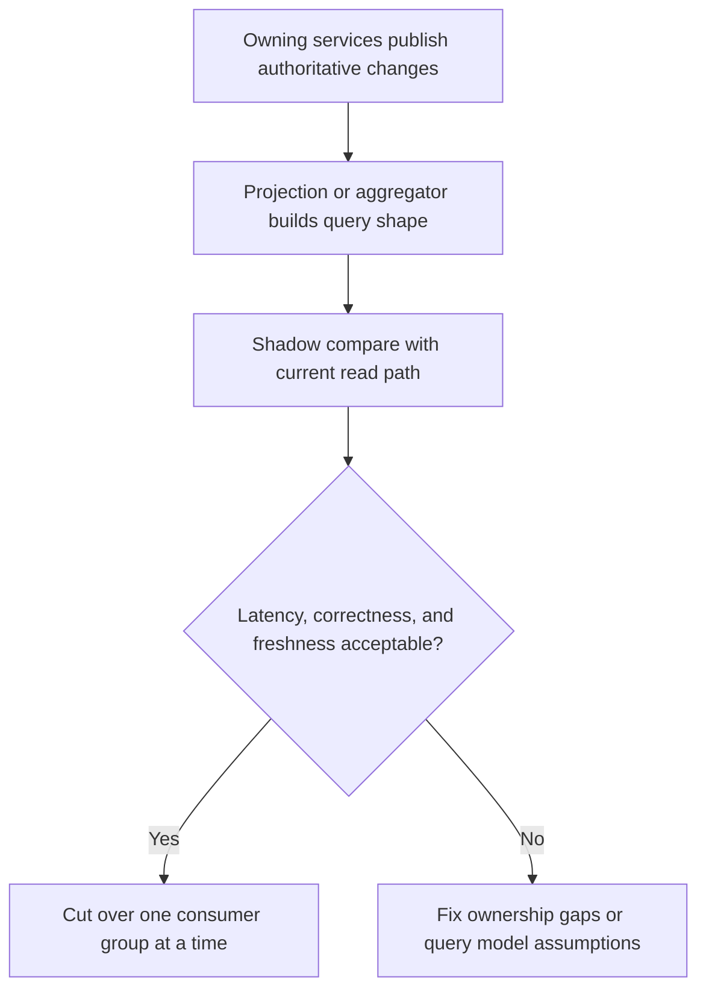

Part 2 is where data ownership stops being a boundary slogan and starts colliding with real query pressure.

Most teams can agree that one service should own one business fact.
The trouble begins when product requirements need combined views across those facts, and every team is tempted to solve that pressure with "just one more synchronous call" or "just one temporary join."

## Quick Summary

| Decision area | Safer default | Why |
| --- | --- | --- |
| Ownership of writes | one service owns each business fact | duplicate write ownership becomes reconciliation work later |
| Cross-service query shape | use explicit composition or projections | convenience reads tend to hide coupling |
| Freshness expectations | document them per read path | "eventually consistent" is too vague to operate |
| Migration approach | shadow and compare before cutting over | query regressions are often subtle, not immediate |
| Failure strategy | degrade the read, not the ownership model | incidents get worse when teams bypass boundaries under pressure |

Part 1 usually explains why ownership matters.
Part 2 is about making the read side survivable.

## What Part 2 Is Really About

The hard question is not "can these services talk to each other?"
The hard question is "what kind of read dependency are we willing to operate?"

For most systems, you are choosing among three costs:

- synchronous dependency fan-out
- stale but efficient materialized reads
- tighter client coupling through custom aggregators

There is no free option.
What matters is choosing the cost intentionally instead of discovering it accidentally during an incident.

## The Real Tradeoff Is Freshness Versus Dependency Fan-Out

Teams often describe query strategy as a technical design choice.
Operators feel it as a reliability choice.

If a user request synchronously calls four services to build one response, you have:

- four latency distributions in the hot path
- four failure domains affecting one user action
- more retry interactions
- harder rollback during consumer migration

If you move that query into a projection, you trade some freshness for:

- lower request-time dependency fan-out
- clearer failure containment
- easier scaling for read-heavy paths

Neither is automatically right.
The mistake is pretending they fail in the same way.

## Where Query Models Usually Earn Their Keep

A dedicated query model is usually worth the extra machinery when:

- a UI or API repeatedly needs fields owned by multiple services
- the read pattern is high-volume and latency-sensitive
- some staleness is acceptable and measurable
- you want consumer-specific shaping without leaking domain ownership

A query model is usually the wrong answer when:

- callers actually need transactional freshness
- the query is rare and coordination is cheap
- the team still has not agreed on who owns the source fields

If the ownership boundary is fuzzy, a projection does not fix the problem.
It just copies the ambiguity into another datastore.

## The Boundary Must Stay Explicit

The easiest way to ruin a good ownership model is to make cross-service reads feel harmless.

Write these rules down:

1. one service owns each authoritative write path
2. no service reads another service's private storage directly
3. every multi-service query uses a named pattern: composition, projection, or exported read API
4. every projection has a freshness contract
5. every temporary bridge has an owner and a removal date

That last rule matters more than teams expect.
Temporary read bridges are one of the main ways a clean decomposition turns back into a distributed monolith.

## Hardening Patterns That Work in Practice

### Use shadow reads before consumer cutover

Build the new read path, keep the old one alive briefly, and compare:

- field completeness
- freshness lag
- latency
- error rate under dependency issues

Most read migrations fail through small mismatches, not dramatic outages.

### Put freshness language in the contract

Do not say a query model is "eventually consistent."
Say something an operator can reason about:

- expected lag under normal conditions
- maximum tolerated lag before alerting
- which fields may be stale
- which user actions must still hit the owning service directly

### Degrade reads intentionally

If one dependency is slow or one projection is behind, decide in advance whether the caller gets:

- partial data
- stale data with a warning
- a fallback summary view
- a hard failure

That choice belongs in the product and platform contract, not in ad hoc incident Slack messages.

## Failure Modes That Keep Reappearing

### Hidden integration hubs

One service becomes the unofficial place where everyone composes everyone else's data.
It is called an API, but operationally it is a coupling concentrator.

### Projection without replay confidence

Teams build a read model but never prove they can rebuild it cleanly from source events or source state.
The first corruption incident then becomes a design review in production.

### Duplicate field ownership

`Orders` thinks it owns customer-facing status.
`Payments` also exposes a payment status that product treats as authoritative.
Soon both teams are changing user-visible truth from different services.

### Query success hiding stale truth

The endpoint returns `200 OK`, but the projection is thirty minutes behind.
Technically available, practically wrong.

## A Practical Hardening Pattern

The important step is not just building the new read path.
It is comparing it against the old one long enough to catch stale assumptions and missing fields before users do.

## Failure Drill Worth Running

Before full cutover, simulate all three of these:

1. the projection lags badly for ten minutes
2. one synchronous dependency in the composed path starts timing out
3. one consumer still expects the old cross-service contract

Then verify:

- which team owns the incident
- whether dashboards show freshness separately from endpoint availability
- whether rollback can happen per consumer group
- whether operators know which data is authoritative when two views disagree

If the answer to "who owns the truth right now?" is fuzzy, the design is not ready.

## Operator Checklist

- each user-visible field maps to one owning service
- the approved read pattern is named and documented
- freshness lag is measured, not hand-waved
- shadow comparison exists for migration paths
- degraded-read behavior is decided before incidents
- replay or rebuild of the query model is tested

## Key Takeaways

- Data ownership gets tested hardest on the read side, not the write diagram.
- Cross-service query strategy is a reliability decision as much as an architecture decision.
- Projections, composition, and direct reads are all valid only when their tradeoffs are explicit.
- The goal of Part 2 is not more abstraction. It is fewer surprises when query pressure hits production.
