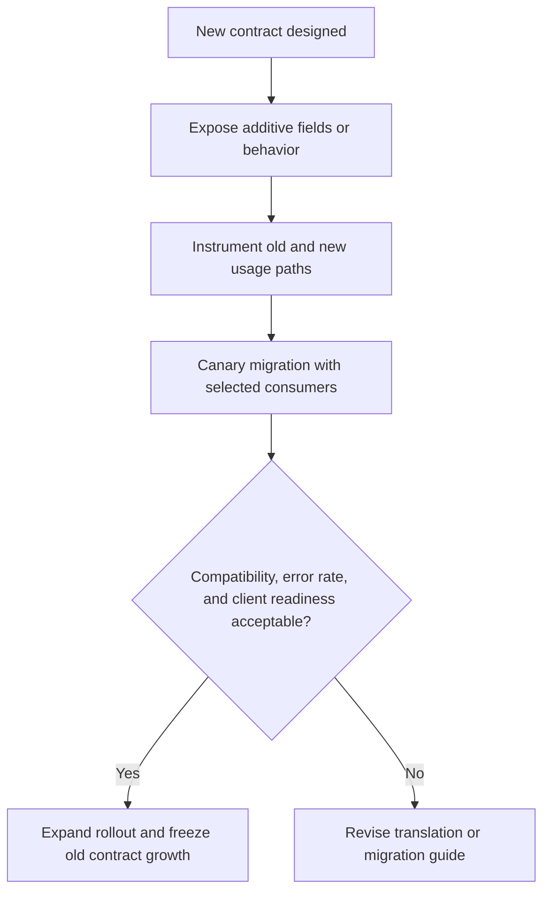

Part 2 is where API compatibility stops being a schema discussion and becomes a rollout discipline.

Teams usually know the obvious rule: avoid breaking clients.
What is less obvious is how many "compatible" changes are still operationally dangerous because they shift semantics, default behavior, or traffic patterns in ways that older consumers were never built to handle.

## Quick Summary

| Decision area | Safer default | Why |
| --- | --- | --- |
| Compatibility judgment | evaluate behavior, not just field shape | semantic breaks hurt even when JSON still parses |
| Migration path | add before remove | consumers need overlap time |
| Version translation | centralize where practical | scattered translation logic creates drift |
| Rollout gate | measure real consumer behavior | deprecation plans without telemetry are guesses |
| Removal readiness | prove dependency is gone | "nobody should be using it" is not evidence |

Part 1 usually sets the compatibility principles.
Part 2 is about surviving the messy middle where old and new contracts both exist.

## The Most Dangerous Breaking Changes Do Not Look Breaking

API teams often focus on obvious breaks:

- removed fields
- renamed endpoints
- changed status codes

Those matter, but many production incidents come from changes that look harmless:

- an old default value now means something different
- an enum gains a value that some clients treat as impossible
- sorting or pagination semantics shift
- a field remains optional but becomes operationally required
- retry behavior changes because validation moved deeper into the stack

Schema compatibility is necessary.
It is not sufficient.

## A Better Compatibility Model

When reviewing an API change, ask three separate questions:

### Can old clients still parse it?

This is the narrowest compatibility test.
It answers only whether the payload shape is still consumable.

### Can old clients still behave correctly?

This is the more important test.
A field can parse fine and still drive the wrong product behavior.

### Can the platform still operate both versions safely?

Mixed-version periods create their own risks:

- doubled metrics cardinality
- more complex dashboards
- longer support windows
- extra translation code
- rollback ambiguity

If the compatibility plan ignores that last category, it is incomplete.

## Translation Logic Needs a Home

One of the fastest ways to make deprecation impossible is to spread compatibility logic everywhere.

Instead, decide where translation belongs:

- at the edge gateway
- in the producer service
- in a dedicated compatibility layer
- inside SDKs you control

What matters most is consistency.
If half the clients translate one way and half the server paths translate another way, you no longer have versioning.
You have contract drift.

## Hardening Patterns That Actually Help

### Additive-first migrations

Prefer this sequence:

1. add the new field or behavior
2. keep the old contract alive briefly
3. publish clear mapping rules
4. measure consumer movement
5. remove only when telemetry proves readiness

This is slower than a clean break.
It is also dramatically easier to operate.

### Compatibility tests with old fixtures

Contract tests should include:

- old client request payloads
- old response readers
- mixed-version integration paths
- dashboards or jobs that rely on the old semantics

A green unit test on the new serializer is not enough.

### Telemetry that identifies lagging consumers

Track:

- request volume by version
- client IDs by version
- deprecated field usage
- error rate after opt-in migration
- fallback or translation-path usage

If you cannot identify the lagging consumers, you do not control the migration.

## Failure Modes That Keep Hurting Teams

### Silent semantic breakage

The response still validates, but old clients interpret the new meaning incorrectly.
These are some of the hardest issues to detect because they do not always create immediate errors.

### Versioning by URL but not by behavior

The path says `/v2`, yet some logic still depends on `/v1` assumptions behind the scenes.
That makes rollback and support painful because the contracts are not truly isolated.

### Permanent compatibility layers

Teams add translation logic "for migration" and then never remove it.
Eventually nobody knows which contract is canonical.

### Removal without adoption evidence

The team announces the sunset date and assumes consumers will comply.
Removal day becomes the first real inventory of who was still depending on the old contract.

## A Practical Hardening Pattern

The critical step is instrumentation before broad rollout.
Without that, deprecation is mostly storytelling.

## Failure Drill Worth Running

Before you call the migration safe, simulate:

1. one major client still sending the old request shape
2. one batch job relying on a deprecated response field
3. one proxy or SDK rewriting headers in a way that hides version usage

Then verify:

- whether the telemetry catches each case
- whether operators can tell semantic mismatch apart from transport failure
- whether the rollback path restores behavior, not just schema
- whether the ownership list for lagging clients is accurate

If rollback only restores endpoints but not compatibility semantics, the plan is weaker than it looks.

## Operator Checklist

- compatibility review covers behavior, not just payload shape
- translation ownership is explicit
- old fixtures and mixed-version tests exist
- version usage and deprecated field usage are visible in telemetry
- rollout happens in stages, not all at once
- removal is blocked until consumer dependency is measured near zero

## Key Takeaways

- API compatibility breaks more often through semantics than syntax.
- Deprecation is an operational program, not a documentation event.
- Translation logic needs a deliberate home or it turns into drift.
- The goal of Part 2 is to make mixed-version operation explainable, observable, and reversible.
