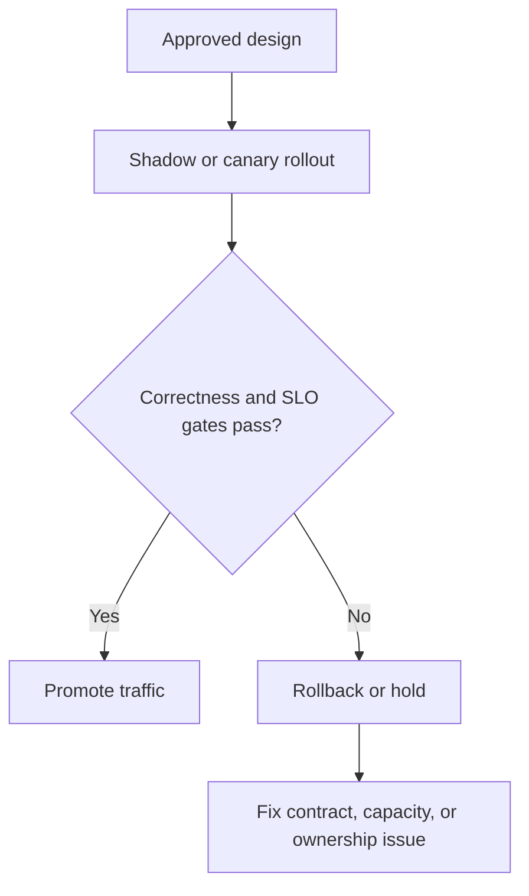

Part 1 is usually about choosing a communication style.
Part 2 is usually about failure semantics.
Part 3 is where teams discover whether the decision can survive real rollout pressure.

That is why this stage is less about architecture diagrams and more about governance, migration sequence, and operational discipline.
The communication model is only "chosen" once the organization knows how to release it safely.

## Quick Summary

| Rollout question | Strong answer |
| --- | --- |
| How do we introduce the new boundary? | phased rollout with explicit success and rollback gates |
| Who owns failure during migration? | one team, named clearly, per boundary |
| What blocks promotion? | user-facing correctness, latency, and operational health signals |
| What usually breaks migrations? | unclear fallback path and hidden coupling to old flows |

The invariant for this stage is:
the new sync or async boundary must improve the system without making rollback, ownership, or diagnosis less clear.

## What Part 3 Is Really About

By the time a team reaches this stage, the abstract debate is mostly over.
They usually already know whether the interaction *should* be sync, async, or mixed.

Now the questions are harder:

- how do we migrate traffic safely?
- what dual-write or dual-read period is acceptable?
- who is allowed to roll back?
- how do we know the new path is actually better?

Those are rollout and governance questions.
Treating them as implementation details is how "good architecture" turns into release pain.

## A Better Promotion Model

Use progressive rollout with explicit gates.

This matters for both sync and async designs:

- sync migrations often fail through latency or cascading dependency pressure
- async migrations often fail through hidden ownership, replay, or monitoring gaps

The promotion gate must reflect the failure mode the architecture is most likely to introduce.

## What to Measure Before Promotion

For sync paths:

- p95 and p99 latency
- timeout and retry rate
- downstream saturation
- fallback-path activation rate

For async paths:

- consumer lag
- duplicate processing rate
- dead-letter rate
- end-to-end completion delay

For both:

- business correctness checks
- rollback time
- operator confidence in diagnosing issues

If the migration is fast but the team cannot explain whether it is correct, the rollout is not ready.

## Ownership Must Be Explicit

One of the ugliest migration failures is shared accountability.

Examples:

- API team owns producer logic, platform team owns broker, but nobody owns consumer lag
- checkout team owns request path, billing team owns event consumer, but rollback decision is unclear
- old synchronous contract remains half-supported, so every incident becomes a negotiation

Before rollout, write down:

1. who owns the new boundary
2. who can stop promotion
3. who can trigger rollback
4. what happens to the old path after migration succeeds

If those answers live only in Slack memory, the architecture is not operationally complete.

## Hidden Coupling Is the Main Migration Risk

Teams often claim they moved to async while still depending on:

- synchronous shared database reads
- release-order coordination between services
- manual replay scripts no one owns
- undocumented schema timing assumptions

That is not decoupling.
That is coupling redistributed across more systems.

The best governance question is:
"What coupling are we removing, and what new operational contract are we accepting instead?"

## Rollout Patterns That Actually Help

### Shadow mode

The new path observes or processes traffic without becoming authoritative.
Good for correctness comparison and lag measurement.

### Canary

A small slice of traffic uses the new path first.
Good for surfacing tail latency or duplicate handling behavior.

### Dual-publish or dual-read with clear stop rules

Sometimes useful, but dangerous if the end condition is vague.
Never start a dual mode without a documented plan to end it.

### Hard rollback path

The old flow still exists temporarily, but ownership of rollback is clear and tested.

## Common Failure Modes

### Promotion gate is too technical

The migration passes because dashboards are green while user-visible correctness is wrong.

### Rollback is theoretically possible but operationally unclear

Everyone believes rollback exists until the first incident forces a real decision.

### Async migration ignores reconciliation

The system publishes events, but there is no plan for lag, duplicates, or replay after partial failure.

### Sync migration underestimates dependency amplification

One extra remote call per request looks harmless until peak traffic turns it into a latency cliff.

## A Practical Governance Checklist

Before full promotion:

- the new boundary has one clearly named owner
- success and rollback gates are written down
- the old path has a retirement plan
- correctness checks exist beyond infrastructure health
- on-call knows which metrics prove the migration is healthy
- replay, duplicate handling, or fallback semantics are documented

These are not administrative details.
They are part of the architecture.

## When to Slow Down on Purpose

Do not force migration speed if:

- consumer lag is unstable
- tail latency is climbing under canary load
- rollback is not rehearsed
- support teams cannot explain the new failure modes

A slow promotion with clear ownership is better than a fast migration followed by months of trust erosion.

## Key Takeaways

- Part 3 is where communication choices become operating policy.
- Promotion gates must reflect the failure mode the new boundary is likely to introduce.
- Ownership and rollback clarity matter as much as code correctness.
- If the migration removes code coupling but creates operational ambiguity, it is not a net improvement yet.
