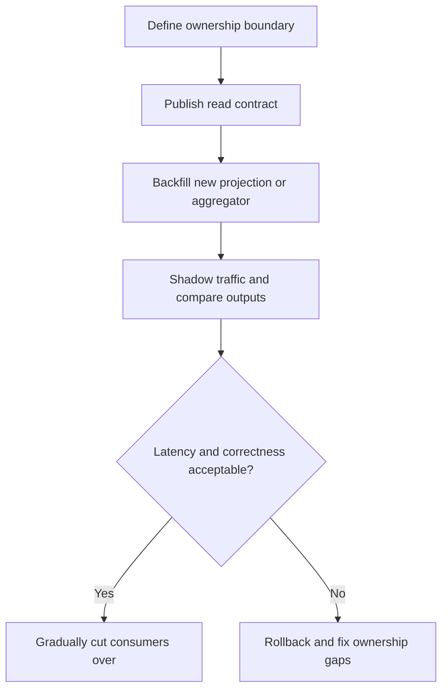

---
categories:
- Java
- Microservices
- Architecture
date: 2026-08-28
seo_title: Data ownership and cross-service query strategies (Part 3) - Advanced Guide
seo_description: Advanced practical guide on data ownership and cross-service query
  strategies (part 3) with architecture decisions, trade-offs, and production patterns.
tags:
- java
- microservices
- distributed-systems
- architecture
- backend
title: Data ownership and cross-service query strategies (Part 3)
toc: true
toc_icon: cog
toc_label: In This Article
header:
  overlay_image: "/assets/images/java-advanced-generic-banner.svg"
  overlay_filter: 0.35
  show_overlay_excerpt: false
  caption: Microservices Architecture and Reliability Patterns
---
Part 3 is where data ownership stops being a design diagram and becomes a rollout discipline.

By now, the team should already know which service owns each write path and which read patterns are acceptable.
The harder question is what happens after that design is approved:
how do you ship it, measure it, and keep convenience from reintroducing the same coupling you were trying to remove?

## Quick Summary

| Question | Healthy answer |
| --- | --- |
| Who owns each business fact? | exactly one service, documented explicitly |
| How do cross-service reads happen? | through approved composition or projection patterns |
| What usually breaks after launch? | ad hoc joins, hidden fan-out, and stale read assumptions |
| What keeps the design healthy? | ownership review, rollout telemetry, and rollback rules |

Part 3 is not inventing a new query strategy.
It is protecting the one you chose from operational decay.

## The Real Failure Mode Is Convenience

Most decompositions do not fail because the initial ownership model was absurd.
They fail because later changes quietly undo it:

- one endpoint starts calling three services synchronously "just for now"
- a reporting job reads private tables from another service
- a new field is authored in two places because migration feels slow
- a materialized view exists, but teams bypass it whenever they need something urgently

Each shortcut saves a sprint.
Together they rebuild cross-service coupling.

## The Three Query Styles You Must Govern

Most systems need a clear policy for three read patterns.

### Direct ownership read

The caller asks the owning service directly.
This is best when:

- freshness matters
- the response is small
- extra network latency is acceptable

### Materialized read model

A separate store or projection serves a cross-service query shape.
This is best when:

- the query spans multiple ownership boundaries
- read traffic is high
- some staleness is acceptable and measurable

### API composition

An aggregator or BFF composes responses at request time.
This is best when:

- the read is client-specific
- the composition changes faster than the core domain boundaries
- the latency and failure fan-out are acceptable

The mistake is not using any of these.
The mistake is letting teams choose one ad hoc without an ownership rule.

## A Good Rollout Plan Looks Boring

The safest migrations are staged:

This sequence is less exciting than a big-bang cutover.
It is also how you catch stale-read assumptions before they become production incidents.

## Rules That Keep Ownership Honest

Write these down before rollout:

1. every externally visible field has one owning service
2. no service reads another service's private storage directly
3. every cross-service query uses an approved composition or projection path
4. every projected read model has an explicit freshness expectation
5. every temporary bridge has an owner and an expiry date

Those rules are not process theater.
They are what stop "temporary" shortcuts from becoming the real architecture.

## The Most Common Anti-Patterns

### Shared-database shortcuts

One service reads another service's tables for convenience.
That bypasses ownership and creates schema coupling immediately.

### Hot-path fan-out

A single user request fans out to many services because the shape was easier to compose than project.
That works until one dependency slows down and the entire path inherits its tail latency.

### Projection without freshness language

Teams say a dashboard is "eventually consistent" without defining whether that means seconds, minutes, or "we hope it catches up soon."

### Duplicate write ownership

Two services both think they authoritatively own the same field.
That is no longer a query issue.
It is an ownership failure.

## What to Measure During Rollout

At minimum, expose:

- p95 and p99 latency of the new read path
- freshness lag for materialized views
- downstream fan-out count for composed requests
- mismatch rate during shadow comparison
- traffic split between old and new consumers
- read failure rate by dependency

If you cannot tell whether the new query model is fresher, slower, or more failure-prone than the old one, you are migrating on hope.

## A Practical Example

Suppose:

- `Orders` owns order lifecycle
- `Payments` owns payment outcome
- the product team wants a customer timeline combining both

A healthy model is:

- keep writes owned separately
- build a customer-facing projection from both event streams
- make the projection's freshness expectation explicit

What you should avoid is letting `Orders` query `Payments` tables directly because the projection is not ready yet.
That shortcut often survives much longer than the migration plan.

## Failure Drill Worth Running

Simulate all three of these before promotion:

1. projection lag spikes for ten minutes
2. one downstream in the composition path returns errors
3. one old consumer still assumes the previous ownership model

Then verify:

- which service is blamed for the bad field
- whether operators can see the freshness or dependency issue quickly
- whether rollback can happen per consumer path instead of for the whole program

If the answer to those questions is fuzzy, the ownership model is not rollout-ready yet.

## Part 3 Decision Rule

Promote the new data ownership and query strategy only when:

- ownership is explicit
- the read style is intentional
- telemetry proves the latency and correctness behavior
- rollback is possible at the consumer edge

If the team still explains the design with "service A usually has this data, but service B also knows some of it," stop and fix the ownership model first.

## Key Takeaways

- Data ownership usually regresses through convenience reads, not through one dramatic design mistake.
- Cross-service queries need policy, not just code.
- Projections and composition are both valid when their freshness and failure costs are explicit.
- Part 3 is governance: keep the ownership model true after day one.
