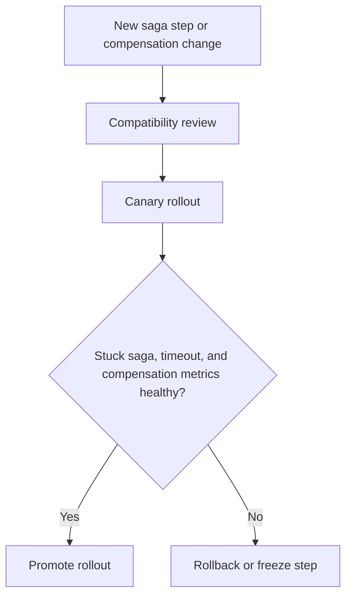

Part 1 is usually about the baseline choice.
Part 2 is about hardening the failure semantics.
Part 3 is where teams either turn the saga into an operable production system or into a permanent incident generator.

At this stage, the technical question is no longer just orchestration vs choreography.
It is governance:
who owns compensation logic, what rollout is safe, and how does the system prove it is still correct when new steps, services, and versions arrive?

## Quick Summary

| Question | Safer default |
| --- | --- |
| who may add a new saga step | one clearly owned change path with compatibility rules |
| when is compensation allowed to change | only with explicit replay and rollback review |
| how should rollout happen | staged release with stuck-saga and compensation metrics |
| what kills operability fastest | unclear ownership of side effects and compensation authority |

Part 3 is about keeping the saga healthy after day one, not just making the diagram look elegant.

## What Usually Breaks After the First Release

A saga design may look fine in staging and still fail in production because:

- a new service adds a side effect that is not truly compensatable
- compensation logic changes in one service but not in another
- orchestration and local service policies drift over time
- event choreography grows implicit dependencies no one now owns
- operators cannot tell whether a workflow is delayed, stuck, compensating, or waiting legitimately

The hard part is not invoking the next step.
It is preserving ownership and reversibility as the workflow evolves.

## The Real Part 3 Question

Ask this directly:

who is allowed to change the business sequence, and who is allowed to change the undo sequence?

Those are not always the same team.

If that answer is fuzzy, the system eventually accumulates:

- partial compensation
- replay ambiguity
- version drift
- broken audit trails

Sagas fail less often because the idea is wrong and more often because nobody owned the long-term contract.

## Orchestration vs Choreography in the Long Run

By Part 3, the architectural difference becomes more operational than stylistic.

### Orchestration tends to centralize

- workflow visibility
- timeout ownership
- retry policy
- compensation sequencing

That helps when the business flow needs strong auditability and coordinated rollback.

### Choreography tends to distribute

- local autonomy
- event ownership
- coupling through emitted facts instead of direct control

That helps when the flow is naturally decentralized and services should not all depend on one workflow brain.

The danger is not choosing one or the other.
The danger is pretending you have choreography while a hidden orchestrator still exists in one team’s head.

## Governance Rules Worth Writing Down

Before scaling the saga, define:

1. which steps are required for success
2. which failures trigger compensation versus manual handling
3. which compensations are guaranteed and which are best effort
4. how version skew is handled during rollout
5. who owns workflow timeouts and replay approval

Those rules are more important than another architecture diagram.

## A Practical Rollout Model

The key is that rollout is not just deployment success.
It is proof that the workflow still compensates and converges under mixed-version conditions.

## Metrics That Actually Matter

Do not stop at request success rate.
Watch:

- saga completion time by version
- compensation rate by step
- stuck-in-progress count
- retry amplification count
- manual intervention rate
- timeout-to-compensation lag
- replay outcomes after partial failure

If the only dashboard says "messages are flowing," the system is not observable enough.

## Where Compensation Logic Goes Wrong

### Compensation is not a true inverse

Refunding money, releasing inventory, or canceling a shipment may not restore the world to its exact previous state.

That is why compensation must be treated as business policy, not mathematical undo.

### Teams add non-compensatable side effects casually

Email, third-party notifications, and irreversible partner calls often sneak into a flow that was designed as if everything could be rolled back.

That is usually where the clean saga story ends.

### Version drift breaks old workflows

Long-running sagas can span deploys.
If a new version cannot understand old events or compensation contracts, the rollout itself becomes a failure mode.

### Manual recovery is undocumented

Some failures will require human intervention.
If that path is not explicit, operators improvise during incidents and create more damage.

## A Useful Failure Drill

Simulate this sequence:

1. one step succeeds
2. the next step times out
3. compensation starts
4. a new version deploys mid-compensation
5. one service is temporarily unavailable

Then verify:

- which component owns retry and timeout decisions
- whether compensation still runs correctly across versions
- whether operators can tell the workflow state without reading source code
- whether rollback is safe or whether manual recovery is required

If the answers are unclear, the saga is not production-ready yet.

## Practical Decision Rule

By Part 3, prefer orchestration when:

- compensation order matters strongly
- auditability is central
- cross-step timeout ownership must be explicit

Prefer choreography when:

- services truly own their local reactions
- the flow is fact-driven rather than centrally sequenced
- the team can tolerate looser global visibility

Prefer neither blindly if:

- compensation is mostly fake
- rollout compatibility rules do not exist
- manual recovery is still tribal knowledge

## Key Takeaways

- Part 3 is about governance, rollout, and operability, not just pattern vocabulary.
- A saga remains healthy only if ownership of forward steps and compensation logic stays explicit.
- Compensation is business policy, not magical undo.
- Mixed-version rollout and stuck-workflow visibility are first-class design concerns.
