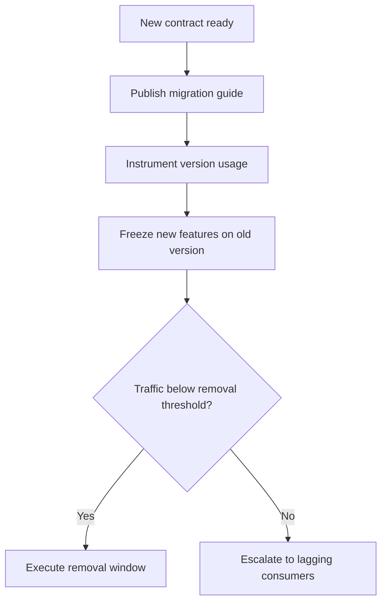

Part 3 is where API evolution stops being a versioning syntax problem and becomes an operations problem.

Most teams know how to create `/v2`.
Far fewer know how to retire `/v1`, prove clients are ready, and stop "temporary" compatibility code from becoming permanent platform debt.

## Quick Summary

| Question | Healthy answer |
| --- | --- |
| When do we version? | only when compatibility cannot be preserved safely |
| How do we deprecate? | with telemetry, timelines, and named owners |
| What usually goes wrong? | zombie versions, silent client breakage, and contradictory contracts |
| What makes Part 3 hard? | governance, rollout sequencing, and removal discipline |

If Part 1 chose the compatibility strategy and Part 2 hardened the mechanics, Part 3 is about making deprecation real.

## The Hard Part Is Not Creating a New Version

Adding a version is easy compared with everything around it:

- which clients still depend on the old contract
- what the migration path looks like
- which teams own the sunset timeline
- how removal gets blocked or approved

Without those answers, versioning becomes a way to avoid hard decisions rather than manage them.

## When Deprecation Governance Is Actually Necessary

You need explicit policy when:

- mobile or partner clients upgrade slowly
- multiple teams publish APIs with different compatibility habits
- public APIs or SDKs exist outside your direct control
- old versions create real maintenance, security, or testing cost

Small internal systems can often manage change with direct coordination.
At scale, informal coordination stops working.

## A Useful Policy Has Four Parts

### Compatibility rule

Define what counts as backward compatible and what does not.

Examples:

- adding an optional field: usually safe
- making an optional field required: breaking
- changing enum meaning: often breaking even if parsing still works
- reusing an old field name with new semantics: dangerous even without a new version

### Telemetry rule

You must know which clients still use the old contract.
Without that, a deprecation date is a guess.

### Timeline rule

Each deprecation should define:

- announcement date
- migration guide date
- feature-freeze date for the old version
- target removal date

### Ownership rule

Somebody must own:

- the contract
- the migration guide
- client communication
- the final removal call

If ownership is fuzzy, old versions never die.

## A Practical Decommissioning Flow



The important part is not just the flow.
It is the threshold.
Removal should be triggered by measured readiness, not by wishful calendar optimism.

## The Failure Modes That Hurt Most

### Zombie versions

The old version is still alive because one unknown client may be using it and no one wants to own the shutdown decision.

### Version explosion

Teams keep creating versions because it feels safer than compatibility discipline.
Soon every change multiplies testing, observability, and support cost.

### Same path, different meaning

The API label stays the same, but behavior shifts in a breaking way.
This is often worse than explicit versioning because clients do not know they should distrust the contract.

### Telemetry-free migration

The team announces deprecation but never measures which consumers actually moved.
Removal day becomes the first real discovery mechanism.

## Metrics That Make Deprecation Real

Track these from day one:

- request volume by version
- unique client IDs by version
- percentage of traffic using deprecated fields
- error rate by client segment during migration
- adoption of replacement fields or endpoints

If you cannot answer "who is still on the old contract?" you are not ready to remove it.

## A Practical Example

Suppose `/payments` currently returns:

```json
{
  "status": "OK"
}
```

and the new contract wants:

```json
{
  "result": "APPROVED"
}
```

A safer migration is:

1. add `result`
2. keep `status` temporarily
3. document the mapping clearly
4. measure which clients still depend on `status`
5. remove `status` only after telemetry proves readiness

The failure mode is keeping both forever because cleanup feels risky.
That turns compatibility into permanent ambiguity.

## Failure Drill Worth Running

Before removal, simulate:

1. one major client still sends old headers
2. one internal job still reads the deprecated field
3. one dashboard or SDK still depends on the old shape

Then verify:

- the telemetry catches each one
- the owner list is accurate
- removal can be halted intentionally
- rollback is understood before the first real complaint arrives

If the only detection strategy is production breakage, the governance layer is not mature enough.

## Part 3 Decision Rule

Remove a deprecated version or field only when:

- measured traffic proves low or zero dependency
- the migration path was documented and communicated
- rollback ownership is explicit
- the support cost of compatibility is no longer justified

If any of those are vague, you do not have a deprecation plan yet.
You have an aspiration.

## Key Takeaways

- API versioning usually succeeds or fails through governance, not URL structure.
- Telemetry matters more than deprecation announcements.
- Compatibility code needs an exit plan or it becomes the permanent platform.
- Good deprecation policy protects both clients and long-term service maintainability.
