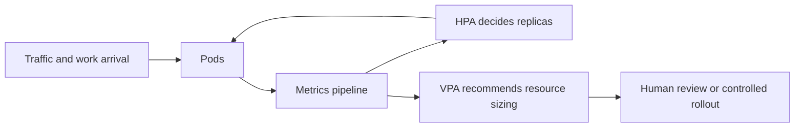

Autoscaling looks simple on slides:
if load rises, add capacity.

In production, it is a set of feedback loops acting on incomplete signals.
That is why HPA and VPA do not merely "work together" or "conflict."
They reshape each other's inputs, timing, and failure modes.

## Quick Summary

| Mechanism | What it changes | Best fit | Common trap |
| --- | --- | --- | --- |
| HPA | replica count | elastic stateless workloads | scaling on a noisy or misleading metric |
| VPA | pod resource requests and limits | steady workloads with poor right-sizing | evicting or resizing pods that already rely on HPA |
| HPA + VPA together | both pod count and resource sizing | carefully separated signals, usually with VPA in recommendation mode | letting both chase the same CPU symptom |

Part 1 is about the safe default model:
how to avoid autoscaling loops that look intelligent in staging and chaotic in production.

## What HPA and VPA Actually Observe

HPA answers:
"Should I run more or fewer pods?"

VPA answers:
"Are the resource requests and limits on each pod wrong for this workload?"

Those are different questions.
The problem begins when teams use both controllers without acknowledging that a change in one controller can distort the other's signal.

Examples:

- VPA raises CPU requests, so HPA utilization percentage changes even if actual work did not.
- HPA adds replicas, so per-pod load drops and VPA recommendations shift.
- VPA restarts pods to apply changes, which can briefly reduce capacity and provoke HPA.

This is why autoscaling should be treated as coupled control systems, not feature toggles.

## Strong Default: Separate Elasticity From Right-Sizing

For most request-serving applications, a practical baseline is:

- use HPA for horizontal elasticity
- use VPA in recommendation mode first
- set requests deliberately instead of outsourcing everything to automation

That approach is not conservative because Kubernetes is scary.
It is conservative because you want to learn the workload before letting two controllers rewrite its capacity plan.

The main lesson is simple:
use one automatic feedback loop for actuation first, and treat the second loop as advisory until the workload is well understood.

## Anti-Pattern 1: HPA and VPA Both Acting on CPU for the Same Workload

This is the classic unstable setup.

Imagine:

- HPA scales on CPU utilization
- VPA changes CPU requests automatically

Now the denominator in HPA's utilization formula keeps moving while HPA is still deciding replica count.
The workload may not be changing much, but the signal is.

Operational result:

- surprise scale events
- difficulty explaining why replicas changed
- false confidence during low-noise periods

If HPA must scale the workload, keep VPA in recommendation mode or use VPA for dimensions HPA is not using as its primary actuation signal.

## Anti-Pattern 2: Scaling a Broken Metric

The most common HPA mistake is not "wrong YAML."
It is scaling on a metric that is correlated with pain but not with safe capacity expansion.

Examples:

- CPU for I/O-bound services
- request rate without concurrency or latency context
- queue depth without worker throughput or retry visibility
- memory for workloads where leaks and cache growth are the real problem

Autoscaling cannot rescue a metric model that misdescribes the workload.
You need a signal tied to the bottleneck you are actually trying to relieve.

## Anti-Pattern 3: Ignoring Request Hygiene

If CPU and memory requests are fiction, neither HPA nor VPA will behave well.

Bad requests cause:

- poor bin-packing
- throttling that looks like application inefficiency
- noisy autoscaling
- node pressure that creates scheduling delays just when scale-out is needed

Before tuning controllers, validate whether requests reflect reality at all.
Autoscaling on top of bad requests is usually just faster confusion.

## Anti-Pattern 4: Treating Rollout Behavior and Autoscaling as Separate Concerns

A workload under rollout is not in the same state as a steady workload.
If HPA is adding replicas while pods are still warming up, caches are cold, and readiness is delayed, the system can oscillate:

- load rises
- HPA adds pods
- new pods are not ready yet
- existing pods take more load
- latency worsens
- HPA adds even more replicas

This is one reason autoscaling needs to be reviewed together with:

- readiness behavior
- startup time
- disruption budgets
- connection draining

The controller is only one part of the capacity story.

## A Better Baseline Rollout Plan

For a new service:

1. set realistic requests and limits from measurement, not guesses
2. start with HPA only if traffic is elastic
3. choose one scaling metric that maps to user pain or resource saturation
4. run VPA in recommendation mode long enough to learn the workload shape
5. compare recommendations against observed latency, throttling, and pod churn

This creates an explainable baseline before automation gets more aggressive.

## Metrics That Matter More Than Replica Count

Replica count is not the outcome.
It is only the controller output.

Track these instead:

- P95 and P99 latency
- CPU throttling
- pending pod time
- scale event frequency
- restart and eviction counts
- queue lag or concurrency saturation
- node pressure during scale-up

If scale events are frequent but latency is still unstable, the controller may be active without being useful.

## Failure Drills to Run on Purpose

Test autoscaling under the conditions that usually trigger incidents:

1. fast traffic spike
2. slow warm-up pods
3. node shortage during HPA scale-out
4. VPA recommendation shifts after a release
5. retry storm or backlog spike

The goal is not to prove that HPA or VPA "works."
It is to see whether the combined system remains understandable under stress.

## Practical Decision Rules

Use HPA by default when:

- the workload is mostly stateless
- more replicas can genuinely relieve pressure
- startup time is acceptable
- the scaling metric reflects a real bottleneck

Use VPA recommendations by default when:

- the workload is steady enough to profile
- requests are probably wrong
- eviction or restart cost is non-trivial
- you want better right-sizing before enabling automation

Be suspicious of full HPA plus VPA automation when:

- the service has slow warm-up
- the main bottleneck is external dependency latency
- requests are unstable across releases
- the team cannot explain the last scale event

## Part 1 Checklist

- one primary scaling objective is defined
- requests and limits are measured, not ceremonial
- HPA metric matches the real bottleneck
- VPA starts in recommendation mode unless proven otherwise
- rollout behavior and autoscaling are reviewed together
- success is judged by latency and stability, not only by replica movement

## Key Takeaways

- HPA and VPA are coupled feedback loops, not isolated features.
- Most autoscaling pain comes from weak signals and unrealistic requests, not from Kubernetes syntax.
- A calm, explainable scaling system is better than an aggressive one that nobody can debug.
- Separate elasticity from right-sizing before letting automation control both at once.
