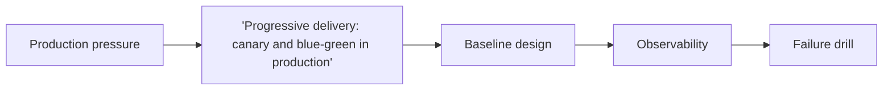

'Progressive delivery: canary and blue-green in production' matters because Kubernetes usually amplifies both good and bad operational decisions. The YAML is not the whole story; the real question is how workloads behave during rollout, recovery, and saturation.

---

## Problem 1: 'Progressive delivery: canary and blue-green in production'

Problem description:
We want 'progressive delivery: canary and blue-green in production' to work under real pod churn, load, and operational failure instead of only on a quiet cluster. This part focuses on the baseline model and the safe default shape.

What we are solving actually:
We are establishing the core boundary, deciding what must stay explicit, and choosing a baseline that is easy to observe. For Kubernetes, the hidden risk is that platform defaults look fine until the first load spike, probe flap, or rolling update under pressure.

What we are doing actually:

1. make the cluster behavior explicit: identify the ownership boundary and the non-negotiable invariant
2. make the cluster behavior explicit: choose the simplest baseline design that preserves correctness
3. make the cluster behavior explicit: make observability visible from the first implementation
4. make the cluster behavior explicit: validate the baseline with one concrete failure drill

---

## Why This Topic Matters

- probe and lifecycle settings directly affect availability under rollout and failure
- platform defaults are rarely enough for latency-sensitive backends
- bad operational signals in Kubernetes tend to spread quickly across replicas

---

## Architecture Model



The diagram centers on workload behavior, control-plane signals, and recovery paths because 'progressive delivery: canary and blue-green in production' is judged during rollout and saturation, not in a quiet namespace.
That framing makes it easier to connect YAML choices to real availability outcomes.

---

## Practical Design Pattern

```yaml
apiVersion: apps/v1
kind: Deployment
metadata:
  name: topic-workload
spec:
  template:
    spec:
      terminationGracePeriodSeconds: 30
      containers:
        - name: app
          # Tune this workload for: 'Progressive delivery: canary and blue-green in production'
```

This snippet is only a foothold for discussion, not a full manifest set, because 'progressive delivery: canary and blue-green in production' succeeds or fails through runtime behavior more than YAML size.
The important part is making the lifecycle rule obvious enough that the team can observe and roll it back.

---

## Failure Drill

Baseline drill: simulate rolling restart under live traffic and verify readiness, drain, and rollback behavior for 'progressive delivery: canary and blue-green in production'.

That drill matters early, before rollout assumptions harden into defaults because Kubernetes amplifies small mistakes in 'progressive delivery: canary and blue-green in production' quickly once probes, autoscaling, and rollout timing start interacting.

---

## Debug Steps

Debug steps:

- compare probe behavior against real application readiness, not process liveness alone while validating 'progressive delivery: canary and blue-green in production'
- measure rollout and drain timing under representative load while validating 'progressive delivery: canary and blue-green in production'
- treat autoscaling, disruption budgets, and termination settings as one system while validating 'progressive delivery: canary and blue-green in production'
- test rollback before assuming the cluster will recover cleanly by default while validating 'progressive delivery: canary and blue-green in production'

---

## Production Checklist

- probe, drain, or scheduling rule tied to one availability goal
- rollout metric that would tell operators to stop quickly
- resource or disruption assumptions written next to the change
- rollback path proven under live-ish load

---

## Key Takeaways

- 'Progressive delivery: canary and blue-green in production' should be designed as a production decision, not just an implementation detail
- platform configuration is part of application reliability, not separate from it
- start from a measurable baseline before optimizing
