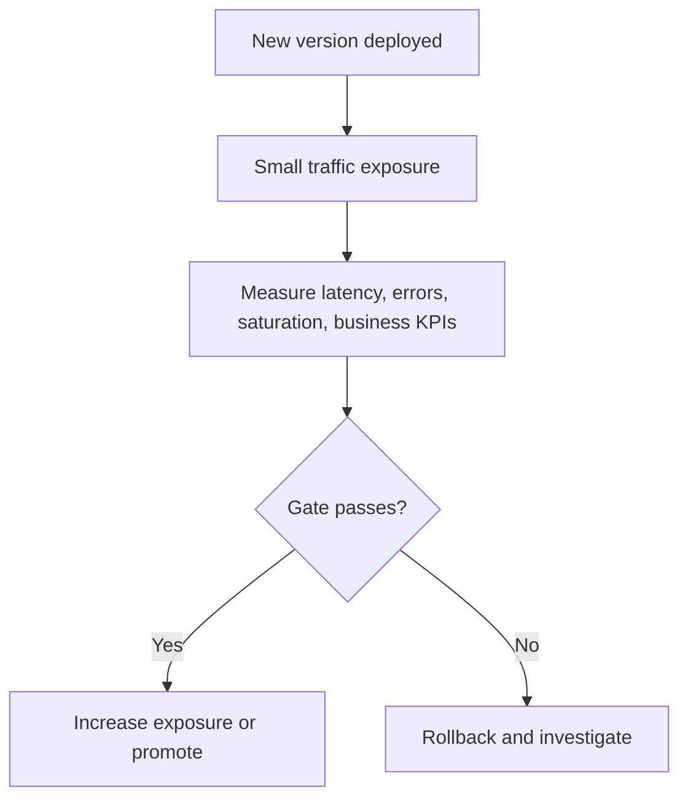

---
categories:
- Kubernetes
- Platform
- Backend
date: 2026-09-05
seo_title: 'Progressive delivery: canary and blue-green in production - Advanced Guide'
seo_description: 'Advanced practical guide on progressive delivery: canary and blue-green
  in production with architecture decisions, trade-offs, and production patterns.'
tags:
- kubernetes
- platform-engineering
- reliability
- backend
- operations
title: 'Progressive delivery: canary and blue-green in production'
toc: true
toc_icon: cog
toc_label: In This Article
header:
  overlay_image: "/assets/images/java-advanced-generic-banner.svg"
  overlay_filter: 0.35
  show_overlay_excerpt: false
  caption: Kubernetes Engineering for Backend Platforms
---
Progressive delivery is not a fancy name for "slow deployment."
It is the practice of reducing rollout risk by making exposure, measurement, and rollback explicit.

That matters because most production incidents caused by deploys are not caused by the container image alone.
They come from bad assumptions about traffic shape, dependency behavior, database compatibility, or rollback safety.

## Quick Comparison

| Strategy | Best fit | Main strength | Main risk |
| --- | --- | --- | --- |
| Rolling update | low-risk changes, simple fleets | operational simplicity | weak isolation from bad version behavior |
| Canary | uncertain risk, strong observability, traffic control available | small blast radius with real production traffic | teams promote too fast or gate on weak metrics |
| Blue-green | instant cutover and fast rollback needed | clean environment switch | double-capacity cost and state compatibility issues |

The right question is not "which one is modern?"
It is "what failure do we most need to contain?"

## Start With the Failure You Are Defending Against

Different rollout strategies protect against different risks.

Examples:

- canary protects against behavior that only appears under real production traffic
- blue-green protects against needing a very fast switch back to the old environment
- rolling update is often enough when the app is stateless and the change is operationally boring

If the team cannot describe the feared failure mode, progressive delivery often becomes ceremony without safety.

## Canary vs Blue-Green in Practice

### Choose canary when:

- the new version needs real production traffic to validate safely
- you can observe latency, errors, saturation, and business KPIs per version
- rollback speed matters, but instant full cutover is not required

### Choose blue-green when:

- switching all traffic at once is acceptable after verification
- you need very fast rollback to a fully separate environment
- the application is operationally expensive to migrate gradually

### Be careful with either when:

- schema changes are not backward compatible
- background consumers or scheduled jobs are not version-aware
- session affinity or caches hide version-specific failures

The deployment method does not fix compatibility mistakes.
It only changes how they fail.

## A Safe Baseline Rollout Model

At minimum, make these things explicit:

1. traffic exposure policy
2. success metrics and error budget gates
3. promotion timing
4. rollback trigger
5. ownership for the decision to continue

If step C is missing real gates, the rest is just staged optimism.

## Metrics That Actually Matter

Too many teams gate rollout on only one or two technical metrics.
That misses the real failure surface.

A better gate includes:

- HTTP or RPC error rate by version
- p95/p99 latency by version
- resource saturation such as CPU throttling or memory pressure
- downstream error amplification
- one business-level correctness metric when possible

Examples:

- payment authorization success rate
- order placement completion
- search result empty-rate spike
- message processing lag

Canary without per-version observability is just partial traffic exposure with delayed surprise.

## Blue-Green Needs Stronger Compatibility Discipline

Blue-green sounds safer because rollback is fast.
That is true only when old and new environments can coexist safely.

Watch for:

- schema changes the old version cannot read
- background jobs running twice
- external side effects from both environments
- caches or queues shared in incompatible ways

The fastest rollback in the world does not help if the old version cannot safely resume work.

## Kubernetes-Specific Failure Modes

### Probes lie during promotion

A pod can be technically ready but still unhealthy under real traffic shape.

### Autoscaling distorts the canary signal

If the canary gets different scaling behavior than the baseline, comparison becomes noisy.

### Retries hide real failure

Aggressive retries can make the new version appear healthier than it is while burning downstream capacity.

### Promotion is time-based instead of evidence-based

"Wait 10 minutes and continue" is not a safe rule unless the gates are clear and traffic is representative.

## A Better Operator Workflow

Before starting the rollout, the operator should know:

- initial traffic percentage
- expected duration at each stage
- stop conditions
- rollback command or procedure
- version-specific dashboards
- whether background consumers or migrations are included in the same release

If promotion requires five people improvising in Slack, the rollout process is under-designed.

## First Drill to Run

Run a staged rollout where the new version has a deliberately injected small regression, such as:

- slightly higher latency
- dependency timeout increase
- increased error rate on one endpoint

Then verify:

1. the canary or blue-green gate catches it
2. rollback happens quickly
3. dashboards make the failure obvious
4. operators do not need tribal knowledge to respond

This is how you learn whether the rollout system is real or merely comforting.

## Production Checklist

- rollout strategy is chosen for a specific failure mode
- version-specific metrics exist before the deploy
- promotion gates are explicit and measurable
- rollback path is fast and rehearsed
- schema and background job compatibility are reviewed
- retry and autoscaling behavior are considered part of rollout design
- ownership for promotion and rollback decisions is clear

## Key Takeaways

- Progressive delivery is a risk-control system, not just a deployment style.
- Canary and blue-green solve different operational problems.
- Metrics must prove safety before promotion, not simply decorate the release dashboard.
- The real test of the strategy is whether rollback remains safe under version, data, and traffic pressure.
